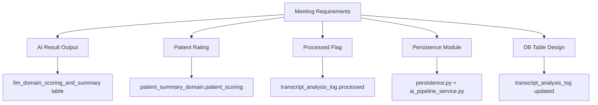
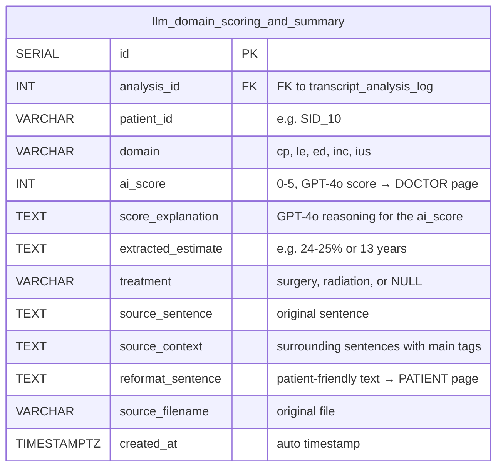
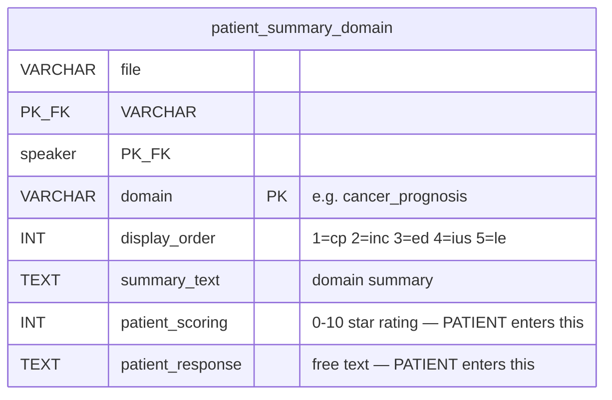
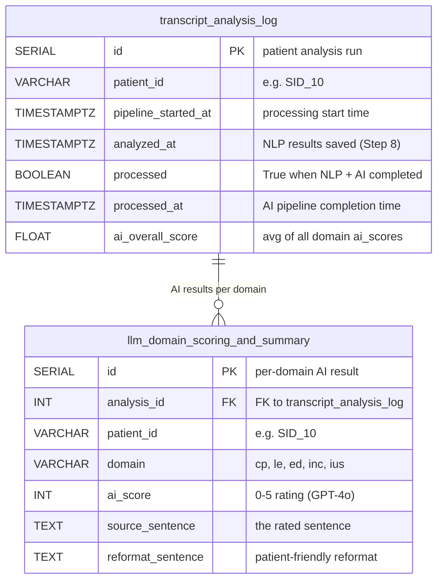

# Meeting Requirements → Implementation Mapping

> Meeting date: 2026-04-16 | Implementation date: 2026-04-16 ~ 2026-04-17  
> Branch: `feat/save-intermediate-results`

---

## 1. Overview

This document maps each requirement from the 2026-04-16 meeting to the actual code changes made.



---

## 2. Requirement-to-Implementation Mapping

### Req 1: "AI result output — check Guillermo's code"

| Aspect | Implementation |
|--------|---------------|
| **Where** | `ai_pipeline_service.py` → calls `ai_pipeline/pipeline.py` (Guillermo's code) |
| **What it produces** | Per-domain: `ai_score` (0-5), `score_explanation`, `extracted_estimate`, `treatment`, `reformat_sentence` |
| **Where stored** | `llm_domain_scoring_and_summary` table (5-9 rows per patient) |
| **Verified** | ✅ SID 10, 14, 15, 18, 33 — all domains processed and saved |



**Frontend usage:**
- `ai_score` → **Doctor page**: consultation quality metric (scores/average, scores/trajectory)
- `reformat_sentence` → **Patient page**: AI-generated risk summary card
- `extracted_estimate` → **Doctor page**: raw risk estimate for review

---

### Req 2: "Rating from patients — couple of things we need to change"

| Aspect | Implementation |
|--------|---------------|
| **Where** | `patient_summary_domain` table |
| **Column** | `patient_scoring` (INT, 0-10, NULL until patient rates) |
| **How patient enters** | Follow-up visit dashboard → star rating per domain |
| **API** | `PUT /api/patient/scoring` |
| **Verified** | ✅ Column exists, initially NULL, updated when patient submits |



**NOTE:** `patient_scoring` ≠ `ai_score`
- `patient_scoring` = patient's subjective rating ("How well did my doctor explain this?") → **Patient page**
- `ai_score` = GPT-4o's objective scoring of sentence relevance → **Doctor page**

---

### Req 3: "Flag if it has been processed or not"

| Aspect | Implementation |
|--------|---------------|
| **Where** | `transcript_analysis_log` table |
| **Columns** | `processed` (BOOLEAN), `processed_at` (TIMESTAMP) |
| **When False** | After NLP save (Step 8) — AI pipeline not yet run |
| **When True** | After AI pipeline completes (Step 9) |
| **Code** | `persistence.py` sets `False`, `ai_pipeline_service.py` sets `True` |
| **Verified** | ✅ All 5 patients show `processed=True` with timestamps |

---

### Req 4: "Run main_complete_pipeline.py and understand the output"

| Aspect | Implementation |
|--------|---------------|
| **Tested with** | SID 15 (Input_Keystrokes REC001 (SID 15).xlsx) |
| **Environment** | conda `prostate_cancer_py_3.10`, NLP via socat proxy (localhost:9999) |
| **Result** | Full Step 0-9 completed, 26 output files generated |
| **Branch** | `test/complete-pipeline` (AI_physician_patient_communication repo) |

Pipeline output per patient:

```
data/output_test/SID_15/
├── segmented_sentences.csv      (Step 2: 122 sentences)
├── predictions_long.csv         (Step 3: 122 × 5 model scores)
├── top10_by_outcome.xlsx        (Step 4: 10 per domain)
├── top10_with_context.xlsx      (Step 5: 10 + context)
├── {domain}_extraction.csv      (Step 7: extracted estimates)
├── {domain}_filtering.csv       (Step 8: filtered candidates)
├── {domain}_result.csv          (Step 9: final selection + reformat)
└── {domain}.xlsx                (per-domain combined)
```

---

### Req 5: "Check what needs to be saved and where does it go"

**What goes to Patient:**

| Data | Table | Column | API |
|------|-------|--------|-----|
| AI risk summary | `llm_domain_scoring_and_summary` | `reformat_sentence` | `GET /api/patient/ai-summary/{file}` |
| Patient rating | `patient_summary_domain` | `patient_scoring` | `PUT /api/patient/scoring` |
| Patient response | `patient_summary_domain` | `patient_response` | `PUT /api/patient/responses` |

**What goes to Doctor:**

| Data | Table | Column | API |
|------|-------|--------|-----|
| AI quality score | `llm_domain_scoring_and_summary` | `ai_score` | `GET /api/doctor/scores/average` |
| Top sentences | `doctor_sentence_view` | `sentence`, `class` | `GET /api/doctor/sentences/{file}/{speaker}` |
| Score trajectory | `llm_domain_scoring_and_summary` | `ai_score` | `GET /api/doctor/scores/trajectory` |

**Doctor does not save** — doctor view is read-only. Rewriting saves to `doctor_rewrite_log` from the dashboard (not pipeline).

---

### Req 6: "Create persistence module — key should be patient_id"

| Aspect | Implementation |
|--------|---------------|
| **Module** | `persistence.py` — `save_all()` function |
| **Called by** | `pipeline_runner.py` (Step 8) |
| **Key** | `transcript_analysis_log.patient_id` (e.g., SID_10) |
| **Transaction** | Single transaction — all tables or none |
| **Tables written** | `transcript_analysis_log` (1), `sentence_prediction` (50), `doctor_sentence_view` (~47), `patient_summary` (1), `patient_summary_domain` (5) |

---

### Req 7: "AI summary → AI reformat (terminology change)"

| Aspect | Implementation |
|--------|---------------|
| **Old term** | "AI summary" |
| **New term** | `reformat_sentence` (column in `llm_domain_scoring_and_summary`) |
| **Code** | `ai_pipeline/reformat.py` → GPT-4o reformats selected estimate into patient-friendly language |
| **Example** | Input: "24-25% risk of death" → Output: "Your doctor noted that your risk of dying of prostate cancer is 24-25%." |
| **Frontend** | `PatientInitialVisitReportV35.tsx` reads `reformat_sentence` via `GET /api/patient/ai-summary/{file}` |

---

### Req 8: "Table: id, sentence, domain, rating, processed flag"

**Implemented across two tables:**



**Mapping to meeting request:**
- `id` → `transcript_analysis_log.id` + `llm_domain_scoring_and_summary.id`
- `sentence` → `llm_domain_scoring_and_summary.source_sentence`
- `domain` → `llm_domain_scoring_and_summary.domain`
- `rating` → `llm_domain_scoring_and_summary.ai_score` (0-5)
- `processed flag` → `transcript_analysis_log.processed` (Boolean)

---

## 3. Pipeline Timing (Verified)

```
SID 10: pipeline_started_at=05:26:14 → analyzed_at=05:26:30 → processed_at=05:29:28 (3m14s)
SID 14: pipeline_started_at=05:29:28 → analyzed_at=05:29:39 → processed_at=05:32:40 (3m12s)
SID 15: pipeline_started_at=05:32:40 → analyzed_at=05:32:46 → processed_at=05:35:32 (2m52s)
SID 18: pipeline_started_at=05:35:32 → analyzed_at=05:35:41 → processed_at=05:38:36 (3m04s)
SID 33: pipeline_started_at=05:38:36 → analyzed_at=05:38:46 → processed_at=05:41:43 (3m07s)
```

All 5 patients: `processed=True` ✅

---

## 4. Files Changed

| File | Change |
|------|--------|
| `pipeline_runner.py` | Replaced `transcript_service` with `sentence_classification` (R stringi). Added `pipeline_started_at`, intermediate file saving (step0-step5). |
| `persistence.py` | Added `pipeline_started_at` and `processed=False` on initial save. |
| `ai_pipeline_service.py` | Set `processed=True` + `processed_at` on AI success. Increased Azure timeout to 30min. |
| `models.py` | Added `pipeline_started_at`, `processed`, `processed_at` to `TranscriptAnalysisLog`. Added frontend usage comments. |
| `database_schema.sql` | Added 3 new columns to `transcript_analysis_log` CREATE TABLE. |
| `docker-compose.yml` | Mounted `sentence_classification/` volume. Extended `start_period` to 2400s. |
| `Dockerfile` | Installed R + stringi 1.8.4 (bundled ICU 74.1) + rpy2. Added ICU version check in prestart. |
| `routes_transcript.py` | Replaced `transcript_service.analyze_transcript` with `sentence_classification`-based implementation. |
| `transcript_service.py` | Moved to `archive/` (no longer used). |

---

## 5. Remaining Work

| Item | Status | Notes |
|------|:------:|-------|
| Processed flag | ✅ Done | `transcript_analysis_log.processed` + `processed_at` |
| Patient rating | ✅ Exists | `patient_summary_domain.patient_scoring` (patient enters on dashboard) |
| AI reformat | ✅ Done | `llm_domain_scoring_and_summary.reformat_sentence` |
| Doctor read-only | ✅ Confirmed | Doctor view does not save — only reads from DB |
| Integration testing | ⬜ Next week | End-to-end: input → pipeline → DB → dashboard display |
| Survey changes | ⬜ On hold | Per meeting decision — not touching until changes finalize |
