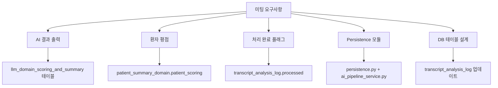
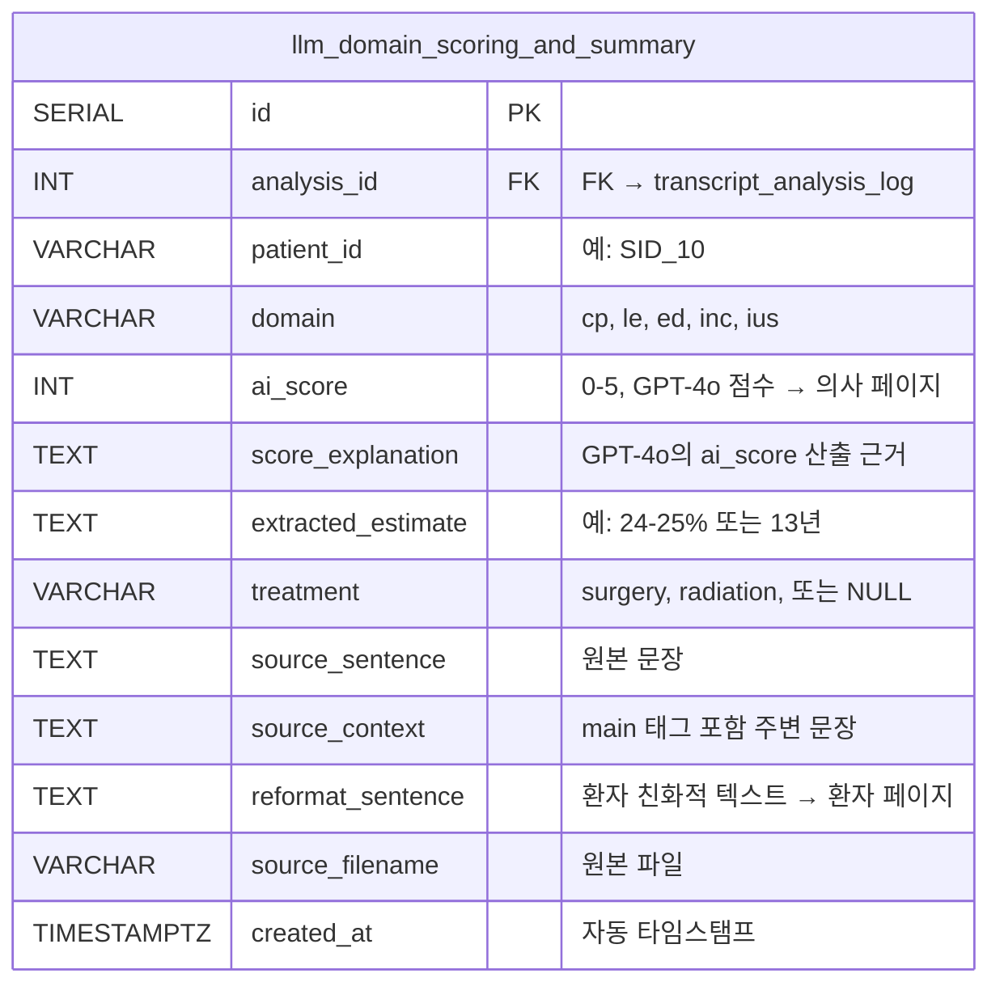
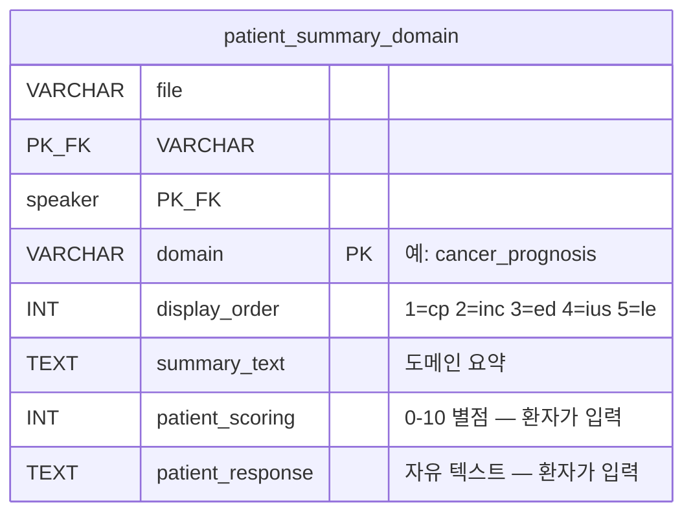
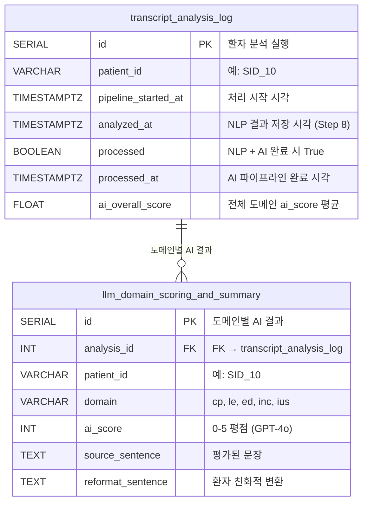
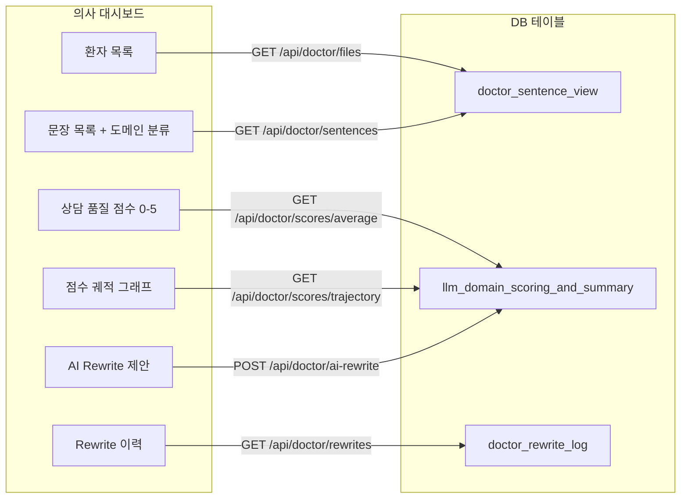
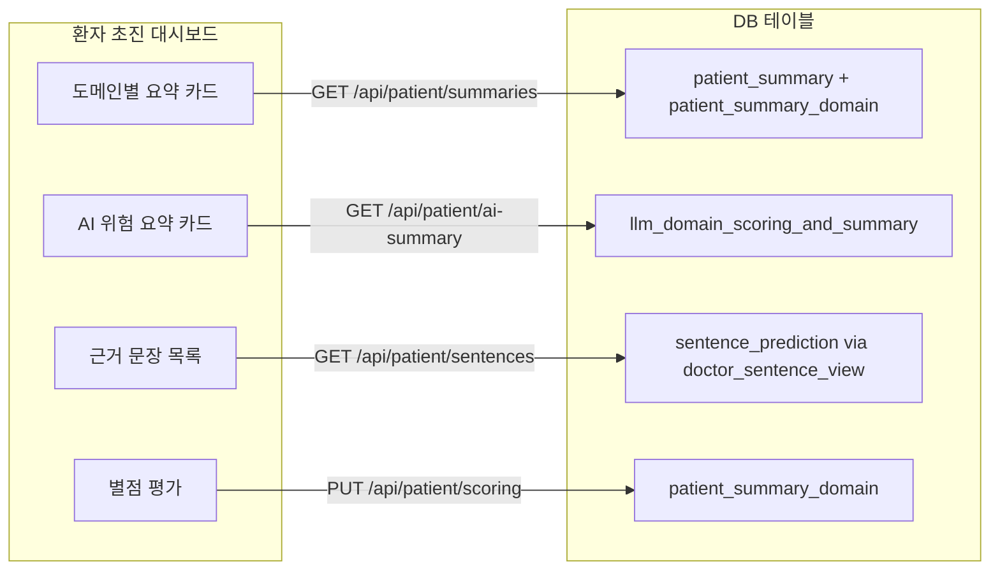
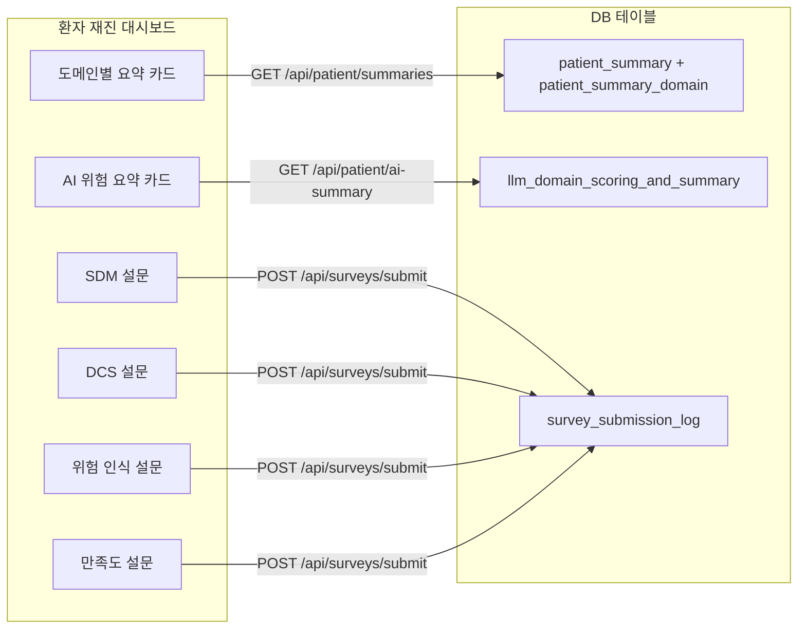

# 미팅 요구사항 → 구현 매핑

> 미팅 일자: 2026-04-16 | 구현 일자: 2026-04-16 ~ 2026-04-17  
> 브랜치: `feat/save-intermediate-results`

---

## 1. 개요

이 문서는 2026-04-16 미팅의 각 요구사항을 실제 코드 변경사항에 매핑합니다.  
각 요구사항에서 ***핵심 구현 포인트***는 <u>밑줄</u>과 **굵은 글씨**로 강조하였습니다.



---

## 2. 요구사항별 구현 매핑

### 요구사항 1: "Guillermo 코드에서 AI result output 확인 필요하고 DB persistency"

> 원문: *"check Guillermo's code, ai result code output, and db persistency"*

**구현 요약:** Guillermo의 `ai_pipeline/` 모듈이 <u>**`ai_pipeline_service.py`를 통해 Docker 안에서 호출**</u>되며, 결과는 <u>**`llm_domain_scoring_and_summary` 테이블에 자동 저장**</u>됩니다.

**상세 구현:**

1. **호출 경로:**  
   `pipeline_runner.py` (Step 9) → <u>**`ai_pipeline_service.run_ai_scoring_and_summary()`**</u> → `ai_pipeline/pipeline.py` → `run_ai_pipeline()`

2. **Guillermo 코드가 생성하는 것** (도메인당):
   - <u>**`ai_score` (0-5)**</u>: GPT-4o가 "의사가 이 도메인의 위험을 얼마나 명확히 전달했는가"를 평가한 점수. **의사 페이지**에서 상담 품질 지표로 표시됨 (`GET /api/doctor/scores/average`, `/scores/trajectory`).
   - **`score_explanation`**: GPT-4o가 점수를 매긴 근거 (chain-of-thought reasoning). 내부 디버깅용.
   - <u>**`extracted_estimate`**</u>: 의사가 말한 구체적 수치 추정값 (예: `"24-25% risk of death"`, `"13 years"`). **의사 페이지**에서 원본 추정값 리뷰용.
   - **`treatment`**: 해당 추정값과 관련된 치료법 (예: `"surgery"`, `"radiation"`, 또는 `NULL`). 부작용 도메인(ed, inc, ius)에서만 값이 있음.
   - <u>**`reformat_sentence`**</u>: GPT-4o가 환자가 이해할 수 있는 언어로 변환한 텍스트. **환자 페이지**에서 AI 요약 카드로 표시됨 (`GET /api/patient/ai-summary/{file}`).

3. **DB 저장 위치:**  
   <u>**`llm_domain_scoring_and_summary` 테이블**</u> — 환자당 5~9행 (도메인당 1~2행)

4. **검증 결과:**  
   SID 10, 14, 15, 18, 33 — **총 33행 저장**, 5명 환자, 5개 도메인 모두 처리 완료



---

### 요구사항 2: "환자 평점(rating) — 변경 필요한 부분"

> 원문: *"there is couple of things we need to change, which is rating from patients"*  
> 원문: *"things for the patient, the review part they are rating"*

**구현 요약:** <u>**`patient_summary_domain.patient_scoring` 컬럼**</u>이 환자의 별점 평가를 저장합니다. 파이프라인에서는 NULL로 초기화되고, <u>**환자가 재진 대시보드에서 직접 입력**</u>합니다.

**상세 구현:**

1. **저장 테이블:** <u>**`patient_summary_domain`**</u>
2. **컬럼:** `patient_scoring` (INT, 0-10)
   - 파이프라인 실행 시: <u>**NULL로 초기화**</u> (아직 환자가 평가하지 않음)
   - 환자가 대시보드에서 별점 클릭 시: <u>**`PUT /api/patient/scoring`**</u> API로 업데이트
3. **프론트엔드:**  
   `PatientFollowUpReportV31Re.tsx` → 각 도메인(cp, le, ed, inc, ius)별로 별점(star rating) UI 표시
4. **INSERT vs UPDATE:**  
   <u>**UPDATE 방식**</u> — "현재 평점"만 중요하므로 이전 값을 덮어씀. 평점 이력은 보존하지 않음.



**각 컬럼의 프론트엔드 사용 현황:**

| 컬럼 | 프론트엔드 사용 | 상세 |
|------|:-:|------|
| `display_order` | ✅ 사용 중 | 환자 페이지에서 도메인 카드 표시 순서 결정 |
| `summary_text` | ✅ 사용 중 | 환자 페이지에서 도메인별 요약 텍스트 표시 |
| <u>**`patient_scoring`**</u> | ✅ 사용 중 | `PatientInitialVisitReportV35.tsx`에서 `updateSingleClassScore()`로 별점 저장. `PUT /api/patient/scoring` |
| <u>**`patient_response`**</u> | ❌ **미사용** | `usePatientData.tsx`에 `updateResponses()` 함수가 **정의는** 되어 있지만, 실제 환자 페이지(`PatientInitialVisitReportV35`, `PatientFollowUpReportV31Re`)에서 **호출하지 않음**. `ApiTestDashboard.tsx`(개발자 테스트 전용)에서만 사용. 즉, **환자가 자유 텍스트 피드백을 입력하는 UI가 아직 구현되지 않은 상태.** |

**중요 구분:** `patient_scoring` ≠ `ai_score`
- <u>**`patient_scoring`**</u> = 환자의 주관적 평가 ("의사가 이 주제를 잘 설명했나?") → **환자 페이지**에서 입력
- <u>**`ai_score`**</u> = GPT-4o의 객관적 문장 관련도 점수 (0-5) → **의사 페이지**에서 표시
- 두 점수는 **서로 다른 테이블, 다른 페이지, 다른 목적**

---

### 요구사항 3: "처리 완료 여부 플래그 추가"

> 원문: *"we also need to flag if it is been processed or not"*  
> 원문: *"add if it is been processed or not"*

**구현 요약:** <u>**`transcript_analysis_log` 테이블에 `processed` (BOOLEAN) + `processed_at` (TIMESTAMP) 컬럼**</u>을 추가했습니다.

**상세 구현:**

1. **Step 8 (NLP 저장 시):**  
   `persistence.py`의 `save_all()` → <u>**`processed=False`**</u>, `processed_at=NULL`로 저장
   
2. **Step 9 (AI 파이프라인 성공 시):**  
   `ai_pipeline_service.py` → <u>**`processed=True`**</u>, <u>**`processed_at=datetime.now(UTC)`**</u>로 UPDATE

3. **Step 9 (AI 파이프라인 실패 시):**  
   `processed=False` **유지** → 나중에 재처리 가능 (non-blocking)

4. **추가 타이밍 컬럼:**  
   <u>**`pipeline_started_at`**</u> = 파이프라인이 이 파일 처리를 시작한 시각  
   이를 통해 전체 소요 시간 계산: `processed_at - pipeline_started_at`

5. **검증 결과:**
   ```
   SID 10: processed=True, pipeline_started_at=05:26:14, processed_at=05:29:28 (3분14초)
   SID 14: processed=True, pipeline_started_at=05:29:28, processed_at=05:32:40 (3분12초)
   SID 15: processed=True, pipeline_started_at=05:32:40, processed_at=05:35:32 (2분52초)
   SID 18: processed=True, pipeline_started_at=05:35:32, processed_at=05:38:36 (3분04초)
   SID 33: processed=True, pipeline_started_at=05:38:36, processed_at=05:41:43 (3분07초)
   ```
   **5명 환자 모두 `processed=True`** 확인

---

### 요구사항 4: "main_complete_pipeline.py 실행하여 출력 이해"

> 원문: *"run main_complete_pipeline.py and understand what is here (maybe the ai result variable in the Guillermo code)"*

**구현 요약:** <u>**SID 15 파일로 `main_complete_pipeline.py`를 로컬에서 실행**</u>하여 Step 0~9 전체 출력을 확인했습니다. 각 Step의 DataFrame 행 수, 컬럼, 샘플 데이터를 디버그 로그로 출력하도록 코드를 수정했습니다.

**상세 구현:**

1. **실행 환경:** conda `prostate_cancer_py_3.10`, NLP Docker 프록시 (`localhost:9999`), Azure OpenAI
2. **테스트 브랜치:** `test/complete-pipeline` (AI_physician_patient_communication 레포, 커밋 `582e046`)
3. **코드 수정:**  
   `main_complete_pipeline.py`에 <u>**각 Step 후 DataFrame 상세 로그 출력**</u> 추가 (행 수, 컬럼, 샘플)  
   `Path()` 래핑 에러 수정 (line 83: `config.output_path / patient_id` → `Path(config.output_path) / patient_id`)
4. **실행 결과 (SID 15):**
   ```
   Step 0:   29 rows   (원본 파일)
   Step 1:   14 rows   (의사 발화만 필터링)
   Step 2:  122 rows   (R stringi 문장 분리)
   Step 3:  122 rows   (NLP 5모델 점수 추가)
   Step 4:   10 × 5    (도메인별 Top-K 선택)
   Step 5:   10 × 5    (context 추가)
   Step 6-9: 5 domains (AI pipeline — Scoring, Extraction, Filtering, Selection, Reformat)
   ```
5. **26개 출력 파일** 생성:
   ```
   data/output_test/SID_15/
   ├── segmented_sentences.csv      (Step 2: 122개 문장)
   ├── predictions_long.csv         (Step 3: 122 × 5개 모델 점수)
   ├── top10_by_outcome.xlsx        (Step 4: 도메인당 10개)
   ├── top10_with_context.xlsx      (Step 5: 10개 + context)
   ├── {domain}_extraction.csv      (Step 7: 추출된 추정값)
   ├── {domain}_filtering.csv       (Step 8: 필터링된 후보)
   ├── {domain}_result.csv          (Step 9: 최종 선택 + reformat)
   └── {domain}.xlsx                (도메인별 통합)
   ```

---

### 요구사항 5: "무엇을 저장하고 어디로 가는지 확인"

> 원문: *"we need the result and check what needs to be saved and where does it go"*  
> 원문: *"you will see what is the thing that are going to patient and to doctor"*  
> 원문: *"for doctor, i think we do not save anything"*

**구현 요약:** <u>**환자에게 가는 데이터**</u>와 <u>**의사에게 가는 데이터**</u>를 명확히 분리했습니다. **의사는 저장하지 않음** (읽기 전용).

**환자에게 가는 것:**

| 데이터 | 테이블 | 컬럼 | API | 설명 |
|--------|--------|------|-----|------|
| <u>**AI 위험 요약**</u> | `llm_domain_scoring_and_summary` | <u>**`reformat_sentence`**</u> | `GET /api/patient/ai-summary/{file}` | GPT-4o가 환자 친화적 언어로 변환한 텍스트. 예: *"Your doctor noted that your risk of dying of prostate cancer is 24-25%."* |
| <u>**환자 평점**</u> | `patient_summary_domain` | <u>**`patient_scoring`**</u> | `PUT /api/patient/scoring` | 환자가 재진 시 직접 입력하는 0-10 별점 |
| 환자 응답 | `patient_summary_domain` | `patient_response` | `PUT /api/patient/responses` | ⚠️ **API는 존재하지만 환자 페이지 UI 미구현** — 자유 텍스트 입력 화면이 아직 없음 |

**의사에게 가는 것 (읽기 전용):**

| 데이터 | 테이블 | 컬럼 | API | 설명 |
|--------|--------|------|-----|------|
| <u>**AI 품질 점수**</u> | `llm_domain_scoring_and_summary` | <u>**`ai_score`**</u> | `GET /api/doctor/scores/average` | GPT-4o의 0-5 점수. 의사 대시보드에 상담 품질 지표로 표시 |
| 상위 문장 | `doctor_sentence_view` | `sentence`, `class` | `GET /api/doctor/sentences/{file}/{speaker}` | NLP Top-10 문장 |
| <u>**점수 궤적**</u> | `llm_domain_scoring_and_summary` | <u>**`ai_score`**</u> | `GET /api/doctor/scores/trajectory` | 시간에 따른 상담 품질 변화 추이 |

**의사는 저장하지 않음** — 의사 뷰는 <u>**읽기 전용(read-only)**</u>. 의사가 문장을 rewrite하면 `doctor_rewrite_log`에 저장되지만 이것은 **대시보드 UI에서 발생**하며 파이프라인과 무관합니다.

---

### 요구사항 6: "Persistence 모듈 생성 — 키는 patient_id"

> 원문: *"create module of persistency, and then call that module there and save those things to the db"*  
> 원문: *"key should be patient id"*

**구현 요약:** <u>**`persistence.py`의 `save_all()` 함수**</u>가 모든 DB 저장을 <u>**단일 트랜잭션**</u>으로 처리합니다. 키는 <u>**`patient_id`**</u>.

**상세 구현:**

1. **모듈:** <u>**`persistence.py`**</u> — `save_all()` 함수 1개로 모든 DB 쓰기 담당
2. **호출:** `pipeline_runner.py` Step 8에서 <u>**`persistence.save_all(Session, ...)`**</u> 한 줄로 호출
3. **키:** `transcript_analysis_log.patient_id` (예: `SID_10`)
4. **트랜잭션:** <u>**단일 트랜잭션 — 모든 테이블에 성공하거나 모두 롤백**</u>
5. **저장하는 테이블 (한 번의 호출로):**

| 순서 | 테이블 | 행 수 | 내용 |
|:----:|--------|:-----:|------|
| 1 | <u>**`transcript_analysis_log`**</u> | 1 | 분석 실행 기록 |
| 2 | <u>**`sentence_prediction`**</u> | 50 | NLP 문장별 예측 |
| 3 | `doctor_sentence_view` | ~47 | 의사 대시보드용 문장 |
| 4 | `patient_summary` | 1 | 환자 요약 기본 행 |
| 5 | <u>**`patient_summary_domain`**</u> | 5 | 도메인별 환자 데이터 |

*AI Pipeline (Step 9) 완료 후 추가 저장:*

| 순서 | 테이블 | 행 수 | 내용 |
|:----:|--------|:-----:|------|
| 6 | <u>**`llm_domain_scoring_and_summary`**</u> | 5~9 | GPT-4o AI 결과 |

**각 테이블의 존재 목적 (실제 데이터 기준: 5명 환자 처리 완료):**

---

**테이블 1: `transcript_analysis_log` (현재 5행)**

> **존재 목적:** 파이프라인이 **"이 환자를 처리했다"는 사실 자체**를 기록하는 테이블. 
> 
> 비유하면 병원의 **접수 대장**. 환자가 왔는지, 언제 왔는지, 검사가 끝났는지를 기록. 실제 검사 결과(문장, 점수)는 다른 테이블에 있지만, "검사를 했는가/안 했는가"는 여기서 확인.
>
> **이 테이블이 없으면:** 파이프라인을 다시 돌릴 때 이미 처리된 파일을 또 처리하게 됨 (중복). xlsx 파일이 디스크에서 삭제되면 결과를 복구할 수 없음. AI pipeline이 실패한 환자를 찾을 수 없음.

| 사용처 | 코드 | 역할 |
|--------|------|------|
| 파이프라인 중복 방지 | `persistence.file_already_processed()` | 이미 처리된 파일은 `[SKIP]`으로 건너뜀. 이 테이블의 `source_filename`을 확인. |
| xlsx 다운로드 fallback | `routes_transcript.py` → `GET /api/transcript/download/{patient_id}` | 디스크에서 xlsx 파일이 삭제되었을 때, `xlsx_data` (BYTEA) 컬럼에서 복구. |
| 분석 이력 조회 | `routes_transcript.py` → `GET /api/transcript/history/{patient_id}` | 환자별 분석 실행 이력 표시. |
| AI Pipeline FK | `llm_domain_scoring_and_summary.analysis_id` → 이 테이블의 `id` | AI 결과가 어떤 분석 실행에 속하는지 연결. |
| <u>**처리 완료 추적**</u> | `processed` + `processed_at` 컬럼 | `processed=False`인 행 조회 → **AI pipeline 재처리 대상** 파악. |

---

**테이블 2: `sentence_prediction` (현재 250행 = 5환자 × 50문장)**

> **존재 목적:** NLP 모델이 **"이 문장이 이 도메인과 얼마나 관련있는가"를 판단한 결과**를 저장하는 테이블.
>
> 비유하면 **시험 채점표**. 122개 문장(학생) 중 각 도메인(과목)에서 상위 10개를 선별하고, 각각의 확률 점수(.pred_1)를 기록. 이 점수가 높을수록 "이 문장이 해당 도메인과 관련있다"는 NLP 모델의 확신이 높은 것.
>
> **이 테이블이 없으면:** 환자 페이지에서 "의사가 이런 말을 했습니다"라는 근거 문장을 보여줄 수 없음. AI pipeline(Step 9)에 입력할 Top-10 문장을 DB에서 재조회할 수 없음.

| 사용처 | 코드 | 역할 |
|--------|------|------|
| 환자 페이지 — 근거 문장 | `routes_patient.py` → `GET /api/patient/sentences/{file}` | 환자에게 "의사가 이런 말을 했습니다" 근거 문장 표시. `pred_score` (NLP 확률)로 정렬. |
| 분석 결과 재구성 | `routes_transcript.py` | 분석 기록에서 어떤 문장이 선택되었는지 조회. |

---

**테이블 3: `doctor_sentence_view` (현재 221행)**

> **존재 목적:** 의사가 대시보드에서 **리뷰하고 수정(rewrite)할 문장 목록**을 저장하는 테이블.
>
> `sentence_prediction`과 다른 이유: `sentence_prediction`은 **도메인별** 데이터 (같은 문장이 cp, le 두 도메인에 Top-10으로 선택되면 2행). 반면 `doctor_sentence_view`는 **문장별** 데이터 (같은 문장은 1행, 대표 도메인 1개만). 의사에게 같은 문장을 2번 보여줄 필요가 없기 때문.
>
> **이 테이블이 없으면:** 의사 대시보드에서 문장 목록을 보여줄 수 없음. 의사가 문장을 rewrite할 때 대상 문장을 식별할 수 없음 (`doctor_rewrite_log`가 이 테이블의 `(file, i, i2)`를 FK로 참조).

| 사용처 | 코드 | 역할 |
|--------|------|------|
| <u>**의사 대시보드 — 문장 목록**</u> | `routes_doctor.py` → `GET /api/doctor/sentences/{file}/{speaker}` | 의사가 리뷰할 문장 목록. 도메인(`class`) + 문장(`sentence`) + 점수(`score`). |
| 의사 대시보드 — 파일 목록 | `routes_doctor.py` → `GET /api/doctor/files` | 처리된 환자 파일 목록. 이 테이블에 파일이 있으면 "처리됨". |
| 의사 rewrite 대상 | `routes_doctor.py` → `PUT /api/doctor/rewrites` | 의사가 문장을 수정(rewrite)할 때, 이 테이블의 `(file, i, i2)`가 대상 식별자. |

---

**테이블 4: `patient_summary` (현재 5행)**

> **존재 목적:** **"이 환자에 대한 요약이 존재한다"는 사실**을 기록하는 부모 테이블.
>
> `patient_summary_domain` (5개 도메인)의 부모 역할. DB 설계 원칙상 1:N 관계에서 "1" 쪽 테이블이 필요. 이 테이블이 있어야 `patient_summary_domain`의 FK(`file`, `speaker`)가 참조할 대상이 존재하고, CASCADE 삭제(환자 삭제 시 도메인 데이터도 삭제)가 가능.
>
> **이 테이블이 없으면:** `patient_summary_domain`의 FK 무결성이 깨짐. 환자 페이지에서 "이 환자의 요약이 있는가?"를 판단할 수 없음 (`routes_patient.py`가 이 테이블 존재 여부로 확인).

| 사용처 | 코드 | 역할 |
|--------|------|------|
| 환자 페이지 — 요약 조회 | `routes_patient.py` → `GET /api/patient/summaries/{file}/{speaker}` | `patient_summary` + `patient_summary_domain` JOIN하여 5개 도메인 요약 반환. |
| FK 부모 | `patient_summary_domain`의 `(file, speaker)` → 이 테이블의 PK | CASCADE 삭제: 환자 삭제 시 도메인 데이터도 삭제. |

---

**테이블 5: `patient_summary_domain` (현재 25행 = 5환자 × 5도메인)**

> **존재 목적:** 환자가 대시보드에서 **도메인별로 피드백(별점, 텍스트)을 입력**하면 저장되는 테이블. 파이프라인이 초기값(NULL)을 만들고, 환자가 나중에 채움.
>
> 비유하면 **환자 설문지**. 파이프라인이 5개 도메인(암 예후, 기대수명, 발기부전, 요실금, 배뇨증상)에 대한 빈 설문지를 만들고, 환자가 재진 시 각 도메인에 별점을 매김. 이 별점은 `ai_score`(GPT-4o 점수, 의사 페이지)와 완전히 별개 — 환자의 주관적 평가.
>
> **이 테이블이 없으면:** 환자가 "의사가 이 주제를 잘 설명했나?" 별점을 저장할 곳이 없음. 도메인별 요약 텍스트를 표시할 수 없음.

| 사용처 | 코드 | 역할 |
|--------|------|------|
| 환자 페이지 — 도메인별 요약 | `routes_patient.py` → `GET /api/patient/summaries/{file}/{speaker}` | `summary_text` (도메인별 텍스트) 표시. |
| <u>**환자 별점 저장**</u> | `routes_patient.py` → `PUT /api/patient/scoring` | `patient_scoring` (0-10) UPDATE. `PatientInitialVisitReportV35.tsx`에서 호출. |
| 환자 응답 저장 | `routes_patient.py` → `PUT /api/patient/responses` | `patient_response` UPDATE. ⚠️ **UI 미구현** — API만 존재. |

---

**테이블 6: `llm_domain_scoring_and_summary` (현재 33행)**

> **존재 목적:** GPT-4o가 **"의사가 위험을 얼마나 구체적으로 전달했는가"를 평가한 결과**를 저장하는 테이블.
>
> `sentence_prediction`(NLP)과의 차이: NLP는 "이 문장이 해당 도메인과 관련있는가?"를 0~1 확률로 판단. 반면 이 테이블의 AI 결과는 "관련있다고 판단된 문장에서, 의사가 **얼마나 구체적으로** 위험 수치를 전달했는가?"를 0~5로 평가. 예: "암 위험이 있습니다" = 점수 1 (모호), "24% 확률로 사망, 치료 시 6%로 감소" = 점수 5 (매우 구체적).
>
> 추가로 GPT-4o가 원문에서 수치를 추출(`extracted_estimate`)하고, 환자가 이해할 수 있는 언어로 변환(`reformat_sentence`)한 결과도 함께 저장.
>
> **이 테이블이 없으면:** 의사 대시보드에서 상담 품질 점수(ai_score)를 표시할 수 없음. 환자 페이지에서 AI 요약 카드(reformat_sentence)를 보여줄 수 없음. 미팅에서 요청한 "rating for the sentence"를 저장할 곳이 없음.

| 사용처 | 코드 | 역할 |
|--------|------|------|
| <u>**의사 페이지 — 상담 품질 점수**</u> | `routes_doctor.py` → `GET /api/doctor/scores/average` | `ai_score` (0-5)의 도메인별/전체 평균. 의사 대시보드 메인 지표. |
| 의사 페이지 — 점수 궤적 | `routes_doctor.py` → `GET /api/doctor/scores/trajectory` | 시간에 따른 `ai_score` 변화 그래프. |
| <u>**환자 페이지 — AI 요약 카드**</u> | `routes_patient.py` → `GET /api/patient/ai-summary/{file}` | `reformat_sentence`를 환자에게 AI 요약 카드로 표시. |
| 의사 AI rewrite | `routes_doctor.py` → `POST /api/doctor/ai-rewrite` | `source_sentence` + `source_context`를 GPT-4o에 보내 문장 개선 제안. |

---

### 요구사항 7: "AI summary가 아니라 다른 이름 (AI reformat)"

> 원문: *"make sure that you have the rating for the sentence, they call it now something different, it is not the ai summary (i think it is ai reformat?)"*  
> 원문: *"check the right language on the video"*

**구현 요약:** <u>**"AI summary"라는 용어가 `reformat_sentence`로 변경**</u>되었습니다. 이것은 `llm_domain_scoring_and_summary` 테이블의 컬럼명입니다.

**상세 구현:**

1. **이전 용어:** "AI summary"
2. **새 용어:** <u>**`reformat_sentence`**</u>
3. **생성 과정:**  
   `ai_pipeline/reformat.py` → GPT-4o가 <u>**Selection에서 선택된 1개 추정값을 환자가 이해할 수 있는 언어로 변환**</u>
4. **실제 예시:**
   - 입력 (의사 원문): `"the chances of you dying from this prostate cancer is coming out at about 24 percent"`
   - GPT-4o Extraction: `"24% risk of death without treatment"`
   - <u>**GPT-4o Reformat**</u>: `"Your doctor noted that your risk of dying of prostate cancer is 24-25%. With treatment, this risk decreases to 6%."`
5. **프론트엔드에서의 사용:**  
   `PatientInitialVisitReportV35.tsx`와 `PatientFollowUpReportV31Re.tsx`가 <u>**`GET /api/patient/ai-summary/{file}`**</u> API를 호출하면, `routes_patient.py`가 `llm_domain_scoring_and_summary.reformat_sentence`를 반환하고, 프론트엔드가 이것을 **환자용 AI 요약 카드**로 표시합니다.

---

### 요구사항 8: "테이블: id, sentence, domain, rating, processed flag"

> 원문: *"Basically the table is the id, sentence, and then the domain, and then the rating, and then the flag to show processed or not. So basically we are doing the ground work. This is the saving step."*

**구현 요약:** 미팅에서 요청한 5개 필드가 <u>**두 테이블에 걸쳐 구현**</u>되었습니다.

**미팅 요구사항과 실제 구현의 매핑:**

| 미팅에서 요청한 것 | 실제 구현 위치 | 컬럼 | 설명 |
|------------------|-------------|------|------|
| <u>**id**</u> | `transcript_analysis_log` | <u>**`id`**</u> (SERIAL PK) | 환자별 분석 실행 고유 ID |
| <u>**sentence**</u> | `llm_domain_scoring_and_summary` | <u>**`source_sentence`**</u> (TEXT) | AI가 평가한 원본 문장 |
| <u>**domain**</u> | `llm_domain_scoring_and_summary` | <u>**`domain`**</u> (VARCHAR) | cp, le, ed, inc, ius |
| <u>**rating**</u> | `llm_domain_scoring_and_summary` | <u>**`ai_score`**</u> (INT, 0-5) | GPT-4o의 문장 관련도 점수 |
| <u>**processed flag**</u> | `transcript_analysis_log` | <u>**`processed`**</u> (BOOLEAN) | True = NLP + AI 완료 |

**왜 두 테이블로 나누었는가:**

미팅에서는 하나의 테이블을 요청했지만, 실제로는 <u>**데이터의 단위(granularity)가 다르기 때문에**</u> 두 테이블로 분리했습니다:

| 판단 근거 | `transcript_analysis_log` | `llm_domain_scoring_and_summary` |
|----------|--------------------------|----------------------------------|
| **데이터 단위** | <u>**환자 단위**</u> (1 patient = 1 row) | <u>**도메인 단위**</u> (1 patient × 5 domains = 5+ rows) |
| **여기에 넣은 이유** | `processed` flag는 **환자 전체**에 대한 상태이므로 환자 단위 테이블에 속함. 도메인별로 processed를 따로 추적할 필요 없음 (전체가 한 번에 처리됨). | `ai_score`, `source_sentence`, `reformat_sentence`는 **도메인별**로 다른 값을 가지므로 도메인 단위 테이블에 속함. cp의 점수와 le의 점수는 다름. |
| **만약 하나로 합치면** | `processed` flag가 5번 중복 저장됨 (비효율) | 환자별 메타데이터(`pipeline_started_at` 등)가 5번 중복됨 |

**각 컬럼이 왜 이 테이블에 추가되었는가 (미팅 요구사항 → 컬럼):**

**`transcript_analysis_log` 테이블 — 새로 추가된 컬럼 3개:**

| 컬럼 | 미팅 요구사항 | 왜 이 테이블에 추가했는가 |
|------|-------------|----------------------|
| <u>**`pipeline_started_at`**</u> | *"we need to flag if it is been processed or not"* — 처리 시간을 추적하려면 시작 시각이 필요. | 이 테이블이 이미 **파이프라인 실행 기록**을 저장하는 테이블(`analyzed_at` 존재). 시작 시각도 같은 곳에 기록하는 것이 자연스러움. `analyzed_at`(NLP 저장 시각)과 함께 NLP 소요 시간 = `analyzed_at - pipeline_started_at`으로 계산 가능. |
| <u>**`processed`**</u> | *"we also need to flag if it is been processed or not"* — 미팅에서 직접 요청. | 이 테이블이 이미 **환자별 분석 실행 1건 = 1행**이므로, "이 분석이 완료되었는가?"를 여기에 기록하는 것이 가장 직관적. 다른 테이블에 넣으면 JOIN이 필요해져 복잡해짐. `processed=False`인 행을 조회하면 **재처리 대상**을 바로 찾을 수 있음. |
| <u>**`processed_at`**</u> | *"flag if it is been processed or not"* — flag만으로는 "언제 완료되었는가"를 알 수 없으므로 시각도 추가. | `pipeline_started_at`과 함께 **전체 소요 시간** = `processed_at - pipeline_started_at`으로 계산. 성능 모니터링에 필요. |

> 참고: `ai_overall_score` (FLOAT)도 이 테이블에 있는데, 이것은 5개 도메인 `ai_score`의 평균으로 **환자 전체 상담 품질**을 한 숫자로 요약한 것. AI pipeline 완료 시 `processed=True`와 함께 설정됨.

**`llm_domain_scoring_and_summary` 테이블 — Guillermo 코드에서 생성되는 컬럼들:**

| 컬럼 | 미팅 요구사항 | 왜 이 테이블에 있는가 |
|------|-------------|-------------------|
| <u>**`ai_score`**</u> | *"the rating"*, *"make sure that you have the rating for the sentence"* | 미팅에서 요청한 "rating". GPT-4o가 **도메인별로** 다른 점수를 매기므로 (cp=3, le=5 등) 도메인 단위 테이블에 저장. `ai_pipeline/scoring.py`의 `run_scoring()` → `pred["score"]`에서 추출. 의사 페이지에서 표시. |
| <u>**`score_explanation`**</u> | *"check Guillermo's code"* — Guillermo의 AI pipeline이 생성하는 부산물. | GPT-4o가 `ai_score`를 매길 때 "왜 이 점수인가"를 단계별로 설명한 텍스트. `ai_pipeline/prompts/scoring/cp.py`의 시스템 프롬프트가 "Step 1 → Step 2 → Step 3 → Step 4" 단계별 평가를 지시하고, GPT-4o가 이 과정을 `explanation` 필드로 반환. `scoring.py` line 40에서 `pred["explanation"]`으로 추출. |
| <u>**`extracted_estimate`**</u> | *"we need the result and check what needs to be saved"* | Guillermo의 AI pipeline Step 7 (Extraction)에서 의사가 말한 구체적 수치를 추출한 것. 도메인마다 다른 종류의 추정값 (cp="24% 사망 위험", le="14년", ed="10-20% ED"). `ai_pipeline/extraction.py`에서 생성. |
| <u>**`treatment`**</u> | *"what is the thing that are going to patient and to doctor"* | 부작용 도메인(ed, inc, ius)에서 어떤 치료법과 관련된 위험인지 표시 ("surgery", "radiation"). cp/le에는 해당 없음 (NULL). `ai_pipeline/extraction.py`에서 함께 추출. |
| <u>**`source_sentence`**</u> | *"the sentence"*, *"Basically the table is the id, sentence, and then the domain"* | 미팅에서 요청한 "sentence". AI가 최종 선택한 1개 원본 문장. `ai_pipeline/selection.py`에서 결정. |
| <u>**`reformat_sentence`**</u> | *"it is not the ai summary (i think it is ai reformat?)"* | 미팅에서 용어 확인 요청한 "AI reformat". GPT-4o가 `source_sentence`를 환자가 이해할 수 있는 언어로 변환한 텍스트. `ai_pipeline/reformat.py`에서 생성. 환자 페이지에서 AI 요약 카드로 표시. |
| <u>**`source_context`**</u> | *"understand that output"* — 출력 이해를 위해 문맥도 함께 저장. | AI가 점수를 매길 때 참고한 주변 ±3 문장. `<main>` 태그로 감싼 형태. 디버깅 및 결과 검증에 필요. |

**`patient_summary_domain` 테이블 — 기존 컬럼 (새로 추가한 것 아님):**

| 컬럼 | 미팅 요구사항 | 왜 이 테이블에 있는가 |
|------|-------------|-------------------|
| <u>**`patient_scoring`**</u> | *"rating from patients"*, *"the review part they are rating"* | 미팅에서 요청한 환자 평점. **환자가 직접 입력**하는 것이므로 파이프라인 결과(`llm_domain_scoring_and_summary`)와 분리. `PatientInitialVisitReportV35.tsx`에서 `updateSingleClassScore()`로 호출 → `PUT /api/patient/scoring`으로 UPDATE. |
| `patient_response` | *"things for the patient, the review part"* | 도메인별 자유 텍스트 피드백. ⚠️ **DB 컬럼 + API(`PUT /api/patient/responses`) + hook 함수(`updateResponses`)는 존재하지만, 실제 환자 페이지 UI가 미구현.** `ApiTestDashboard.tsx`(개발자 테스트용)에서만 호출됨. |

이 두 테이블은 <u>**`analysis_id` (FK)**</u>로 연결됩니다:



---

## 3. 프론트엔드 화면 ↔ DB 테이블 관계

아래는 사용자가 **브라우저에서 실제로 보는 것**이 **어떤 테이블에서** 오는지를 보여줍니다.

### 의사 페이지 (`PhysicianReportsModifiedV41Timothy.tsx`)



| 화면에 보이는 것 | DB 테이블 | 컬럼 | API |
|----------------|----------|------|-----|
| 환자 파일 목록 | `doctor_sentence_view` | `file` (DISTINCT) | `GET /api/doctor/files` |
| 도메인별 문장 목록 | `doctor_sentence_view` | `sentence`, `class`, `i`, `i2` | `GET /api/doctor/sentences/{file}/{speaker}` |
| <u>**상담 품질 점수 (0-5)**</u> | `llm_domain_scoring_and_summary` | <u>**`ai_score`**</u> | `GET /api/doctor/scores/average` |
| 점수 변화 궤적 | `llm_domain_scoring_and_summary` | `ai_score` (시간순) | `GET /api/doctor/scores/trajectory` |
| 도메인별 점수 요약 | `llm_domain_scoring_and_summary` | `ai_score` + `doctor_sentence_view.score` | `GET /api/doctor/scores/summary/{file}` |
| AI Rewrite 제안 | `llm_domain_scoring_and_summary` | `source_sentence`, `source_context` → GPT-4o 호출 | `POST /api/doctor/ai-rewrite` |
| 의사가 수정한 이력 | `doctor_rewrite_log` | `original_sentence`, `revised_sentence`, `score` | `GET /api/doctor/rewrites` |

---

### 환자 초진 페이지 (`PatientInitialVisitReportV35.tsx`)



| 화면에 보이는 것 | DB 테이블 | 컬럼 | API |
|----------------|----------|------|-----|
| 도메인별 요약 텍스트 | `patient_summary_domain` | `summary_text`, `display_order` | `GET /api/patient/summaries/{file}/{speaker}` |
| <u>**AI 위험 요약 카드**</u> (GPT-4o) | `llm_domain_scoring_and_summary` | <u>**`reformat_sentence`**</u> | `GET /api/patient/ai-summary/{file}` |
| 근거 문장 (의사가 한 말) | `doctor_sentence_view` | `sentence`, `class` (Top-7) | `GET /api/patient/sentences/{file}` |
| <u>**환자 별점 (0-10)**</u> | `patient_summary_domain` | <u>**`patient_scoring`**</u> | `PUT /api/patient/scoring` |

**AI 위험 요약 카드 예시** (실제 DB 데이터):
> *"Your doctor noted that, without treatment, your risk of dying of cancer is 24–25%. With treatment, this risk decreases to 6%."*  
> ← `llm_domain_scoring_and_summary.reformat_sentence` (cp 도메인, SID 10)

---

### 환자 재진 페이지 (`PatientFollowUpReportV31Re.tsx`)



| 화면에 보이는 것 | DB 테이블 | 컬럼 | API |
|----------------|----------|------|-----|
| 도메인별 요약 텍스트 | `patient_summary_domain` | `summary_text` | `GET /api/patient/summaries/{file}/{speaker}` |
| <u>**AI 위험 요약 카드**</u> | `llm_domain_scoring_and_summary` | <u>**`reformat_sentence`**</u> | `GET /api/patient/ai-summary/{file}` |
| SDM 설문 제출 | `survey_submission_log` | `answers` (JSONB), `survey_type='sdm'` | `POST /api/surveys/submit` |
| DCS 설문 제출 | `survey_submission_log` | `answers` (JSONB), `survey_type='dcs'` | `POST /api/surveys/submit` |
| 위험 인식 설문 | `survey_submission_log` | `answers`, `survey_type='risk_perception'` | `POST /api/surveys/submit` |
| 만족도 설문 | `survey_submission_log` | `answers`, `survey_type='satisfaction'` | `POST /api/surveys/submit` |
| 이전 설문 복원 | `survey_submission_log` | `answers` (기존 제출 조회) | `GET /api/surveys/by-speaker/{speaker}` |

**설문 → REDCap 동기화 흐름:**
```
환자가 설문 제출 → survey_submission_log INSERT (redcap_synced=False)
  → 백그라운드 REDCap API 호출
  → 성공: redcap_synced=True, redcap_record_id 저장
  → 실패: redcap_synced=False, redcap_error에 에러 기록
```

---

### 전체 요약: 테이블별 프론트엔드 사용처

| DB 테이블 | 의사 페이지 | 환자 초진 | 환자 재진 |
|----------|:---:|:---:|:---:|
| `transcript_analysis_log` | — | — | — |
| `sentence_prediction` | — | 근거 문장 | — |
| <u>**`doctor_sentence_view`**</u> | **문장 목록, 파일 목록** | 근거 문장 | — |
| `doctor_rewrite_log` | Rewrite 이력 | — | — |
| `patient_summary` | — | FK 부모 | FK 부모 |
| <u>**`patient_summary_domain`**</u> | — | **요약 + 별점** | 요약 |
| `survey_submission_log` | — | — | **설문 4종** |
| <u>**`llm_domain_scoring_and_summary`**</u> | **품질 점수, 궤적** | **AI 요약 카드** | **AI 요약 카드** |

> 참고: `transcript_analysis_log`는 프론트엔드에 직접 표시되지 않지만, **파이프라인 관리** (중복 방지, xlsx 다운로드, processed 추적)에 사용됩니다.

---

## 4. 파이프라인 타이밍 (검증 완료)

```
SID 10: pipeline_started_at=05:26:14 → analyzed_at=05:26:30 → processed_at=05:29:28 (3분14초)
SID 14: pipeline_started_at=05:29:28 → analyzed_at=05:29:39 → processed_at=05:32:40 (3분12초)
SID 15: pipeline_started_at=05:32:40 → analyzed_at=05:32:46 → processed_at=05:35:32 (2분52초)
SID 18: pipeline_started_at=05:35:32 → analyzed_at=05:35:41 → processed_at=05:38:36 (3분04초)
SID 33: pipeline_started_at=05:38:36 → analyzed_at=05:38:46 → processed_at=05:41:43 (3분07초)
```

**5명 환자 모두: `processed=True`**

---

## 4. 변경된 파일

| 파일 | 변경 내용 |
|------|----------|
| <u>**`pipeline_runner.py`**</u> | `transcript_service`를 `sentence_classification` (R stringi)으로 교체. `pipeline_started_at` 기록, 중간 결과 파일 저장 (step0-step5) 추가. |
| <u>**`persistence.py`**</u> | 초기 저장 시 `pipeline_started_at` + `processed=False` 추가. |
| <u>**`ai_pipeline_service.py`**</u> | AI 성공 시 `processed=True` + `processed_at` 설정. Azure 타임아웃 30분으로 증가. |
| <u>**`models.py`**</u> | `TranscriptAnalysisLog`에 `pipeline_started_at`, `processed`, `processed_at` 추가. 프론트엔드 사용 주석 추가. |
| <u>**`database_schema.sql`**</u> | `transcript_analysis_log` CREATE TABLE에 3개 새 컬럼 추가. |
| <u>**`docker-compose.yml`**</u> | `sentence_classification/` 볼륨 마운트 추가. `start_period` 2400초로 확장. |
| <u>**`Dockerfile`**</u> | R + stringi 1.8.4 (번들 ICU 74.1) + rpy2 설치. prestart에 ICU 버전 검증 추가. |
| `routes_transcript.py` | `transcript_service.analyze_transcript`를 `sentence_classification` 기반으로 교체. |
| `transcript_service.py` | `archive/`로 이동 (더 이상 사용 안 함). |

---

## 5. 잔여 작업

| 항목 | 상태 | 비고 |
|------|:----:|------|
| 처리 완료 플래그 | **완료** | `transcript_analysis_log.processed` + `processed_at` |
| 환자 평점 | **존재** | `patient_summary_domain.patient_scoring` (환자가 대시보드에서 입력) |
| AI reformat | **완료** | `llm_domain_scoring_and_summary.reformat_sentence` |
| 의사 읽기 전용 | **확인** | 의사 뷰는 저장 안 함 — DB에서 읽기만 |
| 통합 테스트 | **다음 주** | End-to-end: 입력 → 파이프라인 → DB → 대시보드 표시 |
| 설문 변경 | **보류** | 미팅 결정에 따라 — 변경 확정 전까지 미착수 |
