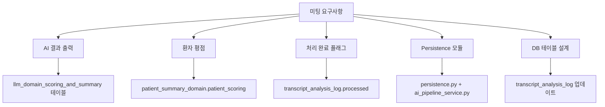
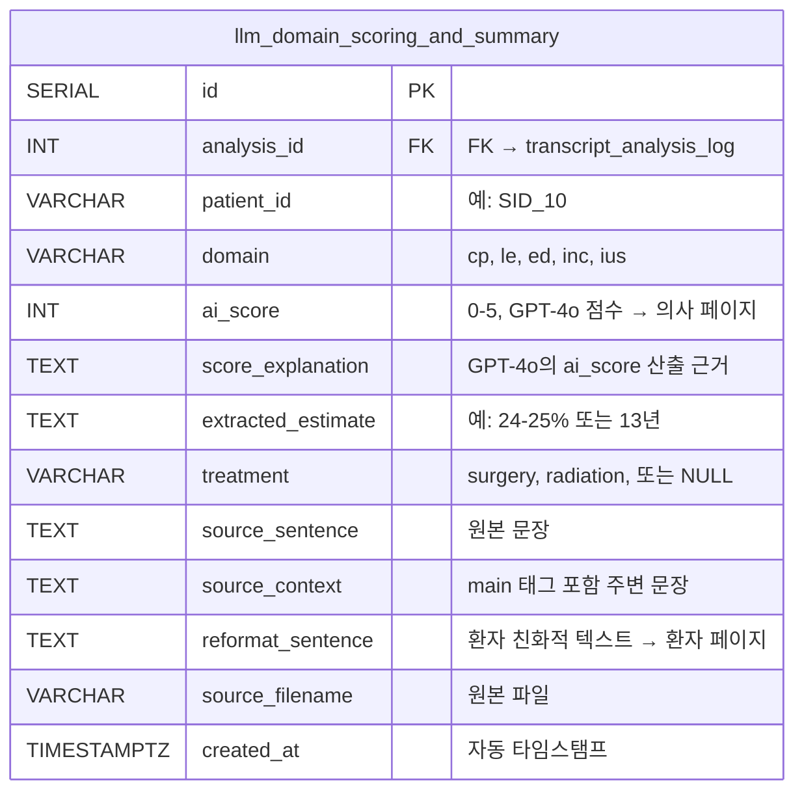
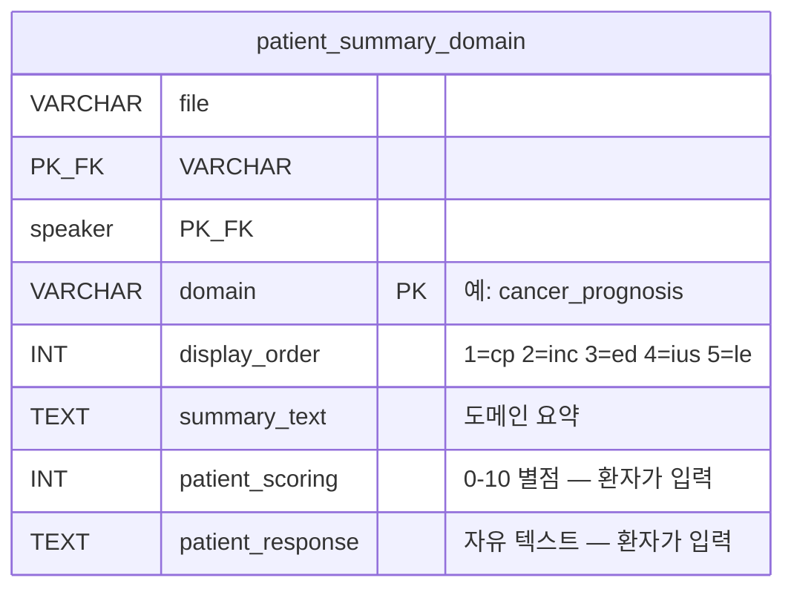
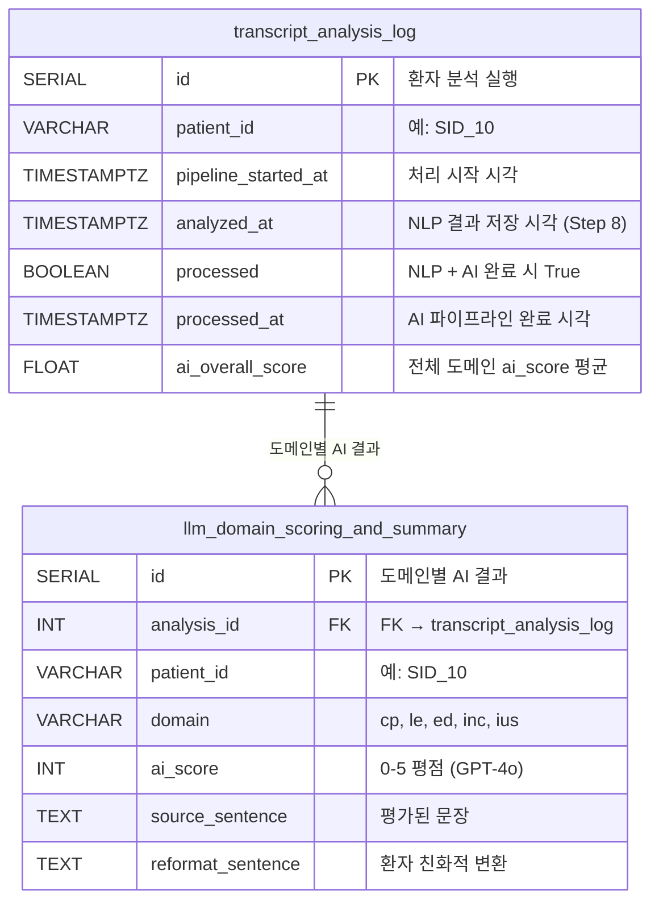

# 미팅 요구사항 → 구현 매핑

> 미팅 일자: 2026-04-16 | 구현 일자: 2026-04-16 ~ 2026-04-17  
> 브랜치: `feat/save-intermediate-results`

---

## 1. 개요

이 문서는 2026-04-16 미팅의 각 요구사항을 실제 코드 변경사항에 매핑합니다.



---

## 2. 요구사항별 구현 매핑

### 요구사항 1: "AI result output — Guillermo 코드 확인"

| 항목 | 구현 내용 |
|------|----------|
| **위치** | `ai_pipeline_service.py` → `ai_pipeline/pipeline.py` (Guillermo 코드) 호출 |
| **생성하는 것** | 도메인별: `ai_score` (0-5), `score_explanation`, `extracted_estimate`, `treatment`, `reformat_sentence` |
| **저장 위치** | `llm_domain_scoring_and_summary` 테이블 (환자당 5-9행) |
| **검증** | SID 10, 14, 15, 18, 33 — 모든 도메인 처리 및 저장 완료 |



**프론트엔드 사용:**
- `ai_score` → **의사 페이지**: 상담 품질 지표 (scores/average, scores/trajectory)
- `reformat_sentence` → **환자 페이지**: AI 생성 위험 요약 카드
- `extracted_estimate` → **의사 페이지**: 원본 위험 추정값 리뷰용

---

### 요구사항 2: "환자 평점 — 변경 필요한 부분"

| 항목 | 구현 내용 |
|------|----------|
| **위치** | `patient_summary_domain` 테이블 |
| **컬럼** | `patient_scoring` (INT, 0-10, 환자가 평가할 때까지 NULL) |
| **환자 입력 방법** | 재진 대시보드 → 도메인별 별점 평가 |
| **API** | `PUT /api/patient/scoring` |
| **검증** | 컬럼 존재, 초기값 NULL, 환자 제출 시 업데이트 |



**참고:** `patient_scoring` ≠ `ai_score`
- `patient_scoring` = 환자의 주관적 평가 ("의사가 이 주제를 잘 설명했나?") → **환자 페이지**
- `ai_score` = GPT-4o의 객관적 문장 관련도 점수 → **의사 페이지**

---

### 요구사항 3: "처리 완료 여부 플래그"

| 항목 | 구현 내용 |
|------|----------|
| **위치** | `transcript_analysis_log` 테이블 |
| **컬럼** | `processed` (BOOLEAN), `processed_at` (TIMESTAMP) |
| **False일 때** | NLP 저장(Step 8) 후 — AI 파이프라인 미실행 |
| **True일 때** | AI 파이프라인 완료(Step 9) 후 |
| **코드** | `persistence.py`에서 `False` 설정, `ai_pipeline_service.py`에서 `True` 설정 |
| **검증** | 5명 환자 모두 `processed=True` + 타임스탬프 확인 |

---

### 요구사항 4: "main_complete_pipeline.py 실행하여 출력 이해"

| 항목 | 구현 내용 |
|------|----------|
| **테스트 파일** | SID 15 (Input_Keystrokes REC001 (SID 15).xlsx) |
| **환경** | conda `prostate_cancer_py_3.10`, NLP socat 프록시 (localhost:9999) |
| **결과** | Step 0-9 전체 완료, 26개 출력 파일 생성 |
| **브랜치** | `test/complete-pipeline` (AI_physician_patient_communication 레포) |

환자별 파이프라인 출력:

```
data/output_test/SID_15/
├── segmented_sentences.csv      (Step 2: 122개 문장)
├── predictions_long.csv         (Step 3: 122 × 5개 모델 점수)
├── top10_by_outcome.xlsx        (Step 4: 도메인당 10개)
├── top10_with_context.xlsx      (Step 5: 10개 + context)
├── {domain}_extraction.csv      (Step 7: 추출된 추정값)
├── {domain}_filtering.csv       (Step 8: 필터링된 후보)
├── {domain}_result.csv          (Step 9: 최종 선택 + 환자용 변환)
└── {domain}.xlsx                (도메인별 통합)
```

---

### 요구사항 5: "무엇을 저장하고 어디로 가는지 확인"

**환자에게 가는 것:**

| 데이터 | 테이블 | 컬럼 | API |
|--------|--------|------|-----|
| AI 위험 요약 | `llm_domain_scoring_and_summary` | `reformat_sentence` | `GET /api/patient/ai-summary/{file}` |
| 환자 평점 | `patient_summary_domain` | `patient_scoring` | `PUT /api/patient/scoring` |
| 환자 응답 | `patient_summary_domain` | `patient_response` | `PUT /api/patient/responses` |

**의사에게 가는 것:**

| 데이터 | 테이블 | 컬럼 | API |
|--------|--------|------|-----|
| AI 품질 점수 | `llm_domain_scoring_and_summary` | `ai_score` | `GET /api/doctor/scores/average` |
| 상위 문장 | `doctor_sentence_view` | `sentence`, `class` | `GET /api/doctor/sentences/{file}/{speaker}` |
| 점수 궤적 | `llm_domain_scoring_and_summary` | `ai_score` | `GET /api/doctor/scores/trajectory` |

**의사는 저장하지 않음** — 의사 뷰는 읽기 전용. Rewriting은 대시보드에서 `doctor_rewrite_log`로 별도 저장 (파이프라인이 아님).

---

### 요구사항 6: "Persistence 모듈 생성 — 키는 patient_id"

| 항목 | 구현 내용 |
|------|----------|
| **모듈** | `persistence.py` — `save_all()` 함수 |
| **호출** | `pipeline_runner.py` (Step 8) |
| **키** | `transcript_analysis_log.patient_id` (예: SID_10) |
| **트랜잭션** | 단일 트랜잭션 — 모든 테이블 또는 없음 |
| **저장 테이블** | `transcript_analysis_log` (1), `sentence_prediction` (50), `doctor_sentence_view` (~47), `patient_summary` (1), `patient_summary_domain` (5) |

---

### 요구사항 7: "AI summary → AI reformat (용어 변경)"

| 항목 | 구현 내용 |
|------|----------|
| **이전 용어** | "AI summary" |
| **새 용어** | `reformat_sentence` (`llm_domain_scoring_and_summary` 테이블 컬럼) |
| **코드** | `ai_pipeline/reformat.py` → GPT-4o가 선택된 추정값을 환자 친화적 언어로 변환 |
| **예시** | 입력: "24-25% risk of death" → 출력: "Your doctor noted that your risk of dying of prostate cancer is 24-25%." |
| **프론트엔드** | `PatientInitialVisitReportV35.tsx`가 `GET /api/patient/ai-summary/{file}`로 `reformat_sentence` 읽음 |

---

### 요구사항 8: "테이블: id, sentence, domain, rating, processed flag"

**두 테이블에 걸쳐 구현:**



**미팅 요구사항과의 매핑:**
- `id` → `transcript_analysis_log.id` + `llm_domain_scoring_and_summary.id`
- `sentence` → `llm_domain_scoring_and_summary.source_sentence`
- `domain` → `llm_domain_scoring_and_summary.domain`
- `rating` → `llm_domain_scoring_and_summary.ai_score` (0-5)
- `processed flag` → `transcript_analysis_log.processed` (Boolean)

---

## 3. 파이프라인 타이밍 (검증 완료)

```
SID 10: pipeline_started_at=05:26:14 → analyzed_at=05:26:30 → processed_at=05:29:28 (3분14초)
SID 14: pipeline_started_at=05:29:28 → analyzed_at=05:29:39 → processed_at=05:32:40 (3분12초)
SID 15: pipeline_started_at=05:32:40 → analyzed_at=05:32:46 → processed_at=05:35:32 (2분52초)
SID 18: pipeline_started_at=05:35:32 → analyzed_at=05:35:41 → processed_at=05:38:36 (3분04초)
SID 33: pipeline_started_at=05:38:36 → analyzed_at=05:38:46 → processed_at=05:41:43 (3분07초)
```

5명 환자 모두: `processed=True`

---

## 4. 변경된 파일

| 파일 | 변경 내용 |
|------|----------|
| `pipeline_runner.py` | `transcript_service`를 `sentence_classification` (R stringi)으로 교체. `pipeline_started_at` 기록, 중간 결과 파일 저장 (step0-step5) 추가. |
| `persistence.py` | 초기 저장 시 `pipeline_started_at` + `processed=False` 추가. |
| `ai_pipeline_service.py` | AI 성공 시 `processed=True` + `processed_at` 설정. Azure 타임아웃 30분으로 증가. |
| `models.py` | `TranscriptAnalysisLog`에 `pipeline_started_at`, `processed`, `processed_at` 추가. 프론트엔드 사용 주석 추가. |
| `database_schema.sql` | `transcript_analysis_log` CREATE TABLE에 3개 새 컬럼 추가. |
| `docker-compose.yml` | `sentence_classification/` 볼륨 마운트 추가. `start_period` 2400초로 확장. |
| `Dockerfile` | R + stringi 1.8.4 (번들 ICU 74.1) + rpy2 설치. prestart에 ICU 버전 검증 추가. |
| `routes_transcript.py` | `transcript_service.analyze_transcript`를 `sentence_classification` 기반으로 교체. |
| `transcript_service.py` | `archive/`로 이동 (더 이상 사용 안 함). |

---

## 5. 잔여 작업

| 항목 | 상태 | 비고 |
|------|:----:|------|
| 처리 완료 플래그 | 완료 | `transcript_analysis_log.processed` + `processed_at` |
| 환자 평점 | 존재 | `patient_summary_domain.patient_scoring` (환자가 대시보드에서 입력) |
| AI reformat | 완료 | `llm_domain_scoring_and_summary.reformat_sentence` |
| 의사 읽기 전용 | 확인 | 의사 뷰는 저장 안 함 — DB에서 읽기만 |
| 통합 테스트 | 다음 주 | End-to-end: 입력 → 파이프라인 → DB → 대시보드 표시 |
| 설문 변경 | 보류 | 미팅 결정에 따라 — 변경 확정 전까지 미착수 |
