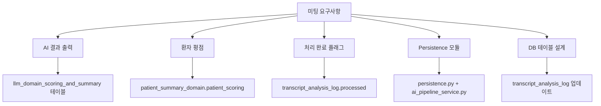
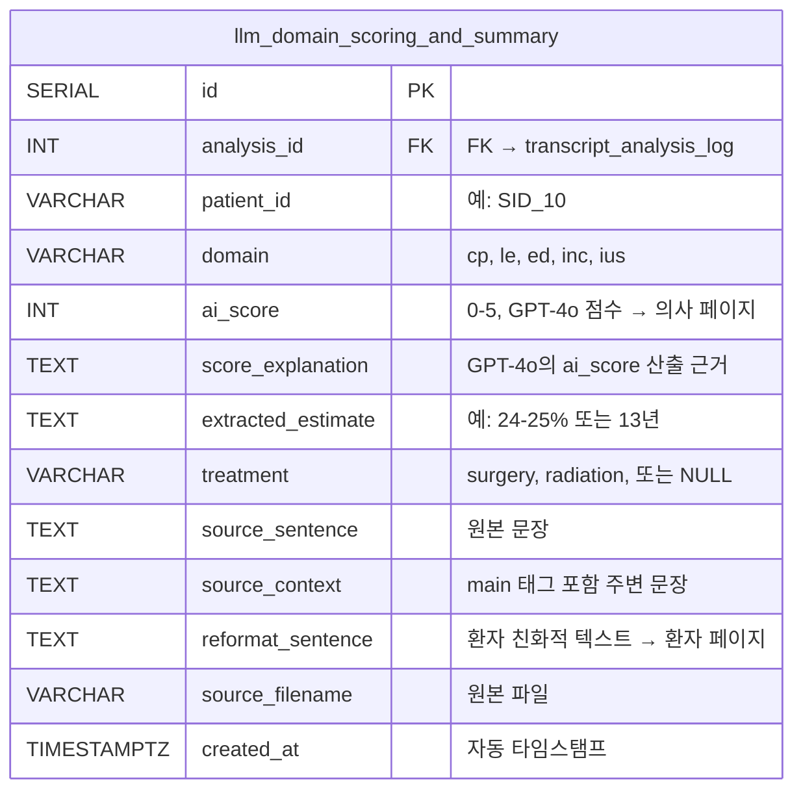
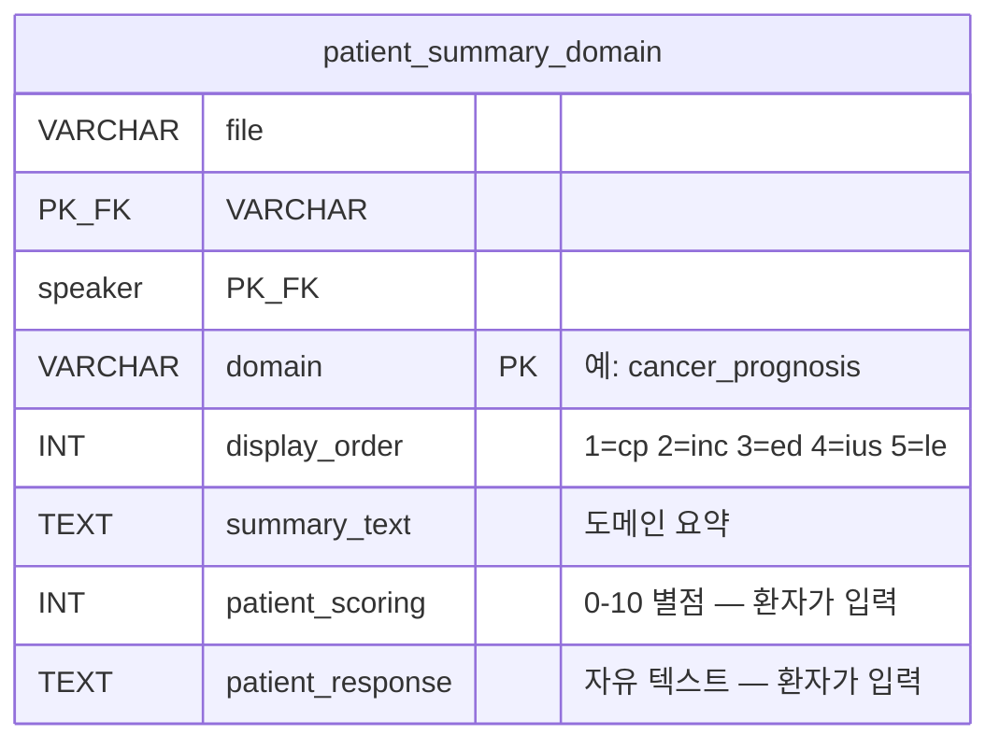
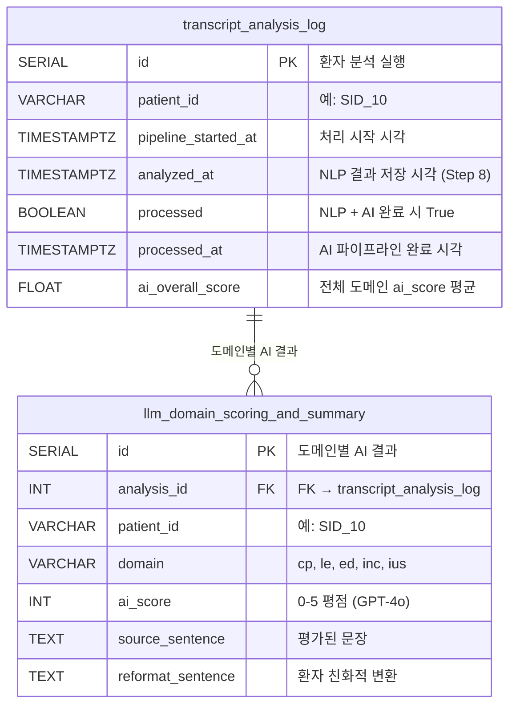

# 미팅 요구사항 → 구현 매핑

> 미팅 일자: 2026-04-16 | 구현 일자: 2026-04-16 ~ 2026-04-17  
> 브랜치: `feat/save-intermediate-results`

---

## 1. 개요

이 문서는 2026-04-16 미팅의 각 요구사항을 실제 코드 변경사항에 매핑합니다.  
각 요구사항에서 ***핵심 구현 포인트***는 <u>밑줄</u>과 **굵은 글씨**로 강조하였습니다.



---

## 2. 요구사항별 구현 매핑

### 요구사항 1: "Guillermo 코드에서 AI result output 확인 필요하고 DB persistency"

> 원문: *"check Guillermo's code, ai result code output, and db persistency"*

**구현 요약:** Guillermo의 `ai_pipeline/` 모듈이 <u>**`ai_pipeline_service.py`를 통해 Docker 안에서 호출**</u>되며, 결과는 <u>**`llm_domain_scoring_and_summary` 테이블에 자동 저장**</u>됩니다.

**상세 구현:**

1. **호출 경로:**  
   `pipeline_runner.py` (Step 9) → <u>**`ai_pipeline_service.run_ai_scoring_and_summary()`**</u> → `ai_pipeline/pipeline.py` → `run_ai_pipeline()`

2. **Guillermo 코드가 생성하는 것** (도메인당):
   - <u>**`ai_score` (0-5)**</u>: GPT-4o가 "의사가 이 도메인의 위험을 얼마나 명확히 전달했는가"를 평가한 점수. **의사 페이지**에서 상담 품질 지표로 표시됨 (`GET /api/doctor/scores/average`, `/scores/trajectory`).
   - **`score_explanation`**: GPT-4o가 점수를 매긴 근거 (chain-of-thought reasoning). 내부 디버깅용.
   - <u>**`extracted_estimate`**</u>: 의사가 말한 구체적 수치 추정값 (예: `"24-25% risk of death"`, `"13 years"`). **의사 페이지**에서 원본 추정값 리뷰용.
   - **`treatment`**: 해당 추정값과 관련된 치료법 (예: `"surgery"`, `"radiation"`, 또는 `NULL`). 부작용 도메인(ed, inc, ius)에서만 값이 있음.
   - <u>**`reformat_sentence`**</u>: GPT-4o가 환자가 이해할 수 있는 언어로 변환한 텍스트. **환자 페이지**에서 AI 요약 카드로 표시됨 (`GET /api/patient/ai-summary/{file}`).

3. **DB 저장 위치:**  
   <u>**`llm_domain_scoring_and_summary` 테이블**</u> — 환자당 5~9행 (도메인당 1~2행)

4. **검증 결과:**  
   SID 10, 14, 15, 18, 33 — **총 33행 저장**, 5명 환자, 5개 도메인 모두 처리 완료



---

### 요구사항 2: "환자 평점(rating) — 변경 필요한 부분"

> 원문: *"there is couple of things we need to change, which is rating from patients"*  
> 원문: *"things for the patient, the review part they are rating"*

**구현 요약:** <u>**`patient_summary_domain.patient_scoring` 컬럼**</u>이 환자의 별점 평가를 저장합니다. 파이프라인에서는 NULL로 초기화되고, <u>**환자가 재진 대시보드에서 직접 입력**</u>합니다.

**상세 구현:**

1. **저장 테이블:** <u>**`patient_summary_domain`**</u>
2. **컬럼:** `patient_scoring` (INT, 0-10)
   - 파이프라인 실행 시: <u>**NULL로 초기화**</u> (아직 환자가 평가하지 않음)
   - 환자가 대시보드에서 별점 클릭 시: <u>**`PUT /api/patient/scoring`**</u> API로 업데이트
3. **프론트엔드:**  
   `PatientFollowUpReportV31Re.tsx` → 각 도메인(cp, le, ed, inc, ius)별로 별점(star rating) UI 표시
4. **INSERT vs UPDATE:**  
   <u>**UPDATE 방식**</u> — "현재 평점"만 중요하므로 이전 값을 덮어씀. 평점 이력은 보존하지 않음.



**중요 구분:** `patient_scoring` ≠ `ai_score`
- <u>**`patient_scoring`**</u> = 환자의 주관적 평가 ("의사가 이 주제를 잘 설명했나?") → **환자 페이지**에서 입력
- <u>**`ai_score`**</u> = GPT-4o의 객관적 문장 관련도 점수 (0-5) → **의사 페이지**에서 표시
- 두 점수는 **서로 다른 테이블, 다른 페이지, 다른 목적**

---

### 요구사항 3: "처리 완료 여부 플래그 추가"

> 원문: *"we also need to flag if it is been processed or not"*  
> 원문: *"add if it is been processed or not"*

**구현 요약:** <u>**`transcript_analysis_log` 테이블에 `processed` (BOOLEAN) + `processed_at` (TIMESTAMP) 컬럼**</u>을 추가했습니다.

**상세 구현:**

1. **Step 8 (NLP 저장 시):**  
   `persistence.py`의 `save_all()` → <u>**`processed=False`**</u>, `processed_at=NULL`로 저장
   
2. **Step 9 (AI 파이프라인 성공 시):**  
   `ai_pipeline_service.py` → <u>**`processed=True`**</u>, <u>**`processed_at=datetime.now(UTC)`**</u>로 UPDATE

3. **Step 9 (AI 파이프라인 실패 시):**  
   `processed=False` **유지** → 나중에 재처리 가능 (non-blocking)

4. **추가 타이밍 컬럼:**  
   <u>**`pipeline_started_at`**</u> = 파이프라인이 이 파일 처리를 시작한 시각  
   이를 통해 전체 소요 시간 계산: `processed_at - pipeline_started_at`

5. **검증 결과:**
   ```
   SID 10: processed=True, pipeline_started_at=05:26:14, processed_at=05:29:28 (3분14초)
   SID 14: processed=True, pipeline_started_at=05:29:28, processed_at=05:32:40 (3분12초)
   SID 15: processed=True, pipeline_started_at=05:32:40, processed_at=05:35:32 (2분52초)
   SID 18: processed=True, pipeline_started_at=05:35:32, processed_at=05:38:36 (3분04초)
   SID 33: processed=True, pipeline_started_at=05:38:36, processed_at=05:41:43 (3분07초)
   ```
   **5명 환자 모두 `processed=True`** 확인

---

### 요구사항 4: "main_complete_pipeline.py 실행하여 출력 이해"

> 원문: *"run main_complete_pipeline.py and understand what is here (maybe the ai result variable in the Guillermo code)"*

**구현 요약:** <u>**SID 15 파일로 `main_complete_pipeline.py`를 로컬에서 실행**</u>하여 Step 0~9 전체 출력을 확인했습니다. 각 Step의 DataFrame 행 수, 컬럼, 샘플 데이터를 디버그 로그로 출력하도록 코드를 수정했습니다.

**상세 구현:**

1. **실행 환경:** conda `prostate_cancer_py_3.10`, NLP Docker 프록시 (`localhost:9999`), Azure OpenAI
2. **테스트 브랜치:** `test/complete-pipeline` (AI_physician_patient_communication 레포, 커밋 `582e046`)
3. **코드 수정:**  
   `main_complete_pipeline.py`에 <u>**각 Step 후 DataFrame 상세 로그 출력**</u> 추가 (행 수, 컬럼, 샘플)  
   `Path()` 래핑 에러 수정 (line 83: `config.output_path / patient_id` → `Path(config.output_path) / patient_id`)
4. **실행 결과 (SID 15):**
   ```
   Step 0:   29 rows   (원본 파일)
   Step 1:   14 rows   (의사 발화만 필터링)
   Step 2:  122 rows   (R stringi 문장 분리)
   Step 3:  122 rows   (NLP 5모델 점수 추가)
   Step 4:   10 × 5    (도메인별 Top-K 선택)
   Step 5:   10 × 5    (context 추가)
   Step 6-9: 5 domains (AI pipeline — Scoring, Extraction, Filtering, Selection, Reformat)
   ```
5. **26개 출력 파일** 생성:
   ```
   data/output_test/SID_15/
   ├── segmented_sentences.csv      (Step 2: 122개 문장)
   ├── predictions_long.csv         (Step 3: 122 × 5개 모델 점수)
   ├── top10_by_outcome.xlsx        (Step 4: 도메인당 10개)
   ├── top10_with_context.xlsx      (Step 5: 10개 + context)
   ├── {domain}_extraction.csv      (Step 7: 추출된 추정값)
   ├── {domain}_filtering.csv       (Step 8: 필터링된 후보)
   ├── {domain}_result.csv          (Step 9: 최종 선택 + reformat)
   └── {domain}.xlsx                (도메인별 통합)
   ```

---

### 요구사항 5: "무엇을 저장하고 어디로 가는지 확인"

> 원문: *"we need the result and check what needs to be saved and where does it go"*  
> 원문: *"you will see what is the thing that are going to patient and to doctor"*  
> 원문: *"for doctor, i think we do not save anything"*

**구현 요약:** <u>**환자에게 가는 데이터**</u>와 <u>**의사에게 가는 데이터**</u>를 명확히 분리했습니다. **의사는 저장하지 않음** (읽기 전용).

**환자에게 가는 것:**

| 데이터 | 테이블 | 컬럼 | API | 설명 |
|--------|--------|------|-----|------|
| <u>**AI 위험 요약**</u> | `llm_domain_scoring_and_summary` | <u>**`reformat_sentence`**</u> | `GET /api/patient/ai-summary/{file}` | GPT-4o가 환자 친화적 언어로 변환한 텍스트. 예: *"Your doctor noted that your risk of dying of prostate cancer is 24-25%."* |
| <u>**환자 평점**</u> | `patient_summary_domain` | <u>**`patient_scoring`**</u> | `PUT /api/patient/scoring` | 환자가 재진 시 직접 입력하는 0-10 별점 |
| 환자 응답 | `patient_summary_domain` | `patient_response` | `PUT /api/patient/responses` | 환자가 직접 입력하는 자유 텍스트 |

**의사에게 가는 것 (읽기 전용):**

| 데이터 | 테이블 | 컬럼 | API | 설명 |
|--------|--------|------|-----|------|
| <u>**AI 품질 점수**</u> | `llm_domain_scoring_and_summary` | <u>**`ai_score`**</u> | `GET /api/doctor/scores/average` | GPT-4o의 0-5 점수. 의사 대시보드에 상담 품질 지표로 표시 |
| 상위 문장 | `doctor_sentence_view` | `sentence`, `class` | `GET /api/doctor/sentences/{file}/{speaker}` | NLP Top-10 문장 |
| <u>**점수 궤적**</u> | `llm_domain_scoring_and_summary` | <u>**`ai_score`**</u> | `GET /api/doctor/scores/trajectory` | 시간에 따른 상담 품질 변화 추이 |

**의사는 저장하지 않음** — 의사 뷰는 <u>**읽기 전용(read-only)**</u>. 의사가 문장을 rewrite하면 `doctor_rewrite_log`에 저장되지만 이것은 **대시보드 UI에서 발생**하며 파이프라인과 무관합니다.

---

### 요구사항 6: "Persistence 모듈 생성 — 키는 patient_id"

> 원문: *"create module of persistency, and then call that module there and save those things to the db"*  
> 원문: *"key should be patient id"*

**구현 요약:** <u>**`persistence.py`의 `save_all()` 함수**</u>가 모든 DB 저장을 <u>**단일 트랜잭션**</u>으로 처리합니다. 키는 <u>**`patient_id`**</u>.

**상세 구현:**

1. **모듈:** <u>**`persistence.py`**</u> — `save_all()` 함수 1개로 모든 DB 쓰기 담당
2. **호출:** `pipeline_runner.py` Step 8에서 <u>**`persistence.save_all(Session, ...)`**</u> 한 줄로 호출
3. **키:** `transcript_analysis_log.patient_id` (예: `SID_10`)
4. **트랜잭션:** <u>**단일 트랜잭션 — 모든 테이블에 성공하거나 모두 롤백**</u>
5. **저장하는 테이블 (한 번의 호출로):**

| 순서 | 테이블 | 행 수 | 내용 |
|:----:|--------|:-----:|------|
| 1 | <u>**`transcript_analysis_log`**</u> | 1 | 분석 실행 기록 (patient_id, 설정값, xlsx, 타이밍, processed flag) |
| 2 | <u>**`sentence_prediction`**</u> | 50 | 5 도메인 × 10 문장, NLP `.pred_1` 확률 + context |
| 3 | `doctor_sentence_view` | ~47 | 중복 제거된 의사 문장 + 도메인 분류 |
| 4 | `patient_summary` | 1 | 환자 요약 기본 행 |
| 5 | <u>**`patient_summary_domain`**</u> | 5 | 도메인별 요약 + patient_scoring(NULL) + patient_response(NULL) |

---

### 요구사항 7: "AI summary가 아니라 다른 이름 (AI reformat)"

> 원문: *"make sure that you have the rating for the sentence, they call it now something different, it is not the ai summary (i think it is ai reformat?)"*  
> 원문: *"check the right language on the video"*

**구현 요약:** <u>**"AI summary"라는 용어가 `reformat_sentence`로 변경**</u>되었습니다. 이것은 `llm_domain_scoring_and_summary` 테이블의 컬럼명입니다.

**상세 구현:**

1. **이전 용어:** "AI summary"
2. **새 용어:** <u>**`reformat_sentence`**</u>
3. **생성 과정:**  
   `ai_pipeline/reformat.py` → GPT-4o가 <u>**Selection에서 선택된 1개 추정값을 환자가 이해할 수 있는 언어로 변환**</u>
4. **실제 예시:**
   - 입력 (의사 원문): `"the chances of you dying from this prostate cancer is coming out at about 24 percent"`
   - GPT-4o Extraction: `"24% risk of death without treatment"`
   - <u>**GPT-4o Reformat**</u>: `"Your doctor noted that your risk of dying of prostate cancer is 24-25%. With treatment, this risk decreases to 6%."`
5. **프론트엔드에서의 사용:**  
   `PatientInitialVisitReportV35.tsx`와 `PatientFollowUpReportV31Re.tsx`가 <u>**`GET /api/patient/ai-summary/{file}`**</u> API를 호출하면, `routes_patient.py`가 `llm_domain_scoring_and_summary.reformat_sentence`를 반환하고, 프론트엔드가 이것을 **환자용 AI 요약 카드**로 표시합니다.

---

### 요구사항 8: "테이블: id, sentence, domain, rating, processed flag"

> 원문: *"Basically the table is the id, sentence, and then the domain, and then the rating, and then the flag to show processed or not. So basically we are doing the ground work. This is the saving step."*

**구현 요약:** 미팅에서 요청한 5개 필드가 <u>**두 테이블에 걸쳐 구현**</u>되었습니다.

**미팅 요구사항과 실제 구현의 매핑:**

| 미팅에서 요청한 것 | 실제 구현 위치 | 컬럼 | 설명 |
|------------------|-------------|------|------|
| <u>**id**</u> | `transcript_analysis_log` | <u>**`id`**</u> (SERIAL PK) | 환자별 분석 실행 고유 ID |
| <u>**sentence**</u> | `llm_domain_scoring_and_summary` | <u>**`source_sentence`**</u> (TEXT) | AI가 평가한 원본 문장 |
| <u>**domain**</u> | `llm_domain_scoring_and_summary` | <u>**`domain`**</u> (VARCHAR) | cp, le, ed, inc, ius |
| <u>**rating**</u> | `llm_domain_scoring_and_summary` | <u>**`ai_score`**</u> (INT, 0-5) | GPT-4o의 문장 관련도 점수 |
| <u>**processed flag**</u> | `transcript_analysis_log` | <u>**`processed`**</u> (BOOLEAN) | True = NLP + AI 완료 |

**왜 두 테이블로 나누었는가:**

미팅에서는 하나의 테이블을 요청했지만, 실제로는 <u>**데이터의 단위(granularity)가 다르기 때문에**</u> 두 테이블로 분리했습니다:

| 판단 근거 | `transcript_analysis_log` | `llm_domain_scoring_and_summary` |
|----------|--------------------------|----------------------------------|
| **데이터 단위** | <u>**환자 단위**</u> (1 patient = 1 row) | <u>**도메인 단위**</u> (1 patient × 5 domains = 5+ rows) |
| **여기에 넣은 이유** | `processed` flag는 **환자 전체**에 대한 상태이므로 환자 단위 테이블에 속함. 도메인별로 processed를 따로 추적할 필요 없음 (전체가 한 번에 처리됨). | `ai_score`, `source_sentence`, `reformat_sentence`는 **도메인별**로 다른 값을 가지므로 도메인 단위 테이블에 속함. cp의 점수와 le의 점수는 다름. |
| **만약 하나로 합치면** | `processed` flag가 5번 중복 저장됨 (비효율) | 환자별 메타데이터(`pipeline_started_at` 등)가 5번 중복됨 |

**각 컬럼이 왜 이 테이블에 추가되었는가 (미팅 요구사항 → 컬럼):**

**`transcript_analysis_log` 테이블 — 새로 추가된 컬럼 3개:**

| 컬럼 | 미팅 요구사항 | 왜 이 테이블에 추가했는가 |
|------|-------------|----------------------|
| <u>**`pipeline_started_at`**</u> | *"we need to flag if it is been processed or not"* — 처리 시간을 추적하려면 시작 시각이 필요. | 이 테이블이 이미 **파이프라인 실행 기록**을 저장하는 테이블(`analyzed_at` 존재). 시작 시각도 같은 곳에 기록하는 것이 자연스러움. `analyzed_at`(NLP 저장 시각)과 함께 NLP 소요 시간 = `analyzed_at - pipeline_started_at`으로 계산 가능. |
| <u>**`processed`**</u> | *"we also need to flag if it is been processed or not"* — 미팅에서 직접 요청. | 이 테이블이 이미 **환자별 분석 실행 1건 = 1행**이므로, "이 분석이 완료되었는가?"를 여기에 기록하는 것이 가장 직관적. 다른 테이블에 넣으면 JOIN이 필요해져 복잡해짐. `processed=False`인 행을 조회하면 **재처리 대상**을 바로 찾을 수 있음. |
| <u>**`processed_at`**</u> | *"flag if it is been processed or not"* — flag만으로는 "언제 완료되었는가"를 알 수 없으므로 시각도 추가. | `pipeline_started_at`과 함께 **전체 소요 시간** = `processed_at - pipeline_started_at`으로 계산. 성능 모니터링에 필요. |

> 참고: `ai_overall_score` (FLOAT)도 이 테이블에 있는데, 이것은 5개 도메인 `ai_score`의 평균으로 **환자 전체 상담 품질**을 한 숫자로 요약한 것. AI pipeline 완료 시 `processed=True`와 함께 설정됨.

**`llm_domain_scoring_and_summary` 테이블 — Guillermo 코드에서 생성되는 컬럼들:**

| 컬럼 | 미팅 요구사항 | 왜 이 테이블에 있는가 |
|------|-------------|-------------------|
| <u>**`ai_score`**</u> | *"the rating"*, *"make sure that you have the rating for the sentence"* | 미팅에서 요청한 "rating". GPT-4o가 **도메인별로** 다른 점수를 매기므로 (cp=3, le=5 등) 도메인 단위 테이블에 저장. `ai_pipeline/scoring.py`의 `run_scoring()` → `pred["score"]`에서 추출. 의사 페이지에서 표시. |
| <u>**`score_explanation`**</u> | *"check Guillermo's code"* — Guillermo의 AI pipeline이 생성하는 부산물. | GPT-4o가 `ai_score`를 매길 때 "왜 이 점수인가"를 단계별로 설명한 텍스트. `ai_pipeline/prompts/scoring/cp.py`의 시스템 프롬프트가 "Step 1 → Step 2 → Step 3 → Step 4" 단계별 평가를 지시하고, GPT-4o가 이 과정을 `explanation` 필드로 반환. `scoring.py` line 40에서 `pred["explanation"]`으로 추출. |
| <u>**`extracted_estimate`**</u> | *"we need the result and check what needs to be saved"* | Guillermo의 AI pipeline Step 7 (Extraction)에서 의사가 말한 구체적 수치를 추출한 것. 도메인마다 다른 종류의 추정값 (cp="24% 사망 위험", le="14년", ed="10-20% ED"). `ai_pipeline/extraction.py`에서 생성. |
| <u>**`treatment`**</u> | *"what is the thing that are going to patient and to doctor"* | 부작용 도메인(ed, inc, ius)에서 어떤 치료법과 관련된 위험인지 표시 ("surgery", "radiation"). cp/le에는 해당 없음 (NULL). `ai_pipeline/extraction.py`에서 함께 추출. |
| <u>**`source_sentence`**</u> | *"the sentence"*, *"Basically the table is the id, sentence, and then the domain"* | 미팅에서 요청한 "sentence". AI가 최종 선택한 1개 원본 문장. `ai_pipeline/selection.py`에서 결정. |
| <u>**`reformat_sentence`**</u> | *"it is not the ai summary (i think it is ai reformat?)"* | 미팅에서 용어 확인 요청한 "AI reformat". GPT-4o가 `source_sentence`를 환자가 이해할 수 있는 언어로 변환한 텍스트. `ai_pipeline/reformat.py`에서 생성. 환자 페이지에서 AI 요약 카드로 표시. |
| <u>**`source_context`**</u> | *"understand that output"* — 출력 이해를 위해 문맥도 함께 저장. | AI가 점수를 매길 때 참고한 주변 ±3 문장. `<main>` 태그로 감싼 형태. 디버깅 및 결과 검증에 필요. |

**`patient_summary_domain` 테이블 — 기존 컬럼 (새로 추가한 것 아님):**

| 컬럼 | 미팅 요구사항 | 왜 이 테이블에 있는가 |
|------|-------------|-------------------|
| <u>**`patient_scoring`**</u> | *"rating from patients"*, *"the review part they are rating"* | 미팅에서 요청한 환자 평점. **환자가 직접 입력**하는 것이므로 파이프라인 결과(`llm_domain_scoring_and_summary`)와 분리. 환자 대시보드에서 `PUT /api/patient/scoring`으로 UPDATE. 이 테이블이 이미 **환자 × 도메인** 단위이므로 도메인별 평점 저장에 적합. |

이 두 테이블은 <u>**`analysis_id` (FK)**</u>로 연결됩니다:



---

## 3. 파이프라인 타이밍 (검증 완료)

```
SID 10: pipeline_started_at=05:26:14 → analyzed_at=05:26:30 → processed_at=05:29:28 (3분14초)
SID 14: pipeline_started_at=05:29:28 → analyzed_at=05:29:39 → processed_at=05:32:40 (3분12초)
SID 15: pipeline_started_at=05:32:40 → analyzed_at=05:32:46 → processed_at=05:35:32 (2분52초)
SID 18: pipeline_started_at=05:35:32 → analyzed_at=05:35:41 → processed_at=05:38:36 (3분04초)
SID 33: pipeline_started_at=05:38:36 → analyzed_at=05:38:46 → processed_at=05:41:43 (3분07초)
```

**5명 환자 모두: `processed=True`**

---

## 4. 변경된 파일

| 파일 | 변경 내용 |
|------|----------|
| <u>**`pipeline_runner.py`**</u> | `transcript_service`를 `sentence_classification` (R stringi)으로 교체. `pipeline_started_at` 기록, 중간 결과 파일 저장 (step0-step5) 추가. |
| <u>**`persistence.py`**</u> | 초기 저장 시 `pipeline_started_at` + `processed=False` 추가. |
| <u>**`ai_pipeline_service.py`**</u> | AI 성공 시 `processed=True` + `processed_at` 설정. Azure 타임아웃 30분으로 증가. |
| <u>**`models.py`**</u> | `TranscriptAnalysisLog`에 `pipeline_started_at`, `processed`, `processed_at` 추가. 프론트엔드 사용 주석 추가. |
| <u>**`database_schema.sql`**</u> | `transcript_analysis_log` CREATE TABLE에 3개 새 컬럼 추가. |
| <u>**`docker-compose.yml`**</u> | `sentence_classification/` 볼륨 마운트 추가. `start_period` 2400초로 확장. |
| <u>**`Dockerfile`**</u> | R + stringi 1.8.4 (번들 ICU 74.1) + rpy2 설치. prestart에 ICU 버전 검증 추가. |
| `routes_transcript.py` | `transcript_service.analyze_transcript`를 `sentence_classification` 기반으로 교체. |
| `transcript_service.py` | `archive/`로 이동 (더 이상 사용 안 함). |

---

## 5. 잔여 작업

| 항목 | 상태 | 비고 |
|------|:----:|------|
| 처리 완료 플래그 | **완료** | `transcript_analysis_log.processed` + `processed_at` |
| 환자 평점 | **존재** | `patient_summary_domain.patient_scoring` (환자가 대시보드에서 입력) |
| AI reformat | **완료** | `llm_domain_scoring_and_summary.reformat_sentence` |
| 의사 읽기 전용 | **확인** | 의사 뷰는 저장 안 함 — DB에서 읽기만 |
| 통합 테스트 | **다음 주** | End-to-end: 입력 → 파이프라인 → DB → 대시보드 표시 |
| 설문 변경 | **보류** | 미팅 결정에 따라 — 변경 확정 전까지 미착수 |
