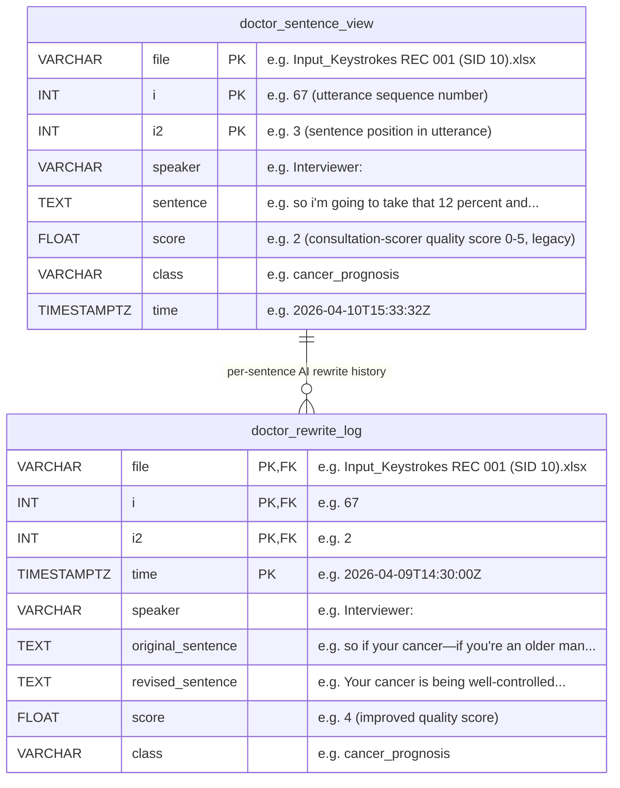
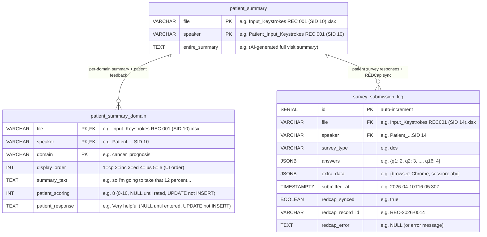
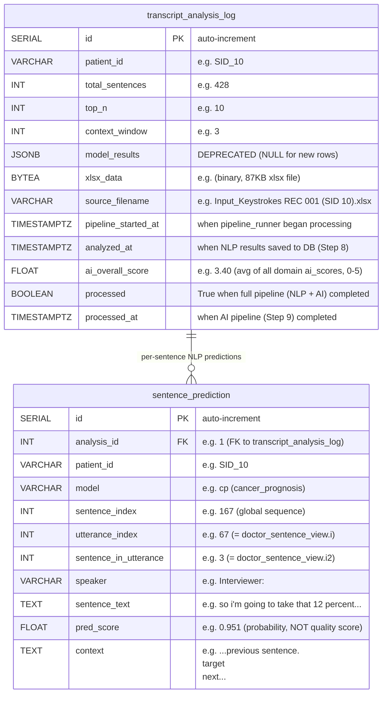
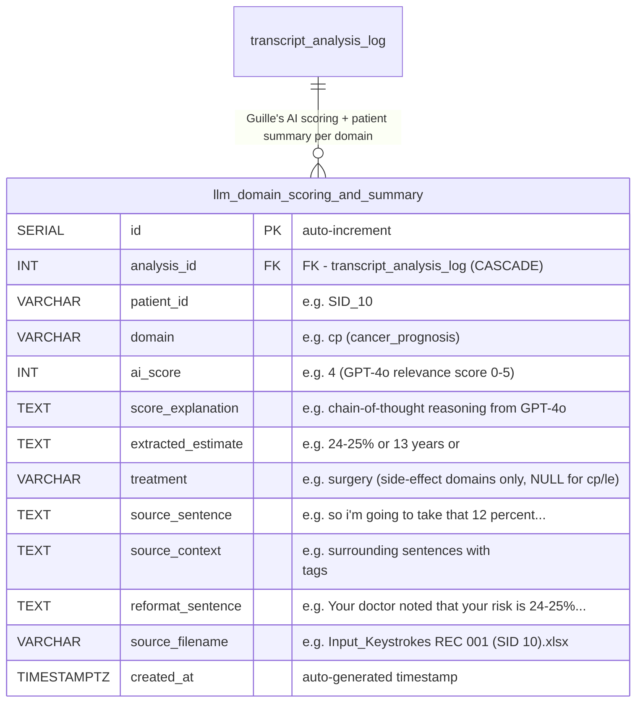
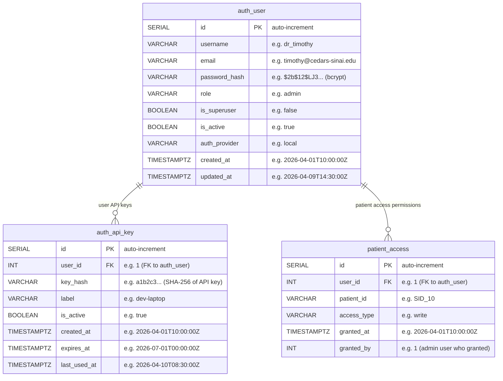
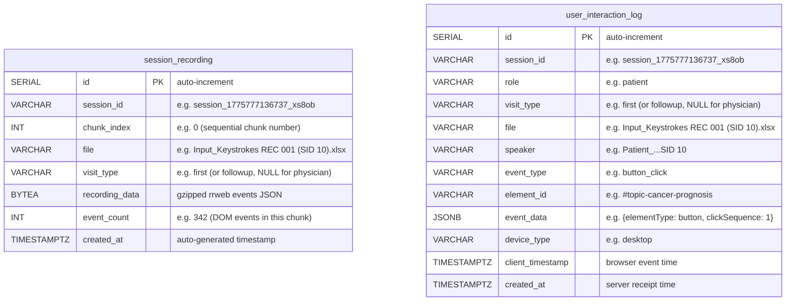

# Prostate Cancer Consultation Dashboard — ERD v3

> Updated: 2026-04-10 | Based on actual code analysis (database_schema.sql, models.py, routes_*.py, pipeline_runner.py)

### A. Doctor Interface



### B. Patient Interface



> **Why `survey_submission_log` uses INSERT (not UPDATE):** The same patient can submit the same survey type at different timepoints (e.g., DCS before and after treatment). Each submission is a distinct measurement — the second does not replace the first. This also allows per-row REDCap sync tracking (`redcap_synced` per submission).
>
> **Why `patient_summary_domain.patient_scoring` uses UPDATE (not INSERT):** This is a "current rating" — only the latest value matters. No need to preserve rating history.

### C. ML Pipeline (Transcript Analysis)



> **Why `transcript_analysis_log.id`:** The same patient (e.g., SID_10) can be analyzed multiple times — with different `top_n`/`context_window` parameters, or after transcript updates. `patient_id` alone cannot distinguish these runs. The `id` is also the FK target for `sentence_prediction.analysis_id`.
>
> **Why `sentence_prediction.id`:** The natural key `(analysis_id, model, sentence_index)` is unique, but a single 4-byte integer PK is more efficient for JOINs and indexing than a 3-column composite key (~14 bytes). With 2,140+ rows per patient, this difference compounds.

### C-2. LLM Domain Scoring & Summary (Guille's AI Pipeline)



> **What this table stores:** After the NLP pipeline classifies and selects top sentences (Steps 1-7), Guille's AI pipeline (Step 11) uses Azure OpenAI GPT-4o to: (1) score each sentence's clinical specificity 0-5, (2) extract the actual risk numbers, (3) select the best estimate, and (4) reformat into patient-facing language. One row per domain per analysis run (5 for regular, more for side-effect domains with multiple treatments).
>
> **`ai_score` (0-5) vs `pred_score` (0.0-1.0) vs `score` (0-5):** Three different scores exist:
> - `sentence_prediction.pred_score` (0.0-1.0) = R Random Forest probability that the sentence belongs to this domain
> - `doctor_sentence_view.score` (0-5) = consultation-scorer quality score
> - `llm_domain_scoring_and_summary.ai_score` (0-5) = GPT-4o assessment of how specifically the doctor communicated risk (0=not mentioned, 5=patient-specific with timeline)
>
> **`source_sentence` vs `source_context`:**
> - `source_sentence` (80-175 chars): The single original sentence that GPT-4o selected and used as the direct input to generate the AI Summary. e.g., *"so i'm going to take that 12 percent and cut it in half again, so six percent will die of cancer"*
> - `source_context` (500-750 chars): The surrounding conversation (multiple sentences before and after) that GPT-4o used for context when scoring. e.g., the full passage about treatment options, risk percentages, and prognosis.
> - **In the patient app:** "View relevant sentences from your visit" displays `source_context` — the broader conversation excerpt that the AI Summary was derived from. This helps patients see the full conversational context, not just the isolated sentence.
> - **AI Summary** (`reformat_sentence`): Generated by GPT-4o from `source_sentence` + `source_context`, converted into patient-friendly language. e.g., *"Your doctor noted that your risk of dying of cancer is 24-25%. With treatment, this decreases to 6%."*
>
> **Side-effect domains:** For ed/inc/ius, the doctor may discuss risks for different treatments (surgery vs radiation). These are stored as separate rows with different `treatment` values. Regular domains (cp/le) have `treatment=NULL`.

**Example data (actual GPT-4o output for SID-10):**

| domain | ai_score | extracted_estimate | treatment | reformat_sentence |
|---|---|---|---|---|
| cp | 4 | 24-25% → 6% | NULL | "Your doctor noted that your risk of dying of cancer is 24-25%. With treatment, this decreases to 6%." |
| le | 5 | 13 years | NULL | "Your doctor estimated your life expectancy to be 13 years based on your age and health conditions." |
| ed | 4 | 100% initially, 20% permanent | surgery | "After surgery, initially 100% of men lose their erections. About 20% never regain function." |
| inc | 4 | 5% permanent | surgery | "About 5% of patients never regain complete urinary control after surgery." |
| ius | 0 | \<missing\> | NULL | "Your doctor did not mention the risk of irritative urinary symptoms." |

**API endpoint:**

| Endpoint | Purpose |
|---|---|
| `GET /api/patient/ai-summary/{file}` | Get GPT-4o generated summaries per domain for a patient |
| `GET /api/patient/ai-summary` | List all patients with AI summaries |

### D. Authentication & Access Control



> **Why `auth_user.id`:** FK target for both `auth_api_key.user_id` and `patient_access.user_id`. One user can have multiple API keys and access to multiple patients.
>
> **Why `auth_api_key.id`:** One user can have multiple keys (e.g., `dev-laptop`, `CI-server`). `(user_id, key_hash)` could be a natural PK but SERIAL is simpler for revocation by ID.
>
> **Why `patient_access.id`:** One user can access multiple patients. Also has a UNIQUE constraint on `(user_id, patient_id)` to prevent duplicate grants.

### E. User Interaction Tracking & Session Recording



> **Why `user_interaction_log.id`:** Hundreds of events per session (clicks, scrolls, page views). No natural unique key exists — the same user can click the same button at different times. SERIAL id uniquely identifies each event row.

---

## Table Details

### 1. `doctor_sentence_view` — Doctor Dashboard Sentence View

**Role in the app:**
Displays per-sentence consultation quality scores in the Doctor Dashboard. Doctors review their communication quality and practice AI-powered rewriting to improve low-scoring sentences.

**When data is populated:**
`pipeline_runner.py` runs automatically on Docker container startup:
1. Scans xlsx/csv files in `/app/data/transcripts/`
2. Classifies sentences using 5 NLP models (cp, inc, ed, ius, le)
3. Scores consultation quality (0-5) via the `consultation-scorer` container (legacy — now superseded by Guille's AI `ai_score` in `llm_domain_scoring_and_summary`)
4. `persistence.py` → INSERT into this table (already-processed files auto-skipped)

**React app screens:**
- Doctor Dashboard > Patient file selector > Sentence list (color-coded by score)
- Score Band Chart (per-domain quality score visualization)

**Example data:**
| file | i | i2 | speaker | sentence | score | class |
|---|---|---|---|---|---|---|
| `Input_Keystrokes REC 001 (SID 10).xlsx` | 67 | 3 | `Interviewer:` | so i'm going to take that 12 percent and cut it in half again, so six... | 2 | cancer_prognosis |
| `Input_Keystrokes REC 001 (SID 10).xlsx` | 67 | 2 | `Interviewer:` | so if your cancer—if you're an older man and your cancer is being cont... | 1 | cancer_prognosis |
| `Input_Keystrokes REC001 (SID 14).xlsx` | 52 | 1 | `Interviewer:` | the nerves that supply the erectile function of the penis go right... | 3 | erectile_dysfunction_potency |

**API endpoints:**
| Endpoint | Purpose |
|---|---|
| `GET /api/doctor/sentences/{file}/{speaker}` | Render sentence list (filtered by class != '-1') |
| `GET /api/doctor/files` | File selector dropdown (DISTINCT file + speaker + count) |
| `GET /api/doctor/scores/average` | Score Band Chart — uses Guille's AI `ai_score` from `llm_domain_scoring_and_summary` |
| `GET /api/doctor/scores/summary/{file}/{speaker}` | Per-patient domain score summary — uses Guille's AI `ai_score` (no consultation-scorer fallback) |
| `POST /api/doctor/score-sentence` | Run Guille's AI scoring on a single sentence (GPT-4o) |
| `POST /api/doctor/ai-rewrite` | AI-powered sentence rewriting |
| `GET /api/doctor/scores/trajectory` | Original NLP scores from doctor_sentence_view |
| `GET /api/doctor/class-distribution` | Class distribution across all files |
| `GET /api/doctor/class-distribution/{file}` | Detailed class distribution for a specific file |
| `GET /api/doctor/improvement-suggestions/{class_}` | Get improvement suggestions for a domain |
| `POST /api/doctor/improvement-suggestions` | Generate new improvement suggestion |

---

### 2. `doctor_rewrite_log` — AI Rewrite History

**Role in the app:**
When a doctor selects a low-score sentence in the Doctor Dashboard, the `patient-summary-rewriter` service generates an AI-improved version. The same sentence can be rewritten multiple times → rows accumulate by timestamp (revision history).

**When data is populated:**
React Doctor UI "Rewrite" button click → `PUT /api/doctor/rewrites` → INSERT

**Important:**
Rewrite scores are NOT used in analysis — this is purely a practice/learning tool for physicians. Score average calculations use only the original `doctor_sentence_view.score`.

**Example data:**
| file | i | i2 | time | speaker | original_sentence | revised_sentence | score | class |
|---|---|---|---|---|---|---|---|---|
| `Input_Keystrokes REC 001 (SID 10).xlsx` | 67 | 2 | 2026-04-09 14:30:00 | `Interviewer:` | so if your cancer—if you're an older man... | Your cancer is being well-controlled, and as an older patient... | 4 | cancer_prognosis |

**API endpoints:**
| Endpoint | Purpose |
|---|---|
| `PUT /api/doctor/rewrites` | Insert new rewrite record |
| `GET /api/doctor/rewrites/{file}/{i}/{i2}/history` | Full rewrite history for a sentence (chronological) |
| `GET /api/doctor/rewrites/stats` | Physician engagement analytics (Admin dashboard) |

---

### 3. `patient_summary` — Patient Consultation Summary

**Role in the app:**
Patients access the Patient Follow-up app after their visit and view an AI-generated summary of their consultation.

**When data is populated:**
`pipeline_runner.py` automatic processing:
- Step 9: `rewriter_service` → `patient-summary-rewriter` container generates AI summaries
- Step 10: `persistence.save_all()` → INSERT into `patient_summary` + `patient_summary_domain`

**React app screen:** Patient Dashboard > "View Consultation Summary"

**Example data:**
| file | speaker | entire_summary |
|---|---|---|
| `Input_Keystrokes REC 001 (SID 10).xlsx` | `Patient_Input_Keystrokes REC 001 (SID 10)` | (AI-generated full visit summary text) |
| `Input_Keystrokes REC001 (SID 14).xlsx` | `Patient_Input_Keystrokes REC001 (SID 14)` | (AI-generated full visit summary text) |

**API endpoints:**
| Endpoint | Purpose |
|---|---|
| `GET /api/patient/summaries` | Patient list + summary preview |
| `GET /api/patient/summaries/{file}/{speaker}` | Detailed summary (requires check_patient_access) |
| `GET /api/patient/files` | File selector dropdown |
| `GET /api/stats/dashboard` | Admin stats (summary count, average scores) |

---

### 4. `patient_summary_domain` — Per-Domain Summary + Patient Feedback

**Role in the app:**
In the Patient Follow-up app, patients:
1. Review AI summaries for 5 domains (cancer prognosis, continence, erectile dysfunction, urinary symptoms, life expectancy)
2. Rate each domain summary's usefulness 0-10 (`patient_scoring`)
3. Enter free-text feedback for each domain (`patient_response`)

`patient_scoring` and `patient_response` start as NULL → UPDATE when patient inputs in app.

**`display_order` — UI rendering order:**
Controls the order in which domains appear in the Patient app. Set by `pipeline_runner.py`'s `_DOMAIN_SLOT_MAP`:

| display_order | domain | Shown as |
|:---:|---|---|
| 1 | `cancer_prognosis` | First |
| 2 | `continence` | Second |
| 3 | `erectile_dysfunction_potency` | Third |
| 4 | `irritative_urinary_symptoms_...` | Fourth |
| 5 | `life_expectancy` | Fifth |

This allows the PI to define a clinically appropriate order independent of alphabetical sorting. The frontend queries with `ORDER BY display_order`.

**Design change history:**
Old: Fixed `class_1~5` columns in `patient_summary` + separate scoring/responses tables
Current: Normalized to 1 row per domain → flexible for N domains

**Example data:**
| file | speaker | domain | display_order | summary_text | patient_scoring | patient_response |
|---|---|---|---|---|---|---|
| `...REC 001 (SID 10).xlsx` | `Patient_...SID 10` | `cancer_prognosis` | 1 | so i'm going to take that 12 percent and cut it in half again... | NULL | NULL |
| `...REC 001 (SID 10).xlsx` | `Patient_...SID 10` | `continence` | 2 | when it does come out, everybody has urinary incontinence, s... | NULL | NULL |
| `...REC 001 (SID 10).xlsx` | `Patient_...SID 10` | `erectile_dysfunction_potency` | 3 | so even if we save the nerves, initially everyone is losing... | 8 | "Very helpful, I didn't know this" |

**API endpoints:**
| Endpoint | Purpose |
|---|---|
| `PUT /api/patient/scoring` | Patient rates domain usefulness 0-10 |
| `PUT /api/patient/responses` | Patient enters free-text feedback |
| `GET /api/patient/scoring` | Query completed domain scores (with average) |
| `GET /api/patient/responses` | Query submitted domain responses |
| `GET /api/patient/sentences/{file}` | "View relevant sentences" (sentence_prediction JOIN doctor_sentence_view, is_in_summary flag) |
| `GET /api/patient/ai-summary/{file}` | Get Guille's AI summaries per domain (reformat_sentence + source_context) |
| `GET /api/patient/ai-summary` | List all patients that have AI summaries available |

---

### 5. `survey_submission_log` — Patient Survey Responses + REDCap Sync

**Role in the app:**
When a patient completes a survey in the Follow-up app and clicks "Submit", the response is saved to this table AND simultaneously synced to the Cedars-Sinai REDCap system.

**4 survey types:**
| survey_type | Items | Description |
|---|---|---|
| `dcs` | 16 items | Decisional Conflict Scale — measures decision-making conflict |
| `sdm` | 4 items | Shared Decision Making — evaluates shared decision process |
| `risk_perception` | 5 items | Treatment risk awareness assessment |
| `satisfaction` | 1 item | Patient satisfaction free text |

**Data flow:**
1. Patient completes survey in Follow-up app → clicks "Submit"
2. `POST /api/surveys/submit` → INSERT into `survey_submission_log`
3. If `REDCAP_ENABLED=true`:
   - Field name mapping via `FRONTEND_TO_REDCAP_MAPPING`
   - Value transformation via `transform_value()` (e.g., DCS 0-4 → REDCap 1-5)
   - POST to REDCap API → success: `redcap_synced=true`, `redcap_record_id` saved
   - Failure: error stored in `redcap_error` (retryable)

**Why this table is needed:**
- Data loss prevention if REDCap sync fails (local backup)
- Survey data collection works without REDCap (dev/test environments)
- Researchers can query survey data directly from DB without REDCap access
- Sync status tracking: `redcap_synced=false` rows = need re-sync

**Example data:**
| id | file | speaker | survey_type | answers | redcap_synced | redcap_record_id |
|---|---|---|---|---|---|---|
| 1 | `...REC001 (SID 14).xlsx` | `Patient_...SID 14` | `dcs` | `{"q1": 2, "q2": 3, "q3": 1, ..., "q16": 4}` | true | `REC-2026-0014` |
| 2 | `...REC001 (SID 14).xlsx` | `Patient_...SID 14` | `sdm` | `{"q1": "yes", "q2": "a_lot", "q3": "some", "q4": "yes"}` | true | `REC-2026-0014` |
| 3 | `...REC001 (SID 14).xlsx` | `Patient_...SID 14` | `risk_perception` | `{"cancerRiskUntreated": 45, "cancerRiskTreated": "10", ...}` | false | NULL |

**API endpoints:**
| Endpoint | Purpose |
|---|---|
| `POST /api/surveys/submit` | INSERT + attempt REDCap sync |
| `GET /api/surveys/submissions` | Query all submissions with filters |
| `GET /api/surveys/submissions/{id}` | Get specific submission by ID |
| `GET /api/surveys/by-speaker/{speaker}` | Query submissions by speaker |
| `GET /api/surveys/by-file/{file}` | Query submissions by file |
| `GET /api/surveys/by-type/{survey_type}` | Query submissions by survey type |
| `GET /api/surveys/stats` | Submission counts by type, completion rates |
| `DELETE /api/surveys/submissions/{id}` | Delete a survey submission |
| `GET /api/surveys/redcap/records` | List REDCap sync records |
| `POST /api/surveys/redcap/records/{id}/import` | Re-sync a specific record to REDCap |
| `POST /api/redcap/import` | Direct REDCap API proxy (bulk record import) |

---

### 6. `transcript_analysis_log` — ML Pipeline Analysis History

**Role in the app:**
Stores results when external users (researchers, R scripts) upload consultation transcripts via REST API and the 7-step NLP pipeline runs. Also stores `pipeline_runner.py` auto-processing results.

**Why this table is needed:**
- **Download fallback:** If container restart deletes disk files, re-serve from `xlsx_data` (BYTEA, 50-200KB) → automatically restores to disk
- **Analysis history:** Preserves multiple analysis runs per patient (parameters, timestamps, source filenames)
- **Batch download:** `DISTINCT ON` query for multi-patient zip download retrieves latest results only

**Why SERIAL id is needed (not just patient_id):**
The same patient can be analyzed multiple times with different parameters or after transcript updates:

| id | patient_id | top_n | context_window | analyzed_at | purpose |
|---|---|---|---|---|---|
| 1 | `SID_10` | 10 | 3 | 2026-04-10 15:33 | initial analysis |
| 2 | `SID_10` | 5 | 5 | 2026-04-11 09:00 | re-analysis with different params |
| 3 | `SID_10` | 10 | 3 | 2026-04-12 14:20 | re-analysis after transcript update |

`patient_id` alone cannot distinguish these 3 runs. The `id` enables:
- `sentence_prediction.analysis_id = 2` → query predictions for a specific run only
- `GET /api/transcript/history/SID_10` → list all 3 analysis runs
- `ORDER BY id DESC LIMIT 1` → get the latest run for download

**`ai_overall_score` column:**
Average of all `llm_domain_scoring_and_summary.ai_score` values for this analysis run. Calculated and saved by `ai_pipeline_service.py` after Guille's AI pipeline completes (Step 11). Used in the Physician Dashboard to display the Overall Score column and for patient filtering (patients without AI scores are hidden).

**model_results column status:**
DEPRECATED — Previously stored all model results as JSON. Now normalized to `sentence_prediction` table. Column retained for legacy data compatibility; new rows set to NULL.

**Example data (actual DB values):**

| id | patient_id | total_sentences | top_n | context_window | source_filename | analyzed_at | xlsx_data | ai_overall_score |
|---|---|---|---|---|---|---|---|---|
| 1 | `SID_10` | 428 | 10 | 3 | `Input_Keystrokes REC 001 (SID 10).xlsx` | 2026-04-10 15:33:32 | (binary, 87KB) | 3.40 |
| 2 | `SID_14` | 423 | 10 | 3 | `Input_Keystrokes REC001 (SID 14).xlsx` | 2026-04-10 15:34:06 | (binary, 92KB) | 3.80 |

**API endpoints:**
| Endpoint | Purpose |
|---|---|
| `POST /api/transcript/analyze` | Run 7-step pipeline → INSERT 1 row + xlsx_data |
| `POST /api/transcript/analyze-batch` | Multiple files, independent DB session per file |
| `GET /api/transcript/download/{patient_id}` | Disk first → DB fallback → auto-restore to disk |
| `GET /api/transcript/download-batch` | Multi-patient zip download (DISTINCT ON query) |
| `GET /api/transcript/history/{patient_id}` | Paginated analysis history (newest first, excludes xlsx_data) |

---

### 7. `sentence_prediction` — Per-Sentence NLP Prediction Results

**Role in the app:**
Normalized storage of NLP prediction probabilities per sentence per model. Used in **both** Doctor app and Patient app as a core data source.

**Why SERIAL id instead of composite PK (analysis_id + model + sentence_index):**
The combination `(analysis_id, model, sentence_index)` is effectively unique, but a single integer PK is more efficient:
- JOINs compare 1 integer (4 bytes) instead of 2 integers + 1 string (~14 bytes)
- Foreign key references are simpler: `WHERE id = 1` vs `WHERE analysis_id = 1 AND model = 'cp' AND sentence_index = 167`
- With 2,140 rows per patient × many patients, index size difference compounds

**How data is stored — 1 sentence × 5 models = 5 rows:**
Each sentence from the transcript is scored by all 5 NLP models independently. For a single sentence, 5 rows are created — one per model — each with its own `pred_score` (probability that the sentence belongs to that domain):

| row | model | sentence_text | pred_score | meaning |
|---|---|---|---|---|
| 1 | `cp` | "so i'm going to take that 12 percent and cut it in half" | **0.951** | 95.1% likely about Cancer Prognosis |
| 2 | `inc` | (same sentence) | 0.123 | 12.3% likely about Incontinence |
| 3 | `ed` | (same sentence) | 0.045 | 4.5% likely about Erectile Dysfunction |
| 4 | `ius` | (same sentence) | 0.067 | 6.7% likely about Irritative Urinary Symptoms |
| 5 | `le` | (same sentence) | 0.312 | 31.2% likely about Life Expectancy |

For a transcript with 428 sentences: 428 × 5 models = **2,140 rows** per analysis run.

**5 NLP models (Random Forest classifiers):**

| model | Domain |
|---|---|
| `cp` | Cancer Prognosis |
| `inc` | Incontinence |
| `ed` | Erectile Dysfunction |
| `ius` | Irritative Urinary Symptoms |
| `le` | Life Expectancy |

**pred_score is a PROBABILITY, not a quality score!**
Range 0.0-1.0. Higher = more relevant to that domain. Quality score (0-5) is in `doctor_sentence_view.score` separately.

**In Doctor app:** Score Band Chart displays quality score of the sentence with highest `pred_score` per domain.
**In Patient app:** "View relevant sentences from your visit" shows top N sentences by `pred_score` per domain. Sentences used in AI summary are marked `is_in_summary=true`.

**JOIN keys with `doctor_sentence_view`:**
- `sentence_prediction.utterance_index` = `doctor_sentence_view.i`
- `sentence_prediction.sentence_in_utterance` = `doctor_sentence_view.i2`
- `transcript_analysis_log.source_filename` = `doctor_sentence_view.file`

**Relationship with `transcript_analysis_log`:**
`transcript_analysis_log` is the **parent** (1 row per analysis run). `sentence_prediction` is the **child** (thousands of rows per run). Linked by `analysis_id` FK. If the parent is deleted, all child rows are CASCADE deleted.

Previously all predictions were stored as JSON in `transcript_analysis_log.model_results` → no SQL filtering possible. Now normalized to per-row → enables queries like `WHERE model = 'cp' AND pred_score > 0.8`.

**Example data (actual DB values):**

| id | analysis_id | patient_id | model | sentence_index | utterance_index | sentence_in_utterance | speaker | sentence_text | pred_score |
|---|---|---|---|---|---|---|---|---|---|
| 1 | 1 | `SID_10` | `cp` | 167 | 67 | 3 | `Interviewer:` | so i'm going to take that 12 percent and cut it in... | 0.951 |
| 2 | 1 | `SID_10` | `cp` | 166 | 67 | 2 | `Interviewer:` | so if your cancer—if you're an older man and your... | 0.9425 |
| 3 | 1 | `SID_10` | `ed` | 115 | 52 | 2 | `Interviewer:` | the nerves that supply the erectile function of... | 0.887 |

> Note: `pred_score` 0.951 means 95.1% probability the sentence is about cancer prognosis — this is NOT a quality score.

**API endpoints:**
| Endpoint | Purpose |
|---|---|
| `POST /api/transcript/analyze` | Bulk INSERT via `flush()` + `add_all()` |
| `GET /api/transcript/predictions/{patient_id}` | Filter by model, min_score, top_n, analysis_id |
| `GET /api/patient/sentences/{file}` | Patient app "View relevant sentences" (JOIN doctor_sentence_view) |
| `GET /api/doctor/scores/average` | Doctor app Score Band Chart |
| `GET /api/doctor/scores/summary/{file}/{speaker}` | Per-patient domain score detail |

---

### 8-10. Authentication & Access Control (`auth_user`, `auth_api_key`, `patient_access`)

> These 3 tables operate together as a single authentication/authorization system.

#### Current Production State: `api_key` Mode (Default)

**Currently, all 3 tables are empty and unused.**

The `.env` file is set to `AUTH_MODE=api_key`, using a single shared API key:
```
All API requests
  → Header: X-API-Key: {API_KEY value from .env}
  → hmac.compare_digest() comparison (timing attack prevention)
  → On success: returns hardcoded "system" user (is_superuser=True)
  → auth_user, auth_api_key, patient_access tables NOT queried
  → All patient data access automatically granted
```

#### Table Usage by AUTH_MODE

| Mode | auth_user | auth_api_key | patient_access | Description |
|------|:---------:|:------------:|:--------------:|-------------|
| **`api_key` (current)** | Not used | Not used | Not used | Single key for full access. Dev/pilot use |
| `multi_key` | **Used** | **Used** | **Used** | Per-user API keys. Production API access control |
| `jwt` | **Used** | Not used | **Used** | Username/password login → JWT token |
| `oauth2` | **Used** (auto-create) | Not used | **Used** | Google/OIDC external login. Auto-creates new users |

#### Authentication Flow by Mode

**`multi_key` mode — Per-user API keys:**
```
API request → X-API-Key header
  → Look up SHA-256(key) in auth_api_key table
  → Validate: is_active=true, expires_at not expired
  → JOIN auth_user: load user info (role, is_superuser, is_active)
  → Update auth_api_key.last_used_at timestamp
  → If is_superuser=false → check patient_access table for authorization
```

**`jwt` mode — Login + token:**
```
1) POST /api/auth/login (username + password)
     → Verify auth_user.password_hash (bcrypt)
     → Issue JWT access token

2) Subsequent API requests → Authorization: Bearer {token}
     → Decode token → verify auth_user.is_active
     → If is_superuser=false → check patient_access
```

**`oauth2` mode — External login (Google, Okta, Azure AD):**
```
External OIDC provider login → receive JWT token
  → Look up auth_user by email
  → No row → auto-INSERT (role='user', is_superuser=false)
  → Row exists → verify is_active
  → Check patient_access
```

#### `auth_user` — User Accounts

**Column roles:**
- `role`: Permission level — `admin` (manage users/keys), `user` (standard), `readonly` (read-only)
- `is_superuser`: If `true`, completely bypasses `check_patient_access()` (access to all patients)
- `is_active`: If `false`, blocks login/API access (disable account without deletion)
- `auth_provider`: Auth method — `local` (password), `google` (OAuth2), `oauth2` (other OIDC)

#### `auth_api_key` — Per-User API Keys

**Used only in `multi_key` mode.**

- `key_hash`: SHA-256 hash of API key (original key shown once at issuance only, never stored on server)
- `is_active=false`: Instantly revoke key without deletion
- `last_used_at`: Updated on every authenticated request (usage/activity tracking)
- `expires_at`: Expired keys automatically rejected (security key rotation)
- One user can hold multiple keys (e.g., `dev-laptop`, `CI-server`, `postman-test`)

#### `patient_access` — Per-Patient Access Control (HIPAA Compliance)

**Why needed:**
HIPAA regulations require medical data access based on "need-to-know" principle.
Doctor A should only access their own patients; Researcher B only IRB-approved patients.

**`check_patient_access()` flow:**
```
check_patient_access(file, user, db) called:

  is_superuser=True?  → Pass unconditionally (api_key mode default)
  is_superuser=False? → Query patient_access for (user_id, patient_id)
                      → No row → HTTP 403 Forbidden
                      → Row found → Verify access_type level
```

**Access levels:**
| access_type | Permission | Example |
|---|---|---|
| `read` | View only | Researcher analyzing data |
| `write` | View + modify | Attending doctor entering rewrites/feedback |
| `admin` | View + modify + grant access to others | PI (Principal Investigator) |

**Endpoints where `check_patient_access()` is called:**
| Route file | Endpoints | Protected resource |
|---|---|---|
| `routes_transcript.py` | download, download-batch, history, predictions | Patient NLP analysis results |
| `routes_doctor.py` | sentences/{file}/{speaker} | Doctor viewing specific patient sentences |
| `routes_patient.py` | summaries/{file}/{speaker}, sentences/{file} | Patient viewing their consultation summary |
| `routes_surveys.py` | All endpoints | **NOT called** (auth only, no per-patient control) |
| `routes_tracking.py` | All endpoints | **NOT called** (auth only, no per-patient control) |

#### Admin Endpoints (`auth/admin_routes.py`)

| Endpoint | Purpose | Required Role |
|---|---|---|
| `POST /api/auth/users` | Create user | admin |
| `PATCH /api/auth/users/{id}` | Update user (role, is_active, etc.) | admin |
| `DELETE /api/auth/users/{id}` | Delete user (CASCADE: api_keys + patient_access deleted) | admin |
| `POST /api/auth/users/{id}/keys` | Issue API key for user | admin |
| `POST /api/auth/login` | JWT login (only works in jwt mode) | Anyone |

#### Future Scaling Scenarios

These 3 tables are **infrastructure prepared for when the research scales from pilot to multi-site clinical trials**:
- **Pilot (current)**: `api_key` mode — small research team, single shared key, full access
- **Single-site clinical**: `multi_key` or `jwt` — per-doctor/researcher accounts + access limited to assigned patients
- **Multi-site clinical**: `oauth2` — institutional SSO (Google, Okta) + fine-grained patient access per site/IRB approval

---

### 11. `user_interaction_log` — UI Interaction Tracking (Research)

**Role in the app:**
Records all UI interactions (clicks, scrolls, tab switches, page views, time spent) from **both** Patient and Doctor apps for research purposes.

**Data flow:**
1. React `TrackingEventManager` batches events client-side (max 500 per batch)
2. Sends to server on page navigation or periodic flush
3. `POST /api/tracking/events` → bulk INSERT into `user_interaction_log`

**Rate Limiting:** Redis `fastapi-limiter` — 30 requests per 60 seconds (abuse prevention)

**Research applications:**
- Usability studies: Which domain summaries do patients view most?
- Session analysis: Average time on task, navigation patterns
- A/B testing: Engagement comparison across UI variants
- Device analysis: Mobile vs desktop usage patterns

**Example data:**
| id | session_id | role | visit_type | file | speaker | event_type | element_id | event_data | device_type | client_timestamp |
|---|---|---|---|---|---|---|---|---|---|---|
| 1 | `session_1775777136737_xs8ob` | patient | first | `...REC 001 (SID 10).xlsx` | `Patient_...SID 10` | `page_view` | `/` | `{"pageUrl": "/"}` | desktop | 2026-04-10 15:26:00 |
| 2 | `session_1775777136737_xs8ob` | patient | first | `...REC 001 (SID 10).xlsx` | `Patient_...SID 10` | `scroll_depth` | `/` | `{"scrollDepth": 50, "maxScrollDepth": 50}` | desktop | 2026-04-10 15:26:12 |
| 3 | `session_1775777136737_xs8ob` | patient | first | `...REC 001 (SID 10).xlsx` | `Patient_...SID 10` | `button_click` | `#topic-cancer-prognosis` | `{"elementType": "button", "clickSequence": 1}` | desktop | 2026-04-10 15:26:18 |
| 4 | `session_1775777200001_ab3cd` | patient | followup | `...REC001 (SID 14).xlsx` | `Patient_...SID 14` | `dwell_time` | `EvidenceToggle_Continence` | `{"duration": 12500, "page": "followup_visit"}` | desktop | 2026-04-10 16:05:30 |
| 5 | `session_1775777300002_ef4gh` | physician | NULL | `...REC 001 (SID 10).xlsx` | `Interviewer:` | `topic_expand` | `ScoreBand_cp` | `{"domain": "cancer_prognosis"}` | desktop | 2026-04-10 17:00:45 |

**API endpoints:**
| Endpoint | Purpose |
|---|---|
| `POST /api/tracking/events` | Batch INSERT (max 500 events/request, rate limited) |
| `GET /api/tracking/events` | Filter by role, visit_type, file, speaker, session_id, event_type |
| `GET /api/tracking/stats` | Total events, sessions, patients, event type counts, visit_type_counts |
| `GET /api/tracking/patients` | Patient files with event counts |
| `GET /api/tracking/analytics` | 6 parallel queries (timeline, by_patient, sessions, device_breakdown, top_elements, hourly_heatmap) |
| `GET /api/tracking/patient-behavior` | Per-patient, per-domain behavior summary (topic_expand, rating_click, survey counts) |
| `POST /api/tracking/recordings` | Store rrweb session recording chunks (gzipped) |
| `GET /api/tracking/recordings` | List available session recordings |
| `GET /api/tracking/recordings/{session_id}` | Retrieve recording chunks for a specific session |

---

### 12. `session_recording` — rrweb Session Replay

**Role in the app:**
Stores rrweb DOM recording chunks for session replay in the Admin dashboard. Each chunk contains a gzipped array of rrweb events capturing the full UI interaction (mouse movements, clicks, scrolls, DOM mutations) with PHI masking applied client-side.

**When data is populated:**
1. React `sessionRecorder.ts` captures rrweb events continuously during patient/physician sessions
2. Events are chunked and gzipped client-side (max ~500 events per chunk)
3. `POST /api/tracking/recordings` → INSERT into `session_recording`

**Why chunked storage:**
A single session can generate thousands of rrweb events. Storing as a single blob would require buffering the entire session in memory. Chunking allows streaming uploads and partial replay.

**Example data:**
| id | session_id | chunk_index | file | visit_type | recording_data | event_count |
|---|---|---|---|---|---|---|
| 1 | `session_1775777136737_xs8ob` | 0 | `...REC 001 (SID 10).xlsx` | first | (gzipped, 45KB) | 342 |
| 2 | `session_1775777136737_xs8ob` | 1 | `...REC 001 (SID 10).xlsx` | first | (gzipped, 38KB) | 287 |

**API endpoints:**
| Endpoint | Purpose |
|---|---|
| `POST /api/tracking/recordings` | Store gzipped rrweb recording chunk |
| `GET /api/tracking/recordings` | List available recordings (session_id, chunk_count, event_count) |
| `GET /api/tracking/recordings/{session_id}` | Retrieve all chunks for a session (ordered by chunk_index) |

---

## Cross-Table JOINs (Relationships without FK constraints)

| Relationship | Connection | Used in |
|---|---|---|
| `doctor_sentence_view.file` = `patient_summary.file` | Same transcript filename | One consultation used in both doctor view + patient summary |
| `sentence_prediction.(utterance_index, sentence_in_utterance)` = `doctor_sentence_view.(i, i2)` | Utterance/sentence index match | `/api/patient/sentences/{file}`, `/api/doctor/scores/average` |
| `transcript_analysis_log.source_filename` = `doctor_sentence_view.file` | Analysis source filename | `/api/doctor/scores/average`, `/api/doctor/scores/summary` |
| `user_interaction_log.file` = `doctor_sentence_view.file` | Which patient data is being viewed | Tracking analytics linked to patient data |
