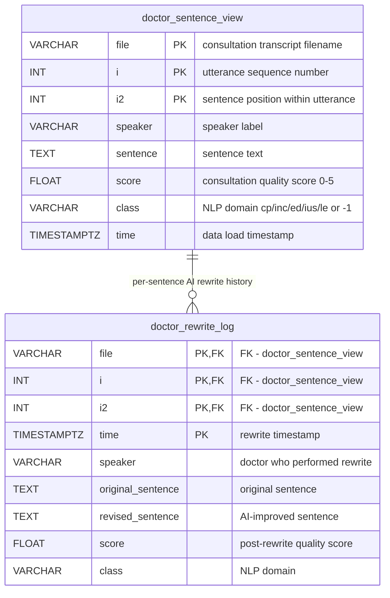
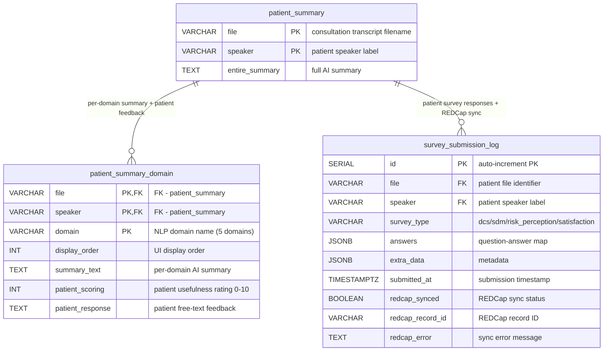
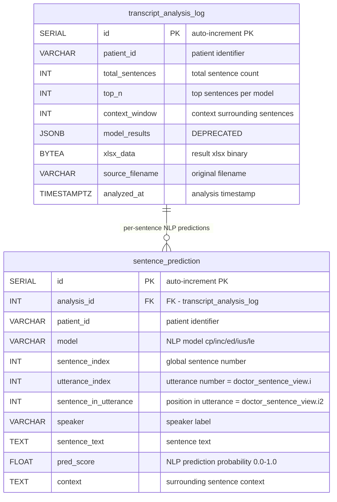
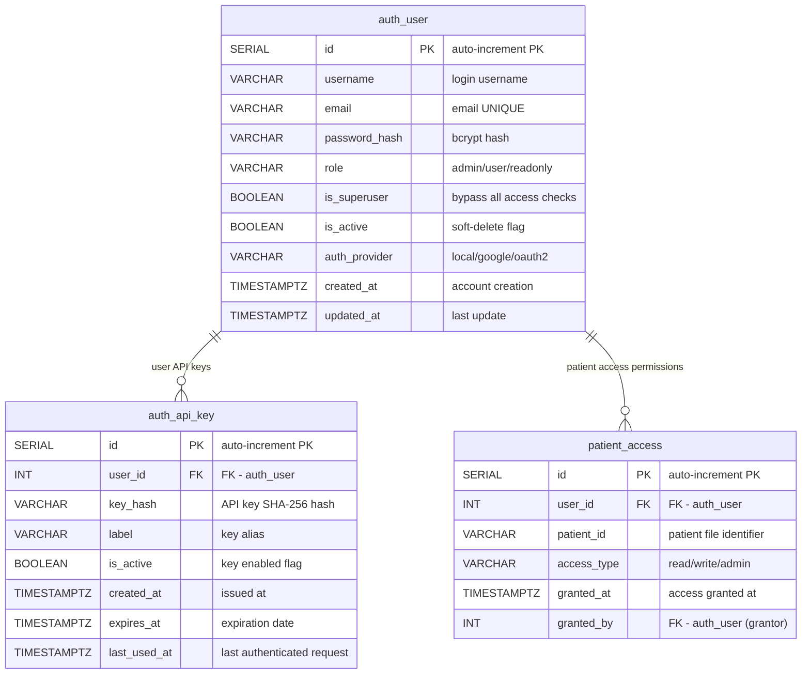
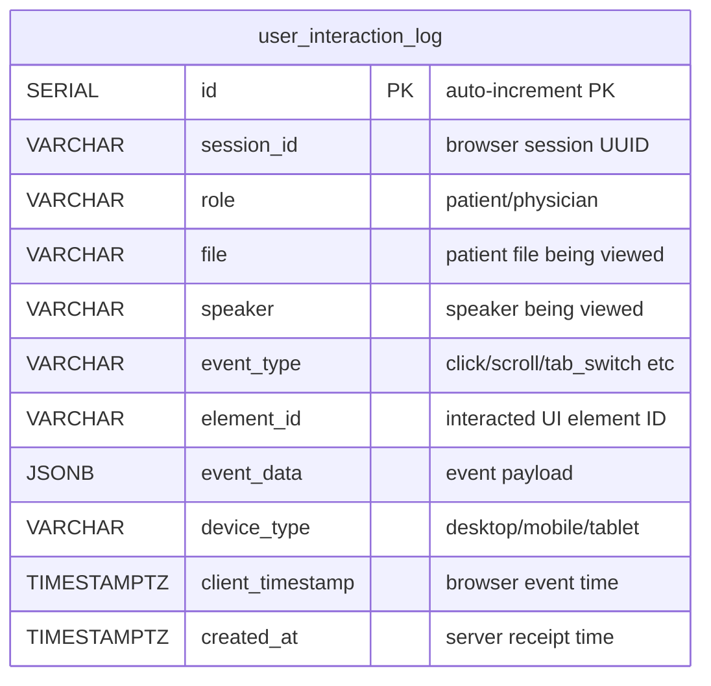

# Prostate Cancer Consultation Dashboard — ERD v3

> Updated: 2026-04-09 | Based on actual code analysis (database_schema.sql, models.py, routes_*.py, pipeline_runner.py)

### A. Doctor Interface



### B. Patient Interface



### C. ML Pipeline (Transcript Analysis)



### D. Authentication & Access Control



### E. User Interaction Tracking



---

## Table Details

### 1. `doctor_sentence_view` — Doctor Dashboard Sentence View

**Role in the app:**
Displays per-sentence consultation quality scores in the Doctor Dashboard. Doctors review their communication quality and practice AI-powered rewriting to improve low-scoring sentences.

**When data is populated:**
`pipeline_runner.py` runs automatically on Docker container startup:
1. Scans xlsx/csv files in `/app/data/transcripts/`
2. Classifies sentences using 5 NLP models (cp, inc, ed, ius, le)
3. Scores consultation quality (0-5) via the `consultation-scorer` container
4. `persistence.py` → INSERT into this table (already-processed files auto-skipped)

**React app screens:**
- Doctor Dashboard > Patient file selector > Sentence list (color-coded by score)
- Score Band Chart (per-domain quality score visualization)

**API endpoints:**
| Endpoint | Purpose |
|---|---|
| `GET /api/doctor/sentences/{file}/{speaker}` | Render sentence list (filtered by class != '-1') |
| `GET /api/doctor/files` | File selector dropdown (DISTINCT file + speaker + count) |
| `GET /api/doctor/scores/average` | Score Band Chart (sentence_prediction JOIN → quality score) |
| `GET /api/doctor/scores/summary/{file}/{speaker}` | Per-patient domain score summary |

---

### 2. `doctor_rewrite_log` — AI Rewrite History

**Role in the app:**
When a doctor selects a low-score sentence in the Doctor Dashboard, the `patient-summary-rewriter` service generates an AI-improved version. The same sentence can be rewritten multiple times → rows accumulate by timestamp (revision history).

**When data is populated:**
React Doctor UI "Rewrite" button click → `PUT /api/doctor/rewrites` → INSERT

**Important:**
Rewrite scores are NOT used in analysis — this is purely a practice/learning tool for physicians. Score average calculations use only the original `doctor_sentence_view.score`.

**API endpoints:**
| Endpoint | Purpose |
|---|---|
| `PUT /api/doctor/rewrites` | Insert new rewrite record |
| `GET /api/doctor/rewrites/{file}/{i}/{i2}/history` | Full rewrite history for a sentence (chronological) |
| `GET /api/doctor/rewrites/stats` | Physician engagement analytics (Admin dashboard) |

---

### 3. `patient_summary` — Patient Consultation Summary

**Role in the app:**
Patients access the Patient Follow-up app after their visit and view an AI-generated summary of their consultation.

**When data is populated:**
`pipeline_runner.py` automatic processing:
- Step 9: `rewriter_service` → `patient-summary-rewriter` container generates AI summaries
- Step 10: `persistence.save_all()` → INSERT into `patient_summary` + `patient_summary_domain`

**React app screen:** Patient Dashboard > "View Consultation Summary"

**API endpoints:**
| Endpoint | Purpose |
|---|---|
| `GET /api/patient/summaries` | Patient list + summary preview |
| `GET /api/patient/summaries/{file}/{speaker}` | Detailed summary (requires check_patient_access) |
| `GET /api/patient/files` | File selector dropdown |
| `GET /api/stats/dashboard` | Admin stats (summary count, average scores) |

---

### 4. `patient_summary_domain` — Per-Domain Summary + Patient Feedback

**Role in the app:**
In the Patient Follow-up app, patients:
1. Review AI summaries for 5 domains (cancer prognosis, continence, erectile dysfunction, urinary symptoms, life expectancy)
2. Rate each domain summary's usefulness 0-10 (`patient_scoring`)
3. Enter free-text feedback for each domain (`patient_response`)

`patient_scoring` and `patient_response` start as NULL → UPDATE when patient inputs in app.

**Design change history:**
Old: Fixed `class_1~5` columns in `patient_summary` + separate scoring/responses tables
Current: Normalized to 1 row per domain → flexible for N domains

**API endpoints:**
| Endpoint | Purpose |
|---|---|
| `PUT /api/patient/scoring` | Patient rates domain usefulness 0-10 |
| `PUT /api/patient/responses` | Patient enters free-text feedback |
| `GET /api/patient/scoring` | Query completed domain scores (with average) |
| `GET /api/patient/responses` | Query submitted domain responses |
| `GET /api/patient/sentences/{file}` | "View relevant sentences" (sentence_prediction JOIN doctor_sentence_view, is_in_summary flag) |

---

### 5. `survey_submission_log` — Patient Survey Responses + REDCap Sync

**Role in the app:**
When a patient completes a survey in the Follow-up app and clicks "Submit", the response is saved to this table AND simultaneously synced to the Cedars-Sinai REDCap system.

**4 survey types:**
| survey_type | Items | Description |
|---|---|---|
| `dcs` | 16 items | Decisional Conflict Scale — measures decision-making conflict |
| `sdm` | 4 items | Shared Decision Making — evaluates shared decision process |
| `risk_perception` | 5 items | Treatment risk awareness assessment |
| `satisfaction` | 1 item | Patient satisfaction free text |

**Data flow:**
1. Patient completes survey in Follow-up app → clicks "Submit"
2. `POST /api/surveys/submit` → INSERT into `survey_submission_log`
3. If `REDCAP_ENABLED=true`:
   - Field name mapping via `FRONTEND_TO_REDCAP_MAPPING`
   - Value transformation via `transform_value()` (e.g., DCS 0-4 → REDCap 1-5)
   - POST to REDCap API → success: `redcap_synced=true`, `redcap_record_id` saved
   - Failure: error stored in `redcap_error` (retryable)

**Why this table is needed:**
- Data loss prevention if REDCap sync fails (local backup)
- Survey data collection works without REDCap (dev/test environments)
- Researchers can query survey data directly from DB without REDCap access
- Sync status tracking: `redcap_synced=false` rows = need re-sync

**API endpoints:**
| Endpoint | Purpose |
|---|---|
| `POST /api/surveys/submit` | INSERT + attempt REDCap sync |
| `GET /api/surveys/responses` | Query surveys by file, speaker, type, date range |
| `GET /api/surveys/stats` | Submission counts by type, completion rates |
| `POST /api/redcap/import` | Direct REDCap API proxy (bulk record import) |

---

### 6. `transcript_analysis_log` — ML Pipeline Analysis History

**Role in the app:**
Stores results when external users (researchers, R scripts) upload consultation transcripts via REST API and the 7-step NLP pipeline runs. Also stores `pipeline_runner.py` auto-processing results.

**Why this table is needed:**
- **Download fallback:** If container restart deletes disk files, re-serve from `xlsx_data` (BYTEA, 50-200KB) → automatically restores to disk
- **Analysis history:** Preserves multiple analysis runs per patient (parameters, timestamps, source filenames)
- **Batch download:** `DISTINCT ON` query for multi-patient zip download retrieves latest results only

**model_results column status:**
DEPRECATED — Previously stored all model results as JSON. Now normalized to `sentence_prediction` table. Column retained for legacy data compatibility; new rows set to NULL.

**API endpoints:**
| Endpoint | Purpose |
|---|---|
| `POST /api/transcript/analyze` | Run 7-step pipeline → INSERT 1 row + xlsx_data |
| `POST /api/transcript/analyze-batch` | Multiple files, independent DB session per file |
| `GET /api/transcript/download/{patient_id}` | Disk first → DB fallback → auto-restore to disk |
| `GET /api/transcript/download-batch` | Multi-patient zip download (DISTINCT ON query) |
| `GET /api/transcript/history/{patient_id}` | Paginated analysis history (newest first, excludes xlsx_data) |

---

### 7. `sentence_prediction` — Per-Sentence NLP Prediction Results

**Role in the app:**
Normalized storage of NLP prediction probabilities per sentence per model. Used in **both** Doctor app and Patient app as a core data source.

**5 NLP models (Random Forest classifiers):**
| model | Domain |
|---|---|
| `cp` | Cancer Prognosis |
| `inc` | Incontinence |
| `ed` | Erectile Dysfunction |
| `ius` | Irritative Urinary Symptoms |
| `le` | Life Expectancy |

**pred_score is a PROBABILITY, not a quality score!**
Range 0.0-1.0. Higher = more relevant to that domain. Quality score (0-5) is in `doctor_sentence_view.score` separately.

**In Doctor app:** Score Band Chart displays quality score of the sentence with highest `pred_score` per domain.
**In Patient app:** "View relevant sentences from your visit" shows top N sentences by `pred_score` per domain. Sentences used in AI summary are marked `is_in_summary=true`.

**JOIN keys with `doctor_sentence_view`:**
- `sentence_prediction.utterance_index` = `doctor_sentence_view.i`
- `sentence_prediction.sentence_in_utterance` = `doctor_sentence_view.i2`
- `transcript_analysis_log.source_filename` = `doctor_sentence_view.file`

**Relationship with `transcript_analysis_log.model_results` (JSON):**
Previously stored as JSON → no SQL filtering possible. Now normalized to per-row → enables model, min_score, top_n queries. Legacy data auto-migrated via `_backfill_predictions()`.

**API endpoints:**
| Endpoint | Purpose |
|---|---|
| `POST /api/transcript/analyze` | Bulk INSERT via `flush()` + `add_all()` |
| `GET /api/transcript/predictions/{patient_id}` | Filter by model, min_score, top_n, analysis_id |
| `GET /api/patient/sentences/{file}` | Patient app "View relevant sentences" (JOIN doctor_sentence_view) |
| `GET /api/doctor/scores/average` | Doctor app Score Band Chart |
| `GET /api/doctor/scores/summary/{file}/{speaker}` | Per-patient domain score detail |

---

### 8-10. Authentication & Access Control (`auth_user`, `auth_api_key`, `patient_access`)

> These 3 tables operate together as a single authentication/authorization system.

#### Current Production State: `api_key` Mode (Default)

**Currently, all 3 tables are empty and unused.**

The `.env` file is set to `AUTH_MODE=api_key`, using a single shared API key:
```
All API requests
  → Header: X-API-Key: {API_KEY value from .env}
  → hmac.compare_digest() comparison (timing attack prevention)
  → On success: returns hardcoded "system" user (is_superuser=True)
  → auth_user, auth_api_key, patient_access tables NOT queried
  → All patient data access automatically granted
```

#### Table Usage by AUTH_MODE

| Mode | auth_user | auth_api_key | patient_access | Description |
|------|:---------:|:------------:|:--------------:|-------------|
| **`api_key` (current)** | Not used | Not used | Not used | Single key for full access. Dev/pilot use |
| `multi_key` | **Used** | **Used** | **Used** | Per-user API keys. Production API access control |
| `jwt` | **Used** | Not used | **Used** | Username/password login → JWT token |
| `oauth2` | **Used** (auto-create) | Not used | **Used** | Google/OIDC external login. Auto-creates new users |

#### Authentication Flow by Mode

**`multi_key` mode — Per-user API keys:**
```
API request → X-API-Key header
  → Look up SHA-256(key) in auth_api_key table
  → Validate: is_active=true, expires_at not expired
  → JOIN auth_user: load user info (role, is_superuser, is_active)
  → Update auth_api_key.last_used_at timestamp
  → If is_superuser=false → check patient_access table for authorization
```

**`jwt` mode — Login + token:**
```
1) POST /api/auth/login (username + password)
     → Verify auth_user.password_hash (bcrypt)
     → Issue JWT access token

2) Subsequent API requests → Authorization: Bearer {token}
     → Decode token → verify auth_user.is_active
     → If is_superuser=false → check patient_access
```

**`oauth2` mode — External login (Google, Okta, Azure AD):**
```
External OIDC provider login → receive JWT token
  → Look up auth_user by email
  → No row → auto-INSERT (role='user', is_superuser=false)
  → Row exists → verify is_active
  → Check patient_access
```

#### `auth_user` — User Accounts

**Column roles:**
- `role`: Permission level — `admin` (manage users/keys), `user` (standard), `readonly` (read-only)
- `is_superuser`: If `true`, completely bypasses `check_patient_access()` (access to all patients)
- `is_active`: If `false`, blocks login/API access (disable account without deletion)
- `auth_provider`: Auth method — `local` (password), `google` (OAuth2), `oauth2` (other OIDC)

#### `auth_api_key` — Per-User API Keys

**Used only in `multi_key` mode.**

- `key_hash`: SHA-256 hash of API key (original key shown once at issuance only, never stored on server)
- `is_active=false`: Instantly revoke key without deletion
- `last_used_at`: Updated on every authenticated request (usage/activity tracking)
- `expires_at`: Expired keys automatically rejected (security key rotation)
- One user can hold multiple keys (e.g., `dev-laptop`, `CI-server`, `postman-test`)

#### `patient_access` — Per-Patient Access Control (HIPAA Compliance)

**Why needed:**
HIPAA regulations require medical data access based on "need-to-know" principle.
Doctor A should only access their own patients; Researcher B only IRB-approved patients.

**`check_patient_access()` flow:**
```
check_patient_access(file, user, db) called:

  is_superuser=True?  → Pass unconditionally (api_key mode default)
  is_superuser=False? → Query patient_access for (user_id, patient_id)
                      → No row → HTTP 403 Forbidden
                      → Row found → Verify access_type level
```

**Access levels:**
| access_type | Permission | Example |
|---|---|---|
| `read` | View only | Researcher analyzing data |
| `write` | View + modify | Attending doctor entering rewrites/feedback |
| `admin` | View + modify + grant access to others | PI (Principal Investigator) |

**Endpoints where `check_patient_access()` is called:**
| Route file | Endpoints | Protected resource |
|---|---|---|
| `routes_transcript.py` | download, download-batch, history, predictions | Patient NLP analysis results |
| `routes_doctor.py` | sentences/{file}/{speaker} | Doctor viewing specific patient sentences |
| `routes_patient.py` | summaries/{file}/{speaker}, sentences/{file} | Patient viewing their consultation summary |
| `routes_surveys.py` | All endpoints | **NOT called** (auth only, no per-patient control) |
| `routes_tracking.py` | All endpoints | **NOT called** (auth only, no per-patient control) |

#### Admin Endpoints (`auth/admin_routes.py`)

| Endpoint | Purpose | Required Role |
|---|---|---|
| `POST /api/auth/users` | Create user | admin |
| `PATCH /api/auth/users/{id}` | Update user (role, is_active, etc.) | admin |
| `DELETE /api/auth/users/{id}` | Delete user (CASCADE: api_keys + patient_access deleted) | admin |
| `POST /api/auth/users/{id}/keys` | Issue API key for user | admin |
| `POST /api/auth/login` | JWT login (only works in jwt mode) | Anyone |

#### Future Scaling Scenarios

These 3 tables are **infrastructure prepared for when the research scales from pilot to multi-site clinical trials**:
- **Pilot (current)**: `api_key` mode — small research team, single shared key, full access
- **Single-site clinical**: `multi_key` or `jwt` — per-doctor/researcher accounts + access limited to assigned patients
- **Multi-site clinical**: `oauth2` — institutional SSO (Google, Okta) + fine-grained patient access per site/IRB approval

---

### 11. `user_interaction_log` — UI Interaction Tracking (Research)

**Role in the app:**
Records all UI interactions (clicks, scrolls, tab switches, page views, time spent) from **both** Patient and Doctor apps for research purposes.

**Data flow:**
1. React `TrackingEventManager` batches events client-side (max 500 per batch)
2. Sends to server on page navigation or periodic flush
3. `POST /api/tracking/events` → bulk INSERT into `user_interaction_log`

**Rate Limiting:** Redis `fastapi-limiter` — 30 requests per 60 seconds (abuse prevention)

**Research applications:**
- Usability studies: Which domain summaries do patients view most?
- Session analysis: Average time on task, navigation patterns
- A/B testing: Engagement comparison across UI variants
- Device analysis: Mobile vs desktop usage patterns

**API endpoints:**
| Endpoint | Purpose |
|---|---|
| `POST /api/tracking/events` | Batch INSERT (max 500 events/request, rate limited) |
| `GET /api/tracking/events` | Filter by role, file, speaker, session_id, event_type |
| `GET /api/tracking/stats` | Total events, sessions, patients, event type counts |
| `GET /api/tracking/patients` | Patient files with event counts |
| `GET /api/tracking/analytics` | 6 parallel queries (timeline, by_patient, sessions, device_breakdown, top_elements, hourly_heatmap) |

---

## Cross-Table JOINs (Relationships without FK constraints)

| Relationship | Connection | Used in |
|---|---|---|
| `doctor_sentence_view.file` = `patient_summary.file` | Same transcript filename | One consultation used in both doctor view + patient summary |
| `sentence_prediction.(utterance_index, sentence_in_utterance)` = `doctor_sentence_view.(i, i2)` | Utterance/sentence index match | `/api/patient/sentences/{file}`, `/api/doctor/scores/average` |
| `transcript_analysis_log.source_filename` = `doctor_sentence_view.file` | Analysis source filename | `/api/doctor/scores/average`, `/api/doctor/scores/summary` |
| `user_interaction_log.file` = `doctor_sentence_view.file` | Which patient data is being viewed | Tracking analytics linked to patient data |
