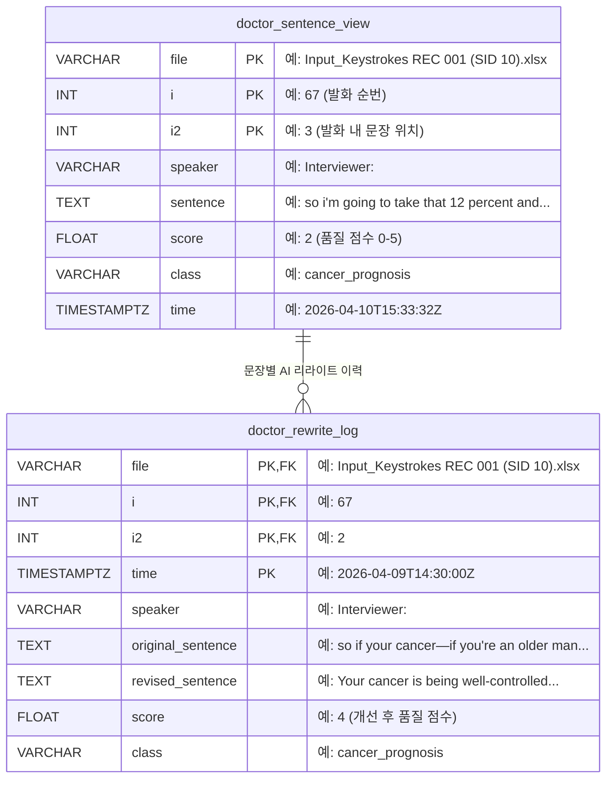
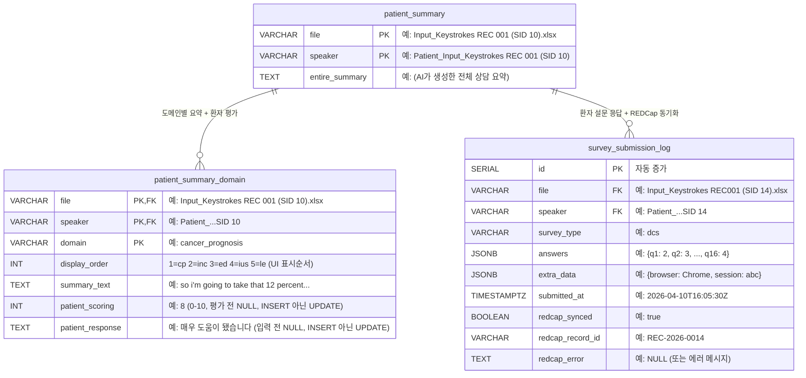
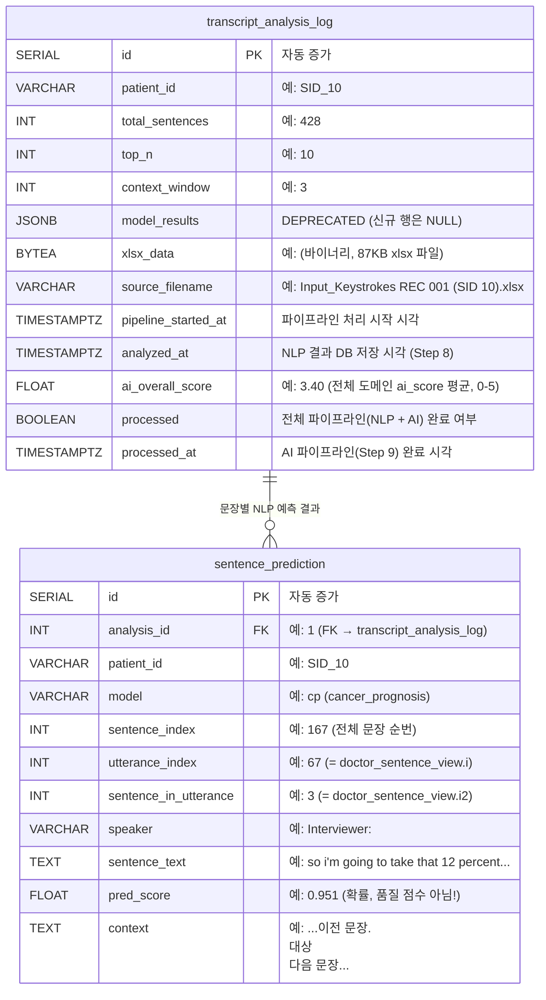
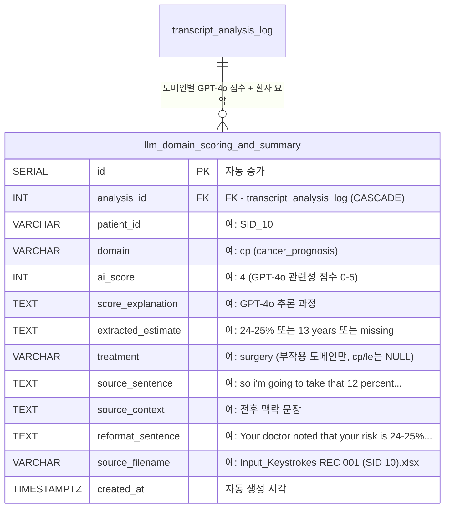
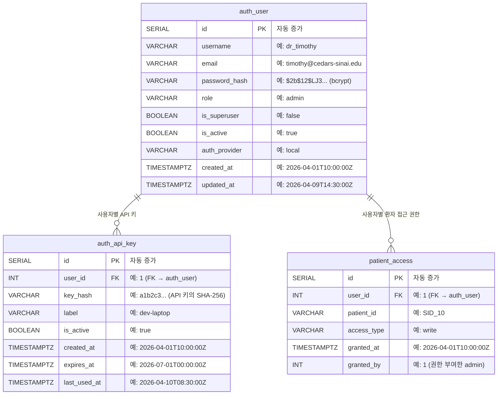
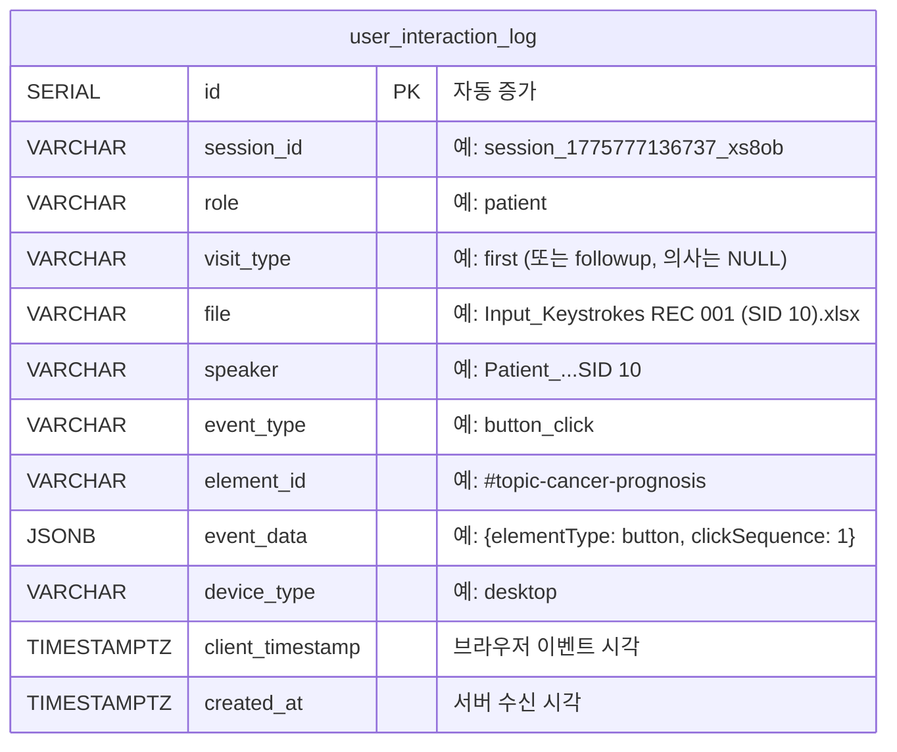

# 전립선암 상담 대시보드 — ERD v3

> 업데이트: 2026-04-09 | 실제 코드 분석 기반 (database_schema.sql, models.py, routes_*.py, pipeline_runner.py)

### A. 의사 인터페이스 (Doctor Interface)



### B. 환자 인터페이스 (Patient Interface)



> **`survey_submission_log`가 INSERT 방식인 이유:** 같은 환자가 같은 설문을 다른 시점에 제출하면 각각이 별개의 측정값. 두 번째 제출이 첫 번째를 덮어쓰면 안 됨. 행별 REDCap 동기화 추적도 가능.
>
> **`patient_summary_domain.patient_scoring`이 UPDATE 방식인 이유:** "현재 평가"만 필요 — 이전 평가 이력을 보존할 필요 없음.

### C. ML 파이프라인 (Transcript Analysis)



> **`transcript_analysis_log.id`가 필요한 이유:** 같은 환자(SID_10)를 다른 `top_n`/`context_window` 파라미터로 여러 번 분석하거나, 녹취록 수정 후 재분석할 수 있음. `patient_id`만으로는 이 실행들을 구분할 수 없음. `sentence_prediction.analysis_id`의 FK 대상이기도 함.
>
> **`sentence_prediction.id`가 필요한 이유:** 자연 키 `(analysis_id, model, sentence_index)`가 유일하지만, 단일 정수 PK(4바이트)가 3컬럼 복합키(~14바이트)보다 JOIN과 인덱싱에 효율적. 환자당 2,140+행에서 차이가 누적됨.

### C-2. LLM 도메인 점수 및 요약 (GPT-4o AI 파이프라인)



> **이 테이블이 저장하는 것:** NLP 파이프라인이 문장을 분류하고 선택한 후 (Step 1-7), Guille의 AI 파이프라인 (Step 11)이 Azure OpenAI GPT-4o를 사용하여: (1) 각 문장의 임상적 구체성 0-5점 평가, (2) 실제 위험 수치 추출, (3) 최적 추정치 선택, (4) 환자가 이해할 수 있는 문장으로 변환. 분석 실행당 도메인별 1행 (부작용 도메인은 치료법별 추가 행).
>
> **`ai_score` (0-5) vs `pred_score` (0.0-1.0) vs `score` (0-5) — 3가지 다른 점수:**
> - `sentence_prediction.pred_score` (0.0-1.0) = R Random Forest 확률 (이 문장이 해당 도메인인지)
> - `doctor_sentence_view.score` (0-5) = consultation-scorer 상담 품질 점수
> - `llm_domain_scoring_and_summary.ai_score` (0-5) = GPT-4o가 평가한 임상적 구체성 (0=언급 없음, 5=환자 특성 반영 + 기간 포함)
>
> **`source_sentence` vs `source_context`:**
> - `source_sentence` (80-175자): GPT-4o가 선택하여 AI Summary 생성의 직접 입력으로 사용한 **원본 단일 문장**. 예: *"so i'm going to take that 12 percent and cut it in half again, so six percent will die of cancer"*
> - `source_context` (500-750자): GPT-4o가 점수를 매길 때 맥락 이해용으로 참고한 **전후 여러 문장**. 예: 치료 옵션, 위험 백분율, 예후에 대한 전체 대화 내용.
> - **환자 앱에서:** "View relevant sentences from your visit"에는 `source_context` 표시 — AI Summary가 도출된 **전체 대화 맥락**을 환자가 볼 수 있음. 고립된 문장이 아닌 대화의 흐름을 이해할 수 있게 해줌.
> - **AI Summary** (`reformat_sentence`): GPT-4o가 `source_sentence` + `source_context`를 바탕으로 생성한 환자 친화적 문장. 예: *"의사가 치료 없이 사망 위험이 24-25%이며, 치료 시 6%로 감소한다고 설명했습니다."*
>
> **부작용 도메인:** ed/inc/ius는 의사가 다른 치료법(수술 vs 방사선)별로 위험을 설명할 수 있음. `treatment` 값이 다른 별도 행으로 저장됨. 일반 도메인(cp/le)은 `treatment=NULL`.

**예시 데이터 (SID-10 실제 GPT-4o 출력):**

| domain | ai_score | extracted_estimate | treatment | reformat_sentence |
|---|---|---|---|---|
| cp | 4 | 24-25% → 6% | NULL | "치료 없이 사망 위험 24-25%, 치료 시 6%로 감소" |
| le | 5 | 13 years | NULL | "기대수명 13년 (나이와 건강 기반)" |
| ed | 4 | 100% 초기, 20% 영구 | surgery | "수술 후 초기 100% 발기부전, 약 20% 영구" |
| inc | 4 | 5% 영구 | surgery | "수술 후 약 5% 완전 조절 불가" |
| ius | 0 | missing | NULL | "의사가 이 위험을 언급하지 않았습니다" |

**API 엔드포인트:**

| 엔드포인트 | 용도 |
|---|---|
| `GET /api/patient/ai-summary/{file}` | 특정 환자의 GPT-4o 생성 도메인별 요약 조회 |
| `GET /api/patient/ai-summary` | AI 요약이 있는 환자 목록 |

### D. 인증 및 접근 제어 (Authentication & Access Control)



> **`auth_user.id`:** `auth_api_key.user_id`와 `patient_access.user_id`의 FK 대상. 1명의 사용자가 여러 키 + 여러 환자 접근 가능.
>
> **`auth_api_key.id`:** 1명이 여러 키 보유 (예: dev-laptop, CI-server). ID로 개별 키 비활성화 가능.
>
> **`patient_access.id`:** 1명이 여러 환자 접근 가능. `(user_id, patient_id)` UNIQUE 제약으로 중복 방지.

### E. 사용자 추적 (User Interaction Tracking)



> **`user_interaction_log.id`가 필요한 이유:** 세션당 수백 건의 이벤트(클릭, 스크롤, 페이지 뷰) 발생. 같은 사용자가 같은 버튼을 다른 시각에 클릭할 수 있어 자연 유일키가 없음.

---

## 테이블별 상세 설명

### 1. `doctor_sentence_view` — 의사 대시보드 문장 뷰

**앱에서의 역할:**
Doctor Dashboard(의사용 웹앱)에서 환자 상담 녹취록의 문장별 품질 점수를 보여주는 테이블. 의사는 이 화면에서 자신의 상담 품질을 확인하고, AI 리라이트를 통해 더 나은 표현을 연습할 수 있음.

**데이터가 들어오는 시점:**
Docker 컨테이너 최초 시작 시 `pipeline_runner.py`가 자동 실행:
1. `/app/data/transcripts/` 폴더의 xlsx/csv 파일 스캔
2. NLP 5개 모델(cp, inc, ed, ius, le)로 문장 분류
3. `consultation-scorer` 컨테이너로 품질 점수(0-5) 매김
4. `persistence.py` → 이 테이블에 INSERT (이미 처리된 파일은 자동 스킵)

**React 앱 화면:**
- Doctor Dashboard > 환자 파일 선택 > 문장 목록 (점수별 색상 표시)
- Score Band Chart (도메인별 품질 점수 시각화)

**예시 데이터:**
| file | i | i2 | speaker | sentence | score | class |
|---|---|---|---|---|---|---|
| `Input_Keystrokes REC 001 (SID 10).xlsx` | 67 | 3 | `Interviewer:` | so i'm going to take that 12 percent and cut it in half again... | 2 | cancer_prognosis |
| `Input_Keystrokes REC 001 (SID 10).xlsx` | 67 | 2 | `Interviewer:` | so if your cancer—if you're an older man and your cancer is... | 1 | cancer_prognosis |
| `Input_Keystrokes REC001 (SID 14).xlsx` | 52 | 1 | `Interviewer:` | the nerves that supply the erectile function of the penis... | 3 | erectile_dysfunction_potency |

**API 엔드포인트:**
| 엔드포인트 | 용도 |
|---|---|
| `GET /api/doctor/sentences/{file}/{speaker}` | 문장 목록 렌더링 (class != '-1' 필터) |
| `GET /api/doctor/files` | 파일 선택 드롭다운 (DISTINCT file + speaker + 문장수) |
| `GET /api/doctor/scores/average` | Score Band Chart (sentence_prediction JOIN → quality score) |
| `GET /api/doctor/scores/summary/{file}/{speaker}` | 환자별 도메인 점수 요약 |

---

### 2. `doctor_rewrite_log` — AI 리라이트 이력

**앱에서의 역할:**
Doctor Dashboard에서 의사가 낮은 점수의 문장을 선택하면 `patient-summary-rewriter` 서비스가 AI 개선안을 생성. 의사는 이 개선안을 검토하고, 같은 문장에 대해 여러 번 리라이트를 시도할 수 있음 → 시간별로 여러 행이 쌓임 (revision history).

**데이터가 들어오는 시점:**
React Doctor UI에서 "Rewrite" 버튼 클릭 시 `PUT /api/doctor/rewrites` → INSERT

**주의:**
리라이트 점수는 분석용이 아님 — 순수하게 의사의 연습/학습 도구. score average 계산에는 원본 `doctor_sentence_view.score`만 사용됨.

**예시 데이터:**
| file | i | i2 | time | speaker | original_sentence | revised_sentence | score | class |
|---|---|---|---|---|---|---|---|---|
| `...REC 001 (SID 10).xlsx` | 67 | 2 | 2026-04-09 14:30:00 | `Interviewer:` | so if your cancer—if you're an older man... | Your cancer is being well-controlled, and as an older patient... | 4 | cancer_prognosis |

**API 엔드포인트:**
| 엔드포인트 | 용도 |
|---|---|
| `PUT /api/doctor/rewrites` | 새 리라이트 행 INSERT |
| `GET /api/doctor/rewrites/{file}/{i}/{i2}/history` | 특정 문장의 전체 리라이트 이력 (시간순) |
| `GET /api/doctor/rewrites/stats` | 의사 참여도 분석 (Admin 대시보드) |

---

### 3. `patient_summary` — 환자 상담 요약

**앱에서의 역할:**
Patient Follow-up 앱에서 환자가 진료 후 접속하면 전체 상담 AI 요약을 확인할 수 있음.

**데이터가 들어오는 시점:**
`pipeline_runner.py` 시작 시 자동 처리:
- Step 9: `rewriter_service` → `patient-summary-rewriter` 컨테이너에서 AI 요약 생성
- Step 10: `persistence.save_all()` → `patient_summary` + `patient_summary_domain` INSERT

**React 앱 화면:**
Patient Dashboard > "상담 요약 보기"

**예시 데이터:**
| file | speaker | entire_summary |
|---|---|---|
| `Input_Keystrokes REC 001 (SID 10).xlsx` | `Patient_Input_Keystrokes REC 001 (SID 10)` | (AI가 생성한 전체 상담 요약 텍스트) |
| `Input_Keystrokes REC001 (SID 14).xlsx` | `Patient_Input_Keystrokes REC001 (SID 14)` | (AI가 생성한 전체 상담 요약 텍스트) |

**API 엔드포인트:**
| 엔드포인트 | 용도 |
|---|---|
| `GET /api/patient/summaries` | 환자 목록 + 요약 미리보기 |
| `GET /api/patient/summaries/{file}/{speaker}` | 특정 환자 상세 요약 (check_patient_access 권한 검사) |
| `GET /api/patient/files` | 파일 선택 드롭다운 |
| `GET /api/stats/dashboard` | Admin 통계 (환자 요약 수, 평균 평가 점수) |

---

### 4. `patient_summary_domain` — 도메인별 요약 + 환자 피드백

**앱에서의 역할:**
환자가 Patient Follow-up 앱에서 5개 도메인별로:
1. AI 요약 확인 (암 예후, 요실금, 발기부전, 배뇨증상, 기대수명)
2. 각 도메인 요약이 도움이 됐는지 0-10점 평가 (`patient_scoring`)
3. 추가 질문이나 피드백 자유 텍스트 입력 (`patient_response`)

`patient_scoring`, `patient_response`는 초기에 NULL → 환자가 앱에서 입력 시 UPDATE됨.

**`display_order` — UI 표시 순서:**
Patient 앱에서 도메인이 보이는 순서를 결정. `pipeline_runner.py`의 `_DOMAIN_SLOT_MAP`에서 설정:

| display_order | domain | 표시 순서 |
|:---:|---|---|
| 1 | `cancer_prognosis` | 첫 번째 |
| 2 | `continence` | 두 번째 |
| 3 | `erectile_dysfunction_potency` | 세 번째 |
| 4 | `irritative_urinary_symptoms_...` | 네 번째 |
| 5 | `life_expectancy` | 다섯 번째 |

알파벳순이 아닌 임상적으로 적절한 순서를 PI가 정의. 프론트엔드에서 `ORDER BY display_order`로 정렬하여 렌더링.

**설계 변경 이력:**
기존: `patient_summary`에 class_1~5 컬럼 + 별도 scoring/responses 테이블 (고정 5개)
현재: `patient_summary_domain`으로 정규화 → 도메인 수 유연하게 확장 가능

**예시 데이터:**
| file | speaker | domain | display_order | summary_text | patient_scoring | patient_response |
|---|---|---|---|---|---|---|
| `...REC 001 (SID 10).xlsx` | `Patient_...SID 10` | `cancer_prognosis` | 1 | so i'm going to take that 12 percent and cut it in half again... | NULL | NULL |
| `...REC 001 (SID 10).xlsx` | `Patient_...SID 10` | `continence` | 2 | when it does come out, everybody has urinary incontinence... | NULL | NULL |
| `...REC 001 (SID 10).xlsx` | `Patient_...SID 10` | `erectile_dysfunction_potency` | 3 | so even if we save the nerves, initially everyone is losing... | 8 | "매우 도움이 됐습니다" |

**API 엔드포인트:**
| 엔드포인트 | 용도 |
|---|---|
| `PUT /api/patient/scoring` | 환자가 도메인별 유용도 0-10점 평가 |
| `PUT /api/patient/responses` | 환자가 도메인별 자유 텍스트 피드백 입력 |
| `GET /api/patient/scoring` | 평가 완료된 도메인 점수 조회 (평균 계산 포함) |
| `GET /api/patient/responses` | 피드백 입력된 도메인 응답 조회 |
| `GET /api/patient/sentences/{file}` | "상담에서 관련 문장 보기" (sentence_prediction JOIN doctor_sentence_view, is_in_summary 표시) |

---

### 5. `survey_submission_log` — 환자 설문 응답 + REDCap 동기화

**앱에서의 역할:**
Patient Follow-up 앱에서 환자가 설문조사를 작성하고 "Submit" 클릭 시, 이 테이블에 저장됨과 동시에 Cedars-Sinai REDCap 시스템에도 동기화됨.

**설문 유형 4가지:**
| survey_type | 문항수 | 내용 |
|---|---|---|
| `dcs` | 16문항 | Decisional Conflict Scale — 의사결정 갈등 측정 |
| `sdm` | 4문항 | Shared Decision Making — 공유 의사결정 평가 |
| `risk_perception` | 5문항 | 치료 위험도 인지 평가 |
| `satisfaction` | 1문항 | 환자 만족도 자유 텍스트 |

**데이터 흐름:**
1. 환자가 Patient Follow-up 앱에서 설문 작성 → "Submit" 클릭
2. `POST /api/surveys/submit` → `survey_submission_log`에 INSERT
3. `REDCAP_ENABLED=true`이면:
   - `FRONTEND_TO_REDCAP_MAPPING`으로 필드명 변환
   - `transform_value()`로 값 변환 (예: DCS 0-4 → REDCap 1-5)
   - REDCap API에 POST → 성공: `redcap_synced=true`, `redcap_record_id` 저장
   - 실패: `redcap_error`에 에러 메시지 저장 (재시도 가능)

**이 테이블이 필요한 이유:**
- REDCap 동기화 실패 시에도 데이터 유실 방지 (로컬 백업)
- REDCap 미설정 환경(개발/테스트)에서도 설문 데이터 수집 가능
- 연구자가 REDCap 없이도 직접 DB에서 설문 데이터 조회 가능
- 동기화 상태 추적: `redcap_synced=false`인 행 = 재동기화 필요

**예시 데이터:**
| id | file | speaker | survey_type | answers | redcap_synced | redcap_record_id |
|---|---|---|---|---|---|---|
| 1 | `...REC001 (SID 14).xlsx` | `Patient_...SID 14` | `dcs` | `{"q1": 2, "q2": 3, ..., "q16": 4}` | true | `REC-2026-0014` |
| 2 | `...REC001 (SID 14).xlsx` | `Patient_...SID 14` | `sdm` | `{"q1": "yes", "q2": "a_lot", "q3": "some", "q4": "yes"}` | true | `REC-2026-0014` |
| 3 | `...REC001 (SID 14).xlsx` | `Patient_...SID 14` | `risk_perception` | `{"cancerRiskUntreated": 45, "cancerRiskTreated": "10", ...}` | false | NULL |

**API 엔드포인트:**
| 엔드포인트 | 용도 |
|---|---|
| `POST /api/surveys/submit` | INSERT + REDCap 동기화 시도 |
| `GET /api/surveys/responses` | 연구자/관리자 설문 데이터 조회 (file, speaker, type, 날짜 필터) |
| `GET /api/surveys/stats` | 설문 유형별 제출 건수, 완료율 집계 |
| `POST /api/redcap/import` | REDCap API 직접 프록시 (벌크 레코드 임포트) |

---

### 6. `transcript_analysis_log` — ML 파이프라인 분석 이력

**앱에서의 역할:**
외부 사용자(연구자, R 스크립트 등)가 REST API를 통해 상담 녹취록을 업로드하면, 7단계 NLP 파이프라인이 실행되고 그 결과가 이 테이블에 저장됨. `pipeline_runner.py` 자동 처리 결과도 여기에 저장.

**이 테이블이 필요한 이유:**
- **다운로드 폴백:** 컨테이너 재시작으로 디스크 파일이 삭제돼도 `xlsx_data`(BYTEA, 50-200KB)에서 재서빙 가능 → 자동으로 디스크에 복원
- **분석 이력:** 같은 환자에 대해 여러 번 분석한 기록 보존 (파라미터, 타임스탬프, 소스 파일명 포함)
- **배치 다운로드:** 여러 환자 결과를 zip으로 한번에 다운로드 시 `DISTINCT ON` 쿼리로 최신 결과만 가져옴

**왜 SERIAL id가 필요한가 (patient_id만으로 충분하지 않은 이유):**
같은 환자를 다른 파라미터로 여러 번 분석하거나, 녹취록 수정 후 재분석할 수 있음:

| id | patient_id | top_n | context_window | analyzed_at | 목적 |
|---|---|---|---|---|---|
| 1 | `SID_10` | 10 | 3 | 2026-04-10 15:33 | 최초 분석 |
| 2 | `SID_10` | 5 | 5 | 2026-04-11 09:00 | 파라미터 변경 후 재분석 |
| 3 | `SID_10` | 10 | 3 | 2026-04-12 14:20 | 녹취록 수정 후 재분석 |

`patient_id`만으로는 이 3건을 구분할 수 없음. `id`가 있어야:
- `sentence_prediction.analysis_id = 2` → 특정 분석 실행의 예측 결과만 조회
- `GET /api/transcript/history/SID_10` → 3건의 분석 이력 나열
- `ORDER BY id DESC LIMIT 1` → 최신 분석 결과로 다운로드

**model_results 컬럼 상태:**
DEPRECATED — 이전에는 전체 모델 결과를 JSON으로 저장했으나, 현재는 `sentence_prediction` 테이블로 정규화됨. 레거시 데이터 호환을 위해 컬럼 유지, 신규 행은 NULL.

**예시 데이터 (실제 DB 값):**

| id | patient_id | total_sentences | top_n | context_window | source_filename | analyzed_at | xlsx_data |
|---|---|---|---|---|---|---|---|
| 1 | `SID_10` | 428 | 10 | 3 | `Input_Keystrokes REC 001 (SID 10).xlsx` | 2026-04-10 15:33:32 | (바이너리, 87KB) |
| 2 | `SID_14` | 423 | 10 | 3 | `Input_Keystrokes REC001 (SID 14).xlsx` | 2026-04-10 15:34:06 | (바이너리, 92KB) |

**API 엔드포인트:**
| 엔드포인트 | 용도 |
|---|---|
| `POST /api/transcript/analyze` | 7단계 파이프라인 실행 → 1행 INSERT + xlsx_data 저장 |
| `POST /api/transcript/analyze-batch` | 여러 파일 동시 분석, 파일별 독립 DB 세션 |
| `GET /api/transcript/download/{patient_id}` | 디스크 우선 → DB 폴백 → 디스크 자동 복원 |
| `GET /api/transcript/download-batch` | 여러 환자 zip 다운로드 (DISTINCT ON 쿼리) |
| `GET /api/transcript/history/{patient_id}` | 페이지네이션된 분석 이력 (최신순, xlsx_data SELECT 제외) |

---

### 7. `sentence_prediction` — 문장별 NLP 예측 결과

**앱에서의 역할:**
NLP 5개 모델(Random Forest 분류기)이 각 문장에 매긴 예측 확률값을 정규화하여 저장. Doctor 앱과 Patient 앱 **모두**에서 핵심적으로 사용됨.

**왜 SERIAL id인가 (복합 PK `analysis_id + model + sentence_index` 대신):**
`(analysis_id, model, sentence_index)` 조합이 사실상 유일하지만, 단일 정수 PK가 더 효율적:
- JOIN 시 정수 1개(4바이트) 비교 vs 정수 2개 + 문자열 1개(~14바이트) 비교
- FK 참조: `WHERE id = 1` vs `WHERE analysis_id = 1 AND model = 'cp' AND sentence_index = 167`
- 환자당 2,140행 × 다수 환자 → 인덱스 크기 차이가 누적됨

**데이터 저장 방식 — 1개 문장 × 5개 모델 = 5행:**
녹취록의 각 문장은 5개 NLP 모델 모두에 의해 독립적으로 평가됨. 하나의 문장에 대해 5개 행이 생성되며, 각 행은 해당 도메인에 속할 확률(`pred_score`)을 가짐:

| 행 | model | sentence_text | pred_score | 의미 |
|---|---|---|---|---|
| 1 | `cp` | "so i'm going to take that 12 percent and cut it in half" | **0.951** | 암 예후 관련 확률 95.1% |
| 2 | `inc` | (동일 문장) | 0.123 | 요실금 관련 확률 12.3% |
| 3 | `ed` | (동일 문장) | 0.045 | 발기부전 관련 확률 4.5% |
| 4 | `ius` | (동일 문장) | 0.067 | 배뇨증상 관련 확률 6.7% |
| 5 | `le` | (동일 문장) | 0.312 | 기대수명 관련 확률 31.2% |

428개 문장의 녹취록이면: 428 × 5모델 = **2,140행** (분석 1회당).

**5개 NLP 모델 (Random Forest 분류기):**

| model | 도메인 |
|---|---|
| `cp` | Cancer Prognosis (암 예후) |
| `inc` | Incontinence (요실금) |
| `ed` | Erectile Dysfunction (발기부전) |
| `ius` | Irritative Urinary Symptoms (배뇨 자극 증상) |
| `le` | Life Expectancy (기대수명) |

**pred_score는 확률이지 점수가 아님!**
0.0~1.0 범위의 예측 확률. 높을수록 해당 도메인과 관련성이 높은 문장. 품질 점수(0-5)는 `doctor_sentence_view.score`에 별도로 있음.

**Doctor 앱에서:** Score Band Chart에서 `pred_score` 1위 문장의 quality score 표시
**Patient 앱에서:** "상담에서 관련 문장 보기"에서 도메인별 `pred_score` 상위 N개 표시. AI 요약에 사용된 문장은 `is_in_summary=true`로 표시.

**`doctor_sentence_view`와의 JOIN 키:**
- `sentence_prediction.utterance_index` = `doctor_sentence_view.i`
- `sentence_prediction.sentence_in_utterance` = `doctor_sentence_view.i2`
- `transcript_analysis_log.source_filename` = `doctor_sentence_view.file`

**`transcript_analysis_log`와의 관계:**
`transcript_analysis_log`는 **부모** (분석 실행 1회 = 1행). `sentence_prediction`은 **자식** (실행당 수천 행). `analysis_id` FK로 연결. 부모 삭제 시 자식도 CASCADE 삭제.

이전에는 모든 예측을 `transcript_analysis_log.model_results`에 JSON으로 저장 → SQL 필터링 불가. 현재는 행별 정규화 → `WHERE model = 'cp' AND pred_score > 0.8` 같은 쿼리 가능.

**예시 데이터 (실제 DB 값):**

| id | analysis_id | patient_id | model | sentence_index | utterance_index | sentence_in_utterance | speaker | sentence_text | pred_score |
|---|---|---|---|---|---|---|---|---|---|
| 1 | 1 | `SID_10` | `cp` | 167 | 67 | 3 | `Interviewer:` | so i'm going to take that 12 percent and cut it in... | 0.951 |
| 2 | 1 | `SID_10` | `cp` | 166 | 67 | 2 | `Interviewer:` | so if your cancer—if you're an older man and your... | 0.9425 |
| 3 | 1 | `SID_10` | `ed` | 115 | 52 | 2 | `Interviewer:` | the nerves that supply the erectile function of... | 0.887 |

**API 엔드포인트:**
| 엔드포인트 | 용도 |
|---|---|
| `POST /api/transcript/analyze` | `flush()` + `add_all()`로 벌크 INSERT |
| `GET /api/transcript/predictions/{patient_id}` | model, min_score, top_n, analysis_id 필터링 |
| `GET /api/patient/sentences/{file}` | Patient 앱 "관련 문장 보기" (JOIN doctor_sentence_view) |
| `GET /api/doctor/scores/average` | Doctor 앱 Score Band Chart |
| `GET /api/doctor/scores/summary/{file}/{speaker}` | 환자별 도메인 점수 상세 |

---

### 8-10. 인증 & 접근 제어 (`auth_user`, `auth_api_key`, `patient_access`)

> 이 3개 테이블은 함께 동작하는 하나의 인증/인가 시스템입니다.

#### 현재 운영 상태: `api_key` 모드 (기본값)

**현재는 이 3개 테이블이 모두 비어있고 사용되지 않습니다.**

`.env` 파일의 `AUTH_MODE=api_key` 설정으로 단일 공유 API 키만 사용 중:
```
모든 API 요청
  → Header: X-API-Key: {.env의 API_KEY 값}
  → hmac.compare_digest()로 비교 (타이밍 공격 방지)
  → 통과 시 하드코딩된 "system" 유저 반환 (is_superuser=True)
  → auth_user, auth_api_key, patient_access 테이블 조회 없음
  → 모든 환자 데이터 접근 자동 허용
```

#### AUTH_MODE별 테이블 사용 여부

| 모드 | auth_user | auth_api_key | patient_access | 설명 |
|------|:---------:|:------------:|:--------------:|------|
| **`api_key` (현재)** | 미사용 | 미사용 | 미사용 | `.env`의 단일 키로 전체 접근. 개발/파일럿 용도 |
| `multi_key` | **사용** | **사용** | **사용** | 사용자별 API 키 발급. 프로덕션 API 접근 제어 |
| `jwt` | **사용** | 미사용 | **사용** | username/password 로그인 → JWT 토큰 발급 |
| `oauth2` | **사용** (자동생성) | 미사용 | **사용** | Google/OIDC 외부 로그인. 신규 사용자 자동 생성 |

#### 모드별 인증 흐름 상세

**`multi_key` 모드 — 사용자별 API 키:**
```
API 요청 → X-API-Key 헤더
  → auth_api_key 테이블에서 SHA-256(key) 조회
  → 키 유효성 확인: is_active=true, expires_at 미만료
  → JOIN auth_user: 사용자 정보 로드 (role, is_superuser, is_active)
  → auth_api_key.last_used_at 타임스탬프 업데이트
  → is_superuser=false이면 → patient_access 테이블에서 환자 접근 권한 확인
```

**`jwt` 모드 — 로그인 + 토큰:**
```
1) POST /api/auth/login (username + password)
     → auth_user.password_hash 검증 (bcrypt)
     → JWT 액세스 토큰 발급

2) 이후 API 요청 → Authorization: Bearer {token}
     → 토큰 디코딩 → auth_user에서 is_active 확인
     → is_superuser=false이면 → patient_access 조회
```

**`oauth2` 모드 — 외부 로그인 (Google, Okta, Azure AD):**
```
외부 OIDC 프로바이더에서 로그인 → JWT 토큰 수신
  → auth_user에서 email로 조회
  → 행 없음 → 자동 INSERT (role='user', is_superuser=false)
  → 행 있음 → is_active 확인
  → patient_access 조회
```

#### `auth_user` — 사용자 계정

**컬럼별 역할:**
- `role`: 권한 등급 — `admin`(사용자/키 관리 가능), `user`(일반 사용), `readonly`(읽기만)
- `is_superuser`: `true`이면 `check_patient_access()` 완전 우회 (모든 환자 접근)
- `is_active`: `false`이면 로그인/API 접근 차단 (계정 삭제 없이 비활성화)
- `auth_provider`: 인증 방식 — `local`(password), `google`(OAuth2), `oauth2`(기타 OIDC)

#### `auth_api_key` — 사용자별 API 키

**`multi_key` 모드에서만 사용.**

- `key_hash`: API 키의 SHA-256 해시 저장 (원본 키는 발급 시 1회만 표시, 서버에 저장 안 됨)
- `is_active=false`: 삭제 없이 즉시 키 차단 가능
- `last_used_at`: 매 인증 요청마다 업데이트 (사용량/활성도 추적)
- `expires_at`: 설정 시 만료된 키는 자동 거부 (보안 키 로테이션)
- 1명의 사용자가 여러 키 보유 가능 (예: `dev-laptop`, `CI-server`, `postman-test`)

#### `patient_access` — 환자별 접근 권한 (HIPAA 준수)

**왜 필요한가:**
HIPAA 규정상 의료 데이터는 "need-to-know" 원칙에 따라 접근 제어 필요.
의사 A는 자기 환자만, 연구자 B는 IRB 승인된 환자만 접근해야 함.

**`check_patient_access()` 동작 흐름:**
```
check_patient_access(file, user, db) 호출 시:

  is_superuser=True?  → 무조건 통과 (api_key 모드의 기본값)
  is_superuser=False? → patient_access 테이블에서 (user_id, patient_id) 조회
                      → 행 없음 → HTTP 403 Forbidden 반환
                      → 행 있음 → access_type 레벨 확인
```

**접근 레벨:**
| access_type | 권한 | 예시 |
|---|---|---|
| `read` | 조회만 가능 | 연구자가 데이터 분석 시 |
| `write` | 조회 + 수정 | 담당 의사가 리라이트/피드백 입력 시 |
| `admin` | 조회 + 수정 + 타인에게 권한 부여 | PI(연구 책임자) |

**실제 호출되는 엔드포인트:**
| 라우트 파일 | 엔드포인트 | 보호 대상 |
|---|---|---|
| `routes_transcript.py` | download, download-batch, history, predictions | 환자 NLP 분석 결과 다운로드 |
| `routes_doctor.py` | sentences/{file}/{speaker} | 의사가 특정 환자 문장 조회 |
| `routes_patient.py` | summaries/{file}/{speaker}, sentences/{file} | 환자가 자기 상담 요약 조회 |
| `routes_surveys.py` | 모든 엔드포인트 | **미호출** (인증만 확인, 환자별 제어 없음) |
| `routes_tracking.py` | 모든 엔드포인트 | **미호출** (인증만 확인, 환자별 제어 없음) |

#### 관리자 엔드포인트 (`auth/admin_routes.py`)

| 엔드포인트 | 용도 | 필요 권한 |
|---|---|---|
| `POST /api/auth/users` | 사용자 생성 | admin |
| `PATCH /api/auth/users/{id}` | 사용자 수정 (role, is_active 등) | admin |
| `DELETE /api/auth/users/{id}` | 사용자 삭제 (api_key, patient_access 함께 CASCADE 삭제) | admin |
| `POST /api/auth/users/{id}/keys` | 해당 사용자에게 API 키 발급 | admin |
| `POST /api/auth/login` | JWT 로그인 (jwt 모드에서만 동작) | 누구나 |

#### 향후 확장 시나리오

이 3개 테이블은 **연구가 파일럿에서 다기관 임상으로 확장될 때** 활성화됩니다:
- **파일럿 (현재)**: `api_key` 모드 — 소수 연구팀이 단일 키로 전체 접근
- **단일 기관 임상**: `multi_key` 또는 `jwt` — 의사/연구자별 계정 + 담당 환자만 접근
- **다기관 임상**: `oauth2` — 기관별 SSO(Google, Okta) + 환자 접근 권한 세분화

---

### 11. `user_interaction_log` — UI 상호작용 추적 (연구용)

**앱에서의 역할:**
Patient 앱과 Doctor 앱 **모두**에서 사용자의 모든 UI 상호작용(클릭, 스크롤, 탭 전환, 페이지 뷰, 체류 시간 등)을 기록. 연구 목적으로 사용.

**데이터 흐름:**
1. React 앱의 `TrackingEventManager`가 클라이언트에서 이벤트를 배치로 모음 (최대 500개)
2. 페이지 이동 시 또는 주기적으로 서버에 일괄 전송
3. `POST /api/tracking/events` → `user_interaction_log`에 벌크 INSERT

**Rate Limiting:** Redis `fastapi-limiter` 60초당 30요청 (DDoS/남용 방지)

**연구 활용:**
- 사용성 연구: 환자가 어떤 도메인 요약을 가장 많이 보는지
- 세션 분석: 평균 체류 시간, 페이지 이동 패턴
- A/B 테스트: UI 변형 간 참여도 비교
- 디바이스 분석: 모바일 vs 데스크톱 사용 패턴

**예시 데이터:**
| id | session_id | role | visit_type | file | speaker | event_type | element_id | event_data | device_type | client_timestamp |
|---|---|---|---|---|---|---|---|---|---|---|
| 1 | `session_177..._xs8ob` | patient | first | `...REC 001 (SID 10).xlsx` | `Patient_...SID 10` | `page_view` | `/` | `{"pageUrl": "/"}` | desktop | 2026-04-10 15:26:00 |
| 2 | `session_177..._xs8ob` | patient | first | `...REC 001 (SID 10).xlsx` | `Patient_...SID 10` | `scroll_depth` | `/` | `{"scrollDepth": 50, "maxScrollDepth": 50}` | desktop | 2026-04-10 15:26:12 |
| 3 | `session_177..._xs8ob` | patient | first | `...REC 001 (SID 10).xlsx` | `Patient_...SID 10` | `button_click` | `#topic-cancer-prognosis` | `{"elementType": "button", "clickSequence": 1}` | desktop | 2026-04-10 15:26:18 |
| 4 | `session_177..._ab3cd` | patient | followup | `...REC001 (SID 14).xlsx` | `Patient_...SID 14` | `dwell_time` | `EvidenceToggle_Continence` | `{"duration": 12500, "page": "followup_visit"}` | desktop | 2026-04-10 16:05:30 |
| 5 | `session_177..._ef4gh` | physician | NULL | `...REC 001 (SID 10).xlsx` | `Interviewer:` | `topic_expand` | `ScoreBand_cp` | `{"domain": "cancer_prognosis"}` | desktop | 2026-04-10 17:00:45 |

**API 엔드포인트:**
| 엔드포인트 | 용도 |
|---|---|
| `POST /api/tracking/events` | 배치 INSERT (최대 500 이벤트/요청, Rate Limited) |
| `GET /api/tracking/events` | role, visit_type, file, speaker, session_id, event_type 필터링 |
| `GET /api/tracking/stats` | 총 이벤트, 세션, 환자 수, 이벤트 유형별/visit_type별 카운트 |
| `GET /api/tracking/patients` | 이벤트가 있는 환자 파일 목록 + 이벤트 수 |
| `GET /api/tracking/analytics` | 6개 병렬 쿼리 (timeline, by_patient, sessions, device_breakdown, top_elements, hourly_heatmap) |

---

## Cross-Table JOINs (FK 없이 JOIN되는 관계들)

| 관계 | 연결 방식 | 사용 위치 |
|---|---|---|
| `doctor_sentence_view.file` = `patient_summary.file` | 같은 녹취록 파일명 | 하나의 상담이 의사 뷰 + 환자 요약에 모두 사용 |
| `sentence_prediction.(utterance_index, sentence_in_utterance)` = `doctor_sentence_view.(i, i2)` | 발화/문장 인덱스 매칭 | `/api/patient/sentences/{file}`, `/api/doctor/scores/average` |
| `transcript_analysis_log.source_filename` = `doctor_sentence_view.file` | 분석 원본 파일명 | `/api/doctor/scores/average`, `/api/doctor/scores/summary` |
| `user_interaction_log.file` = `doctor_sentence_view.file` | 어떤 환자 데이터를 보고 있는지 | 추적 분석 시 환자 데이터와 연결 |
