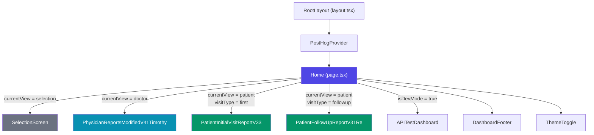
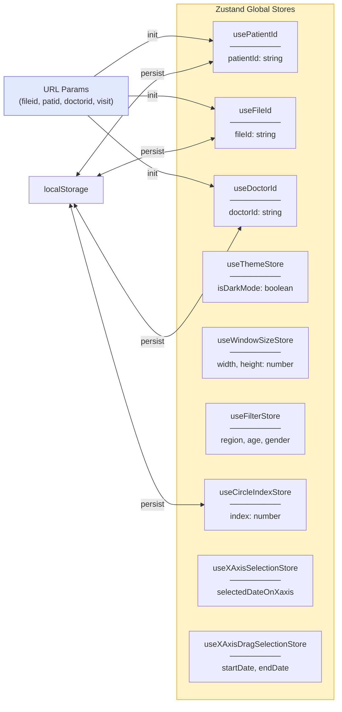
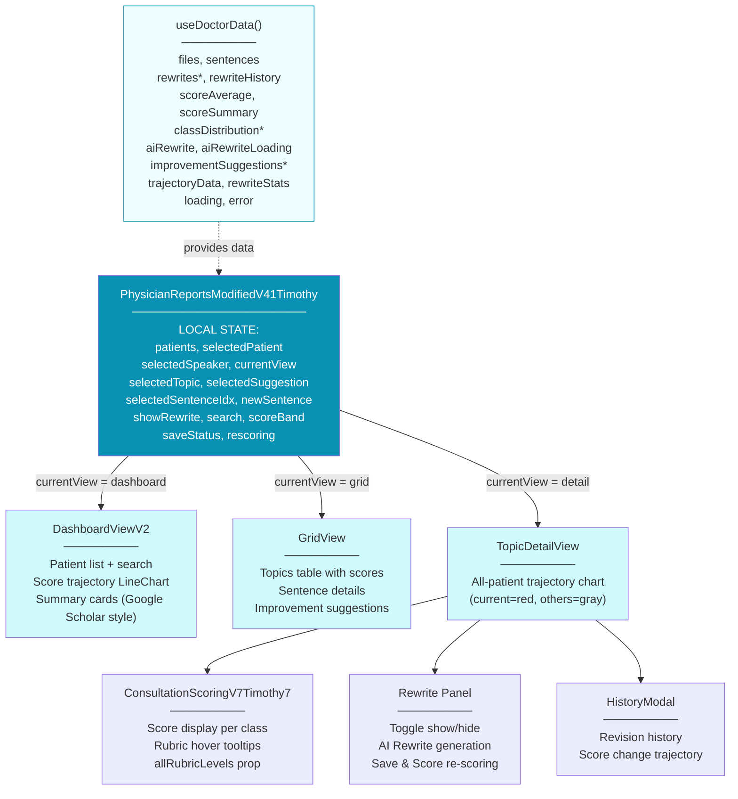
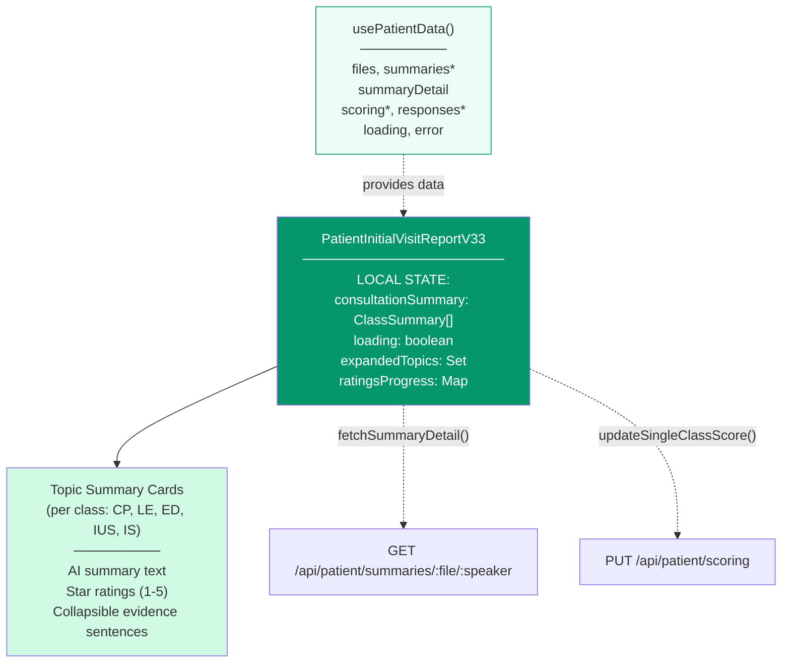
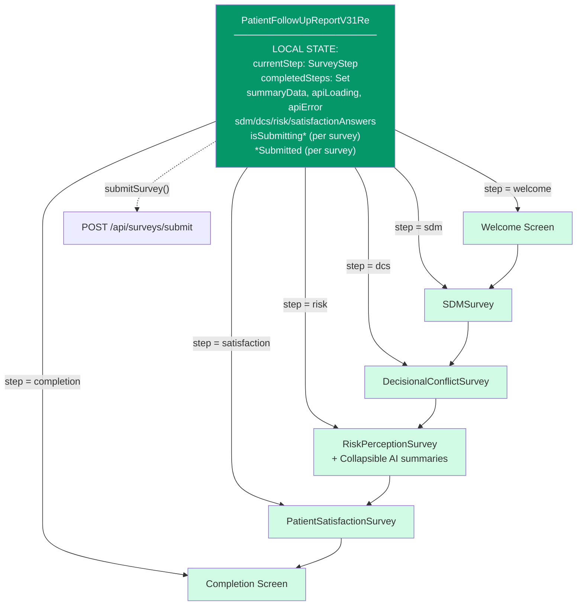
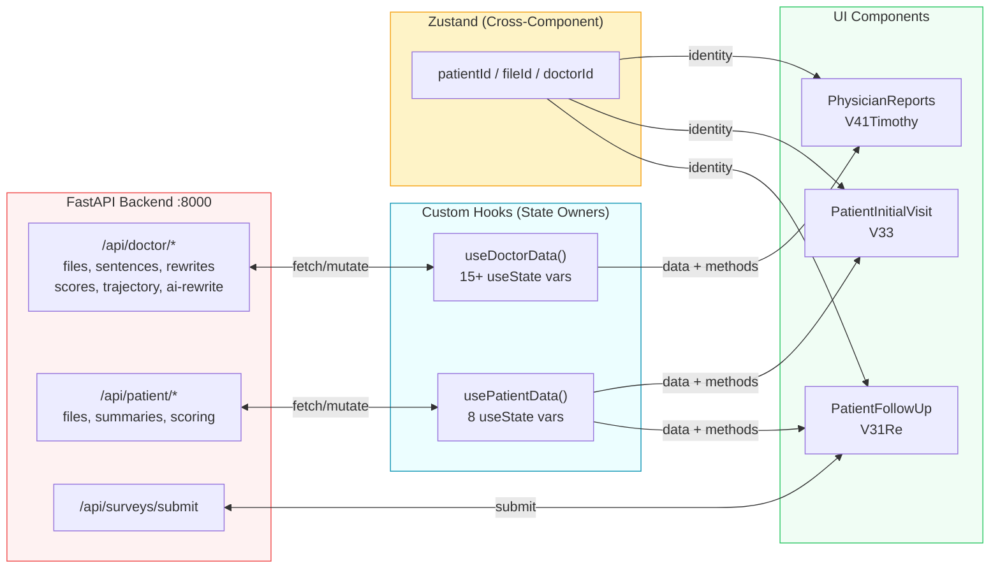
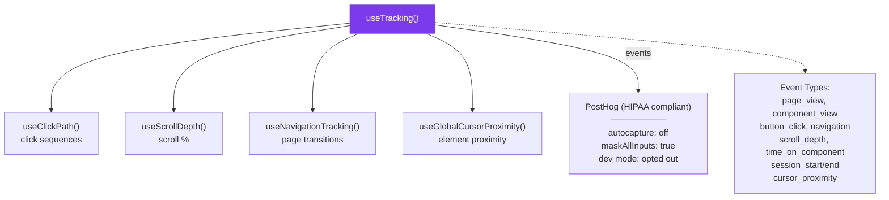

# Component Tree + State Map

## 1. Component Hierarchy & View Routing

## 2. Global State (Zustand Stores)

## 3. Doctor View — Component Tree & State

## 4. Patient First Visit — Component Tree & State

## 5. Patient Follow-Up — Survey Flow & State

## 6. Data Flow — API ↔ Hooks ↔ Components

## 7. Tracking System

## 8. State Ownership Summary

| Layer | Mechanism | Purpose | Persistence |
|-------|-----------|---------|-------------|
| URL Params | `useSearchParams()` | Initial routing (fileid, patid, doctorid, visit) | URL |
| Zustand Stores | `create()` | Cross-component identity & settings | localStorage |
| Custom Hooks | `useState()` x many | API data, loading/error states | Memory only |
| Component State | `useState()` | UI toggles, form inputs, selections | Memory only |
| PostHog | External service | User behavior analytics | Cloud |

## 9. Active Component Versions

| Role | Active Version | File |
|------|---------------|------|
| Doctor Dashboard | `PhysicianReportsModifiedV41Timothy` | `components/PhysicianReportsModifiedV41Timothy.tsx` |
| Patient First Visit | `PatientInitialVisitReportV33` | `components/PatientInitialVisitReportV33.tsx` |
| Patient Follow-Up | `PatientFollowUpReportV31Re` | `components/PatientFollowUpReportV31Re.tsx` |
| Scoring UI | `ConsultationScoringV7Timothy7` | `components/ConsultationScoringV7Timothy7.tsx` |
