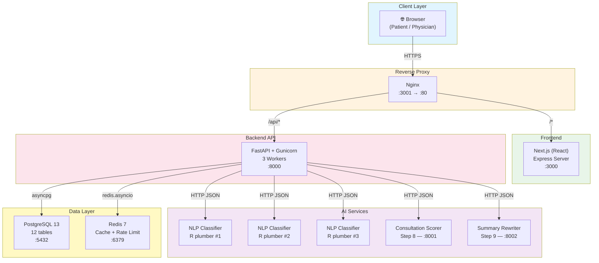
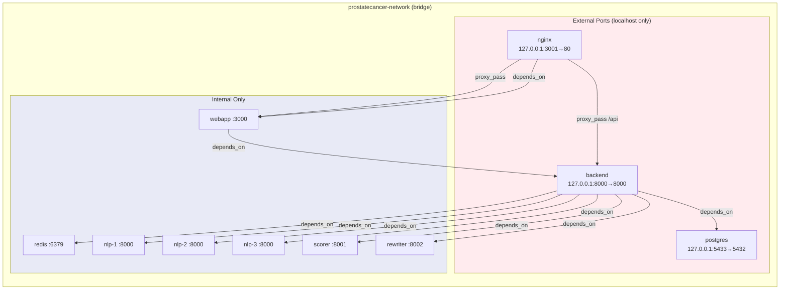
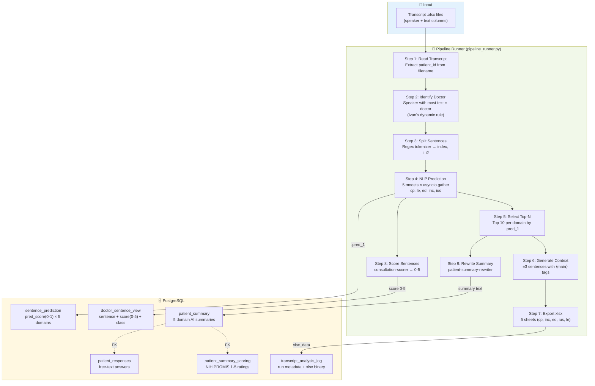
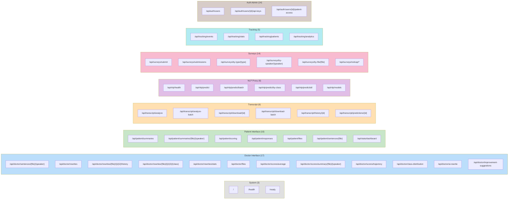
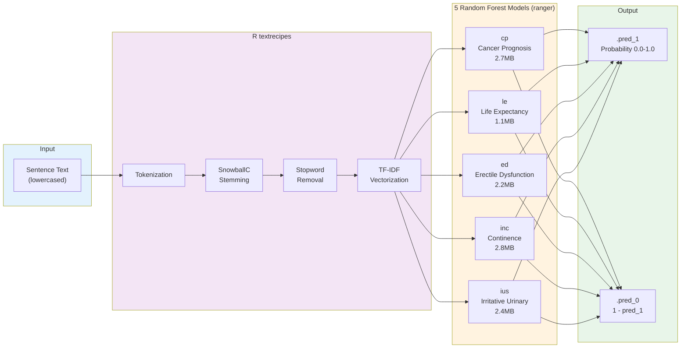
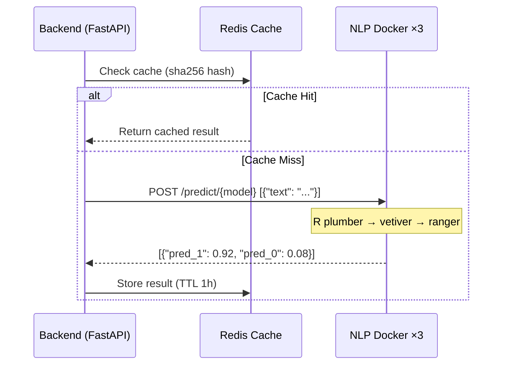
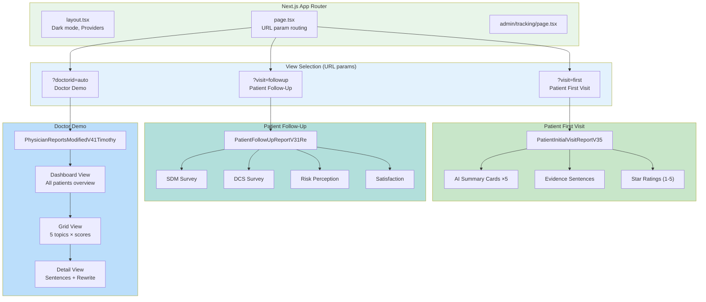
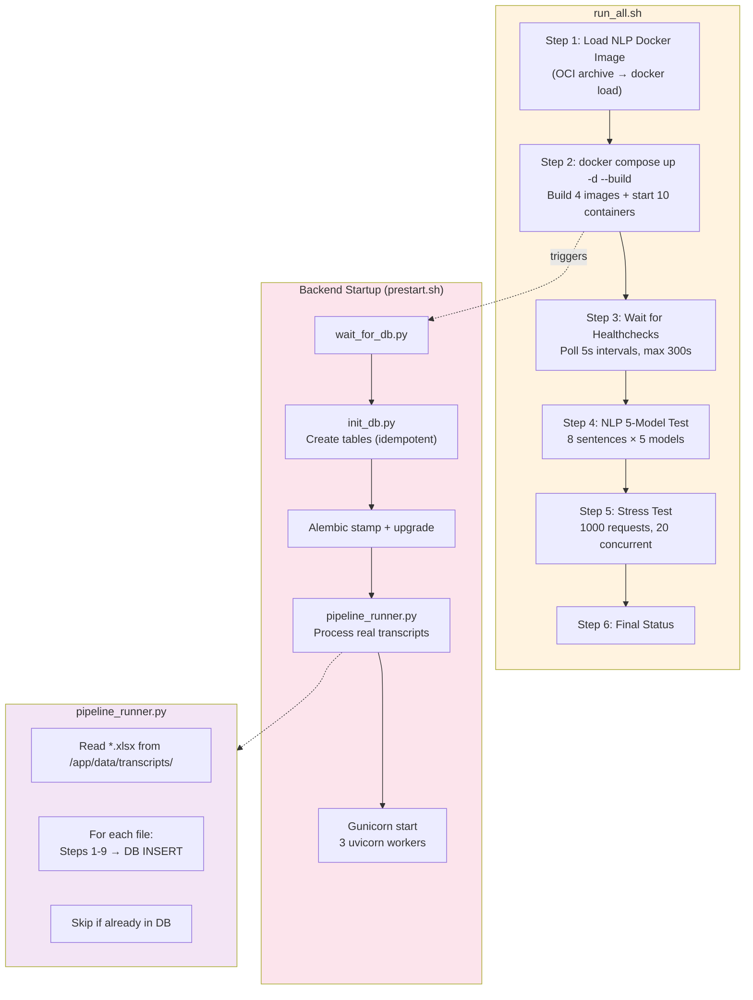
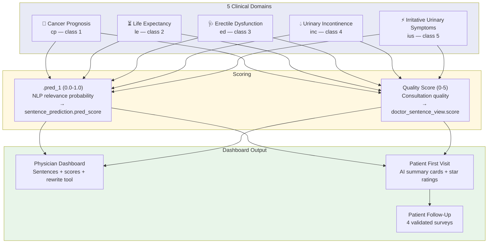
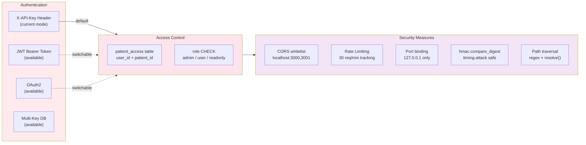

# System Architecture — Prostate Cancer Consultation Dashboard

> **Version:** 3.0 — 2026-04-02  
> **Status:** Production-ready (research deployment)  
> **Stack:** FastAPI · Next.js · PostgreSQL · Redis · R plumber · Docker Compose

---

## 1. High-Level System Architecture



---

## 2. Docker Service Topology



### Service Resource Limits

| Service | Image | Memory | CPU | Replicas | Healthcheck |
|---------|-------|--------|-----|----------|-------------|
| postgres | postgres:13 | 512M | 1.0 | 1 | pg_isready 15s |
| redis | redis:7 | 256M | 0.5 | 1 | redis-cli ping 5s |
| nlp-classifiers | r01-nlp-classifiers | 2G | — | **3** | Rscript /ping 15s |
| backend | Python 3.10-slim | 1G | 2.0 | 1 | curl /health 15s |
| consultation-scorer | Python 3.10-slim | 256M | 0.5 | 1 | urllib /ping 10s |
| patient-summary-rewriter | Python 3.10-slim | 256M | 0.5 | 1 | urllib /ping 10s |
| webapp | Node 18-alpine | — | — | 1 | wget / 15s |
| nginx | nginx:alpine | — | — | 1 | curl /nginx-health 15s |

---

## 3. Data Flow — Full Pipeline



---

## 4. Database ER Diagram

```mermaid
erDiagram
    doctor_sentence_view {
        varchar file PK
        int i PK
        int i2 PK
        varchar speaker
        text sentence
        float score "0-5 quality"
        varchar class "domain name"
        timestamptz time
    }

    doctor_rewrite_log {
        varchar file PK-FK
        int i PK-FK
        int i2 PK-FK
        timestamptz time PK
        text original_sentence
        text revised_sentence
        float score
        varchar class
    }

    patient_summary {
        varchar file PK
        varchar speaker PK
        text entire_summary
        varchar class_1
        text summary_class_1
        varchar class_2
        text summary_class_2
        varchar class_3
        text summary_class_3
        varchar class_4
        text summary_class_4
        varchar class_5
        text summary_class_5
    }

    patient_summary_scoring {
        varchar file PK-FK
        varchar speaker PK-FK
        int class_1_patient_scoring "0-10"
        int class_2_patient_scoring
        int class_3_patient_scoring
        int class_4_patient_scoring
        int class_5_patient_scoring
    }

    patient_responses {
        varchar file PK-FK
        varchar speaker PK-FK
        text answer_1
        text answer_2
        text answer_3
        text answer_4
        text answer_5
    }

    survey_submission_log {
        serial id PK
        varchar file FK
        varchar speaker FK
        varchar survey_type
        jsonb answers
        jsonb extra_data
        timestamptz submitted_at
        boolean redcap_synced
    }

    transcript_analysis_log {
        serial id PK
        varchar patient_id
        int total_sentences
        int top_n
        int context_window
        jsonb model_results "deprecated"
        bytea xlsx_data
        varchar source_filename
        timestamptz analyzed_at
    }

    sentence_prediction {
        serial id PK
        int analysis_id FK
        varchar patient_id
        varchar model "cp le ed inc ius"
        int sentence_index
        float pred_score "0.0-1.0"
        text context
    }

    user_interaction_log {
        serial id PK
        varchar session_id
        varchar role "patient/physician"
        varchar file
        varchar event_type
        jsonb event_data
        timestamptz client_timestamp
    }

    auth_user {
        serial id PK
        varchar username
        varchar email UK
        varchar role "admin/user/readonly"
        boolean is_active
    }

    auth_api_key {
        serial id PK
        int user_id FK
        varchar key_hash
        boolean is_active
        timestamptz expires_at
    }

    patient_access {
        serial id PK
        int user_id FK
        varchar patient_id
        varchar access_type "read/write/admin"
    }

    doctor_sentence_view ||--o{ doctor_rewrite_log : "1:N CASCADE"
    patient_summary ||--|| patient_summary_scoring : "1:1 CASCADE"
    patient_summary ||--|| patient_responses : "1:1 CASCADE"
    patient_summary ||--o{ survey_submission_log : "1:N CASCADE"
    transcript_analysis_log ||--o{ sentence_prediction : "1:N CASCADE"
    auth_user ||--o{ auth_api_key : "1:N CASCADE"
    auth_user ||--o{ patient_access : "1:N CASCADE"
```

---

## 5. API Endpoint Map



---

## 6. NLP Model Architecture



### Model Serving Flow



---

## 7. Frontend Page Architecture



---

## 8. Deployment Flow



---

## 9. Technology Stack

| Layer | Technology | Version | Purpose |
|-------|-----------|---------|---------|
| **Frontend** | Next.js | 13.5.6 | React SSR/SSG framework |
| | React | 18.x | UI components |
| | Tailwind CSS | 3.x | Utility-first styling |
| | Zustand | 5.x | State management (8 stores) |
| | Recharts | 2.x | Dashboard charts |
| | D3.js | 7.x | Data visualization |
| **Backend** | FastAPI | 0.135.1 | Async REST API |
| | Gunicorn | 25.1.0 | WSGI/ASGI server |
| | SQLAlchemy | 2.0.48 | Async ORM |
| | Alembic | 1.18.4 | DB migrations |
| | Pydantic | 2.12.5 | Request/response validation |
| | httpx | 0.28.1 | Async HTTP client |
| **NLP Models** | R | 4.5.1 | Model runtime |
| | tidymodels / ranger | — | Random Forest classification |
| | vetiver / plumber | — | Model serving API |
| | textrecipes | — | TF-IDF, stemming, stopwords |
| **Database** | PostgreSQL | 13 | Primary data store |
| | Redis | 7 | Cache + rate limiting |
| **Infrastructure** | Docker Compose | 3.8 | Container orchestration |
| | Nginx | alpine | Reverse proxy |

---

## 10. Key Architectural Decisions

| Decision | Rationale |
|----------|-----------|
| **Dynamic doctor identification** (text length) | Ivan's rule — no hardcoded speaker IDs; works with any transcript format |
| **5 NLP models in parallel** (asyncio.gather) | ~5× speedup over sequential; verified bit-identical results |
| **JSONB for JSON columns** | Auto-validation, field-level queries, smaller storage vs TEXT |
| **Separate scorer/rewriter services** | Step 8/9 are Guillermo's — isolated containers allow independent replacement |
| **pipeline_runner.py** (no fake CSV) | Real transcripts → NLP → scorer → rewriter → DB directly |
| **file_details in /api/doctor/files** | Dynamic speaker per file — frontend auto-detects, no hardcoding |
| **Alembic for migrations** | Schema versioning for production; DDL for initial creation |
| **Multi-stage Docker build** | Builder installs deps → runtime copies only binaries (428MB backend) |
| **Redis caching with TTL** | NLP predictions cached 1h; same text+model returns instantly |
| **Covering indexes** | History endpoint: index-only scan, no heap access |

---

## 11. Clinical Domain Mapping



---

## 12. Security Architecture



---

*Generated: 2026-04-02 | 29 commits | 10 Docker services | 12 DB tables | 75 API endpoints*
