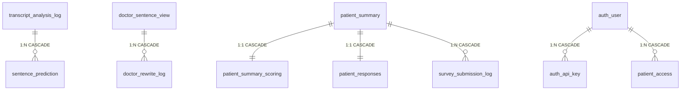

# Database Schema Guide — Prostate Cancer Consultation Dashboard
> This document contains both English and Korean versions.
> 이 문서에는 영어와 한국어 버전이 모두 포함되어 있습니다.

---

## English


> Updated: 2026-04-02 (DB optimization: TEXT→JSONB, index tuning, Alembic, model_results deprecation)
> Database: PostgreSQL 13 (`prostatecancer_db`)
> ORM: SQLAlchemy (Backend: async/asyncpg, Pipeline: sync/psycopg2)
> Schema DDL: `Backend/database_schema.sql`
> ORM Models: `Backend/models.py`
> Migrations: Alembic (`Backend/migrations/`)

---

## Overview

This database serves two systems that share the same PostgreSQL instance:

1. **NLP Pipeline** (`AI_physician_patient_communication/`) — writes analysis results
2. **Dashboard Backend** (`Backend/`) — reads results for display, writes user interactions

There are **12 tables** organized into 5 functional groups:

| Group | Tables | Purpose |
|-------|--------|---------|
| Physician Interface | `doctor_sentence_view`, `doctor_rewrite_log` | NLP-scored sentences + rewrite practice history |
| Patient Interface | `patient_summary`, `patient_summary_scoring`, `patient_responses` | AI summaries + patient feedback |
| Survey System | `survey_submission_log` | SDM, DCS, Risk Perception, Satisfaction surveys |
| ML Pipeline Results | `transcript_analysis_log`, `sentence_prediction` | Raw NLP pipeline output storage |
| Infrastructure | `user_interaction_log`, `auth_user`, `auth_api_key`, `patient_access` | Behavior tracking + access control |

---

## Table Relationship Diagram



---

## 1. `doctor_sentence_view` — Physician Dashboard Sentence Data

### Why this table exists

This is the **primary data source for the physician dashboard**. When a physician opens the dashboard, every sentence they see — along with its NLP score and domain classification — comes from this table. Without it, the physician dashboard has nothing to display.

### How data gets in

- **Pipeline path**: NLP pipeline Step 10 → `persistence.save_doctor_sentences()` → INSERT
- **CSV seed path**: `convert_output_to_csv.py` → `docter_interface_render_processed.csv` → `init_db.py` → INSERT
- Both paths produce identical data; the CSV path is used for initial seeding when the pipeline hasn't been run against the Docker DB yet.

### Who reads it

- **Physician Dashboard**: `GET /api/doctor/sentences/{file}/{speaker}` — fetches sentences grouped by domain
- **Physician Dashboard**: `GET /api/doctor/scores/summary/{file}/{speaker}` — computes average score per domain
- **Physician Dashboard**: `GET /api/doctor/scores/trajectory?speaker=...` — builds score trend across patients
- **Patient First Visit**: `GET /api/patient/sentences/{file}/{speaker}` — shows evidence sentences under AI summary cards

### Column details

| Column | Type | PK | Description |
|--------|------|:--:|-------------|
| `file` | VARCHAR(255) | PK1 | Transcript filename. Acts as the patient identifier across the dashboard. Example: `Input_Keystrokes REC001 (SID 14).xlsx` |
| `i` | INT | PK2 | Utterance index (1-based). Corresponds to the row number in the original transcript before sentence segmentation. |
| `i2` | INT | PK3 | Sentence index within the utterance (1-based). If utterance 5 was split into 3 sentences, `i2` = 1, 2, 3. |
| `speaker` | VARCHAR(100) | | Speaker label from the transcript. Always the doctor's label (e.g., `Interviewer:`). Includes trailing colon — the frontend queries with this exact string. |
| `sentence` | TEXT | | The actual sentence text (lowercased by the pipeline's segmentation step). This is what the physician reads on the dashboard. |
| `score` | FLOAT | | Consultation quality score (0–5). Assigned by the NLP pipeline's scoring step. Higher = better communication quality for the classified domain. |
| `class` | VARCHAR(100) | | Domain full name: `cancer_prognosis`, `life_expectancy`, `erectile_dysfunction_potency`, `continence`, or `irritative_urinary_symptoms`. The frontend groups sentences by this column. |
| `time` | TIMESTAMP WITH TIME ZONE | | Timestamp of when this record was created. Used for ordering in trajectory views. |

### Primary Key logic

The composite PK `(file, i, i2)` uniquely identifies one sentence from one patient's transcript. A single sentence can appear in multiple domains in `sentence_prediction`, but in `doctor_sentence_view` each `(file, i, i2)` appears once — the `convert_output_to_csv.py` deduplication keeps only the highest-scoring domain for each sentence.

### Indexes

| Index | Columns | Purpose |
|-------|---------|---------|
| PK (implicit) | `(file, i, i2)` | Unique sentence lookup + covers `file`-only queries |
| `idx_dsv_file_speaker_class_i` | `(file, speaker, class, i DESC, i2 DESC) WHERE class != '-1' AND score IS NOT NULL` | Partial + composite index for scores/average 3-stage subquery — the physician dashboard's heaviest query |

> Note: `idx_doctor_render_file (file)` was removed — redundant with PK first column.

---

## 2. `doctor_rewrite_log` — Physician Rewrite Practice History

### Why this table exists

Physicians can practice improving low-scoring sentences by rewriting them and getting a new score. This table records every rewrite attempt. It serves two purposes:
1. **Learning persistence**: When a physician refreshes the page, their latest rewrite is restored from this table.
2. **Research data**: Researchers can analyze how physicians improve their communication over time.

**Important**: Rewrites are a learning tool only. They do NOT change the original score in `doctor_sentence_view`. This was explicitly decided on 2026-03-13 (Ivan) to prevent score gaming.

### How data gets in

- **Physician Dashboard**: `PUT /api/doctor/rewrites` — saves original sentence, revised sentence, both scores, and timestamp.
- Each rewrite creates a new row (not an update), building a revision history.

### Who reads it

- **Physician Dashboard**: `GET /api/doctor/rewrites?file=...&speaker=...` — loads rewrites for a patient
- **Physician Dashboard**: `GET /api/doctor/rewrites/{file}/{i}/{i2}/history` — full revision history for one sentence
- **Physician Dashboard**: On page load, the most recent rewrite for the current sentence is loaded into the textarea.

### Column details

| Column | Type | PK | Description |
|--------|------|:--:|-------------|
| `file` | VARCHAR(255) | PK1 | FK → `doctor_sentence_view.file`. Links to the patient transcript. |
| `i` | INT | PK2 | FK → `doctor_sentence_view.i`. Utterance index of the original sentence. |
| `i2` | INT | PK3 | FK → `doctor_sentence_view.i2`. Sentence-within-utterance index. |
| `time` | TIMESTAMP WITH TIME ZONE | PK4 | Timestamp of this rewrite attempt. Part of PK to allow multiple rewrites of the same sentence. |
| `speaker` | VARCHAR(100) | | Doctor speaker label (same as in `doctor_sentence_view`). |
| `original_sentence` | TEXT | | The original sentence text that was rewritten. Stored redundantly for self-contained history. |
| `revised_sentence` | TEXT | | The physician's rewritten version of the sentence. |
| `score` | FLOAT | | The NLP score of the rewritten sentence. **Currently hardcoded to 5** (temporary — will be replaced with actual NLP re-scoring). |
| `class` | VARCHAR(100) | | Domain name (e.g., `cancer_prognosis`). Stored for filtering rewrites by domain. |

### Foreign Key

```
(file, i, i2) → doctor_sentence_view(file, i, i2) ON DELETE CASCADE
```

If a sentence is removed from `doctor_sentence_view`, all its rewrites are automatically deleted.

---

## 3. `patient_summary` — Patient AI Summary Cards

### Why this table exists

When a patient opens their report page, they see **5 AI-generated summary cards** — one per clinical domain. The text for these cards comes from this table. It's the primary content that patients read.

### How data gets in

- **Current (temporary)**: `convert_output_to_csv.py` concatenates the top-3 highest-scoring sentences per domain and stores them as the "summary". This is a placeholder.
- **Future (Step 9)**: Guillermo's AI Reformat sub-pipeline will generate patient-friendly summaries in plain language and save them via `persistence.save_patient_summary()`.

### Who reads it

- **Patient First Visit**: `GET /api/patient/summaries/{file}/{speaker}` — displays 5 summary cards
- **Patient Follow-Up**: Same endpoint — shows summaries alongside survey questions (especially Risk Perception survey)

### Column details

| Column | Type | PK | Description |
|--------|------|:--:|-------------|
| `file` | VARCHAR(255) | PK1 | Transcript filename (same as `doctor_sentence_view.file`). |
| `speaker` | VARCHAR(100) | PK2 | Patient identifier label. Format: `Patient_{filename}`. |
| `entire_summary` | TEXT | | Combined summary across all 5 domains. Currently NULL — reserved for future use. |
| `class_1` | VARCHAR(100) | | Domain name for slot 1 (e.g., `cancer_prognosis`). |
| `summary_class_1` | TEXT | | AI summary text for domain 1. **Currently temporary**: top-3 NLP sentences concatenated. |
| `class_2` | VARCHAR(100) | | Domain name for slot 2 (e.g., `continence`). |
| `summary_class_2` | TEXT | | AI summary text for domain 2. |
| `class_3` | VARCHAR(100) | | Domain name for slot 3 (e.g., `erectile_dysfunction_potency`). |
| `summary_class_3` | TEXT | | AI summary text for domain 3. |
| `class_4` | VARCHAR(100) | | Domain name for slot 4 (e.g., `irritative_urinary_symptoms`). |
| `summary_class_4` | TEXT | | AI summary text for domain 4. |
| `class_5` | VARCHAR(100) | | Domain name for slot 5 (e.g., `life_expectancy`). |
| `summary_class_5` | TEXT | | AI summary text for domain 5. |

### Design note

The `class_N` / `summary_class_N` pattern stores domain name and summary as paired columns. This is a denormalized design chosen for simplicity — the frontend reads all 5 summaries in a single row rather than joining 5 rows. The domain-to-slot mapping is fixed:

| Slot | Domain | Pipeline abbreviation |
|------|--------|-----------------------|
| 1 | cancer_prognosis | cp |
| 2 | continence | inc |
| 3 | erectile_dysfunction_potency | ed |
| 4 | irritative_urinary_symptoms | ius |
| 5 | life_expectancy | le |

---

## 4. `patient_summary_scoring` — Patient Helpfulness Ratings

### Why this table exists

After reading each AI summary card, patients rate how helpful the information was using a NIH PROMIS unipolar scale (1–5: "Not at all helpful" to "Extremely helpful"). These ratings are research data — they measure whether the AI-generated summaries are actually useful to patients.

### How data gets in

- **Patient First Visit**: `PUT /api/patient/scoring` — saves individual domain ratings as the patient clicks star ratings.
- Initial row created by `init_db.py` with all scores NULL, then updated as the patient interacts.

### Who reads it

- **Patient First Visit**: `GET /api/patient/scoring` — restores previously saved ratings on page reload.
- **Research Analysis**: Exported for measuring patient engagement and summary quality.

### Column details

| Column | Type | PK | Description |
|--------|------|:--:|-------------|
| `file` | VARCHAR(255) | PK1 | FK → `patient_summary.file`. |
| `speaker` | VARCHAR(100) | PK2 | FK → `patient_summary.speaker`. |
| `class_1_patient_scoring` | INT | | Rating for domain 1 (cancer prognosis). CHECK: 0–10. Frontend uses 1–5 scale. |
| `class_2_patient_scoring` | INT | | Rating for domain 2 (continence). |
| `class_3_patient_scoring` | INT | | Rating for domain 3 (erectile dysfunction). |
| `class_4_patient_scoring` | INT | | Rating for domain 4 (irritative urinary). |
| `class_5_patient_scoring` | INT | | Rating for domain 5 (life expectancy). |

### Foreign Key

```
(file, speaker) → patient_summary(file, speaker) ON DELETE CASCADE
```

---

## 5. `patient_responses` — Patient Free-Text Answers

### Why this table exists

On the Patient First Visit page, patients can optionally provide free-text answers to open-ended questions about each domain. This captures qualitative feedback that star ratings alone cannot convey.

### Column details

| Column | Type | PK | Description |
|--------|------|:--:|-------------|
| `file` | VARCHAR(255) | PK1 | FK → `patient_summary.file`. |
| `speaker` | VARCHAR(100) | PK2 | FK → `patient_summary.speaker`. |
| `answer_1` ~ `answer_5` | TEXT | | Free-text response per domain. Same slot mapping as `patient_summary`. |

---

## 6. `survey_submission_log` — Survey Responses (SDM, DCS, Risk Perception, Satisfaction)

### Why this table exists

The Patient Follow-Up page presents 4 validated survey instruments. Each submission is stored as a separate row with the full answers in JSON format. This design supports:
- Multiple submissions (e.g., partial saves on Next click, final save on Submit)
- Different survey types with different question structures in a single table
- REDCap synchronization for clinical research data management

### How data gets in

- **Patient Follow-Up**: `POST /api/surveys/submit` — called on Submit and on auto-save (Next click with `partial: true` in metadata).
- Each submission creates a new INSERT (not an update), so the full history of partial + final saves is preserved.

### Who reads it

- **Patient Follow-Up**: `GET /api/surveys/by-speaker/{speaker}` — restores previous answers on page reload.
- **REDCap Sync**: Backend can export survey data to REDCap via API integration.

### Column details

| Column | Type | PK | Description |
|--------|------|:--:|-------------|
| `id` | SERIAL | PK | Auto-increment primary key. |
| `file` | VARCHAR(255) | | FK → `patient_summary.file`. Indexed for fast lookup. |
| `speaker` | VARCHAR(100) | | FK → `patient_summary.speaker`. Indexed. |
| `survey_type` | VARCHAR(50) | | One of: `sdm`, `dcs`, `risk_perception`, `satisfaction`, `baseline`, `questions`. Indexed. |
| `answers` | JSONB | | JSON object containing all question-answer pairs. Structure varies by survey type. Example for SDM: `{"q1": "yes", "q2": 4, "q3": "no", ...}`. JSONB provides automatic validation and field-level queries. |
| `extra_data` | JSONB | | JSON object for metadata. Contains `{ "partial": true }` for auto-saves, or additional context. |
| `submitted_at` | TIMESTAMP | | When this submission was recorded. |
| `redcap_synced` | BOOLEAN | | Whether this submission has been exported to REDCap. Default `FALSE`. |
| `redcap_record_id` | VARCHAR(255) | | REDCap record ID after successful sync. NULL until synced. |
| `redcap_error` | TEXT | | Error message if REDCap sync failed. NULL on success. |

### Survey types

| Type | Survey Instrument | Question Count | Scale |
|------|-------------------|----------------|-------|
| `sdm` | Shared Decision Making | ~10 | Yes/No + Likert |
| `dcs` | Decisional Conflict Scale | ~16 | 5-point Likert |
| `risk_perception` | Risk Perception | 5 (one per domain) | 6-point scale |
| `satisfaction` | Patient Satisfaction | ~5 | Likert |

---

## 7. `transcript_analysis_log` — Pipeline Analysis Run Records

### Why this table exists

Every time the NLP pipeline processes a transcript file, it creates one row in this table. This provides:
- **Audit trail**: When was each file analyzed, with what parameters?
- **Reproducibility**: The `top_n` and `context_window` settings used for each run are recorded.
- **Download fallback**: The `xlsx_data` column stores the binary xlsx output, so results can be downloaded even if the file is deleted from disk.

### How data gets in

- **Pipeline Step 10**: `persistence.save_analysis_run()` — creates one row per pipeline execution.
- **CSV seed**: `transcript_analysis_log.csv` → `init_db.py` for initial seeding.

### Who reads it

- **Backend API**: `GET /api/transcript/history/{patient_id}` — lists all analysis runs for a patient.
- **Backend API**: `GET /api/transcript/download/{patient_id}` — falls back to `xlsx_data` if the file isn't on disk.

### Column details

| Column | Type | PK | Description |
|--------|------|:--:|-------------|
| `id` | SERIAL | PK | Auto-increment. Used as FK target by `sentence_prediction`. |
| `patient_id` | VARCHAR(255) | | Patient identifier extracted from filename (e.g., `SID_14`). Indexed. |
| `total_sentences` | INT | | Total number of sentences after Step 2 segmentation. Useful for understanding transcript size. |
| `top_n` | INT | | The `top_k` parameter used for this run (default: 10). Records how many sentences were selected per domain. |
| `context_window` | INT | | The `context_window` parameter used (default: 3). Records how many surrounding sentences were included. |
| `model_results` | JSONB | | **Deprecated** — set to NULL for new analysis runs. Per-model result data is now stored exclusively in the `sentence_prediction` table. Kept for backward compatibility with legacy rows that predate the `sentence_prediction` feature; `_backfill_predictions()` reads this column to reconstruct old data. |
| `xlsx_data` | BYTEA | | Binary xlsx file for DB-backed download. Allows result retrieval even after disk cleanup. Can be large (~50-200KB per file). |
| `source_filename` | VARCHAR(500) | | Original input filename (e.g., `Input_Keystrokes REC001 (SID 14).xlsx`). |
| `analyzed_at` | TIMESTAMP | | When this analysis was run. Indexed for chronological queries. |

### Indexes

| Index | Columns | Purpose |
|-------|---------|---------|
| `idx_transcript_log_analyzed_at` | `analyzed_at` | Chronological queries |
| `idx_transcript_log_patient_analyzed` | `(patient_id, analyzed_at DESC)` | Composite — covers both patient lookup and "latest run" queries. Replaces former single-column `idx_transcript_log_patient_id`. |
| `idx_transcript_log_patient_xlsx` | `(patient_id, analyzed_at DESC) WHERE xlsx_data IS NOT NULL` | Partial — download endpoint skips NULL xlsx rows |
| `idx_transcript_log_history` | `(patient_id, analyzed_at DESC) INCLUDE (id, total_sentences, top_n, context_window, source_filename)` | Covering — history endpoint can answer from index alone (index-only scan) |

### Relationship

```
transcript_analysis_log.id ←── sentence_prediction.analysis_id (1:N, CASCADE)
```

Deleting an analysis run cascades to delete all associated sentence predictions.

---

## 8. `sentence_prediction` — Per-Sentence NLP Scores

### Why this table exists

This is the **most granular NLP output** — one row per sentence per domain. While `doctor_sentence_view` stores only the highest-scoring domain for each sentence (for dashboard display), `sentence_prediction` stores **all 5 domain scores** for each of the top-K sentences. This enables:
- Querying "show me all sentences scored > 0.8 for cancer prognosis"
- Comparing how the same sentence scores across different domains
- Full context preservation (the `context` column with ±3 surrounding sentences)

### How data gets in

- **Pipeline Step 10**: `persistence.save_sentence_predictions()` — bulk inserts all top-K sentences for all 5 domains.
- **CSV seed**: `sentence_prediction.csv` → `init_db.py`.

### Who reads it

- **Backend API**: `GET /api/transcript/predictions/{patient_id}` — returns predictions with optional filters (`?model=cp&top_n=5&min_score=0.7`).

### Column details

| Column | Type | PK | Description |
|--------|------|:--:|-------------|
| `id` | SERIAL | PK | Auto-increment. |
| `analysis_id` | INT | FK | → `transcript_analysis_log.id`. Links this prediction to a specific pipeline run. CASCADE on delete. Indexed. |
| `patient_id` | VARCHAR(255) | | Patient identifier. Redundant with the analysis log but indexed for direct lookups without joining. |
| `model` | VARCHAR(10) | | NLP domain abbreviation: `cp`, `le`, `ed`, `inc`, or `ius`. Combined with `patient_id` for indexed queries. |
| `sentence_index` | INT | | Global sentence number (1-based) across the entire segmented transcript. Maps to `index` column in pipeline DataFrames. |
| `utterance_index` | INT | | Original utterance row number from the transcript. Maps to `i` column. |
| `sentence_in_utterance` | INT | | Position within the utterance (1-based). Maps to `i2` column. |
| `speaker` | VARCHAR(100) | | Speaker label (always the doctor for current implementation). |
| `sentence_text` | TEXT | | The sentence text (lowercased). |
| `pred_score` | FLOAT | | NLP prediction probability (0.0–1.0). Maps to `.pred_1` from the NLP Docker response. Indexed DESC for "top scoring" queries. |
| `context` | TEXT | | Surrounding sentences with `<main>target sentence</main>` tags. Window size determined by `context_window` in the analysis run. |

### Indexes

| Index | Columns | Purpose |
|-------|---------|---------|
| `idx_sp_analysis_model` | `(analysis_id, model)` | Composite — covers both join-to-run and filter-by-model. Replaces former `idx_sp_analysis_id` (redundant: first column covers single-column queries). |
| `idx_sp_patient_model` | `(patient_id, model)` | Filter by patient + domain |
| `idx_sp_pred_score` | `pred_score DESC` | "Top scoring sentences" queries |

### Difference from `doctor_sentence_view`

| Aspect | `sentence_prediction` | `doctor_sentence_view` |
|--------|-----------------------|------------------------|
| **Granularity** | One row per sentence **per domain** | One row per sentence (highest domain only) |
| **Rows for 1 patient** | ~50 (10 sentences × 5 domains) | ~45-50 (deduplicated) |
| **Has context** | Yes (`context` column) | No |
| **Has analysis_id** | Yes (links to pipeline run) | No |
| **Used by** | API predictions endpoint | Physician + Patient dashboards |

---

## 9. `user_interaction_log` — Behavior Tracking

### Why this table exists

Every click, page view, scroll, and interaction in the dashboard is tracked for **research purposes**. This data measures:
- How much time patients spend reading each summary
- Whether physicians actually use the rewrite tool
- Which domains get the most attention
- Device types and session patterns

The frontend batches events and sends them via `POST /api/tracking/events`.

### Column details

| Column | Type | PK | Description |
|--------|------|:--:|-------------|
| `id` | SERIAL | PK | Auto-increment. |
| `session_id` | VARCHAR(100) | | UUID generated per browser session. Indexed. Groups events from the same visit. |
| `role` | VARCHAR(20) | | `patient` or `doctor`. Indexed. Determines which UI the user was on. |
| `file` | VARCHAR(255) | | Which patient's data the user was viewing. Indexed. |
| `speaker` | VARCHAR(100) | | Speaker identifier. Indexed. |
| `event_type` | VARCHAR(50) | | Event category. Indexed. Examples: `page_view`, `click`, `summary_expand`, `rating_submit`, `survey_next`, `rewrite_save`. |
| `element_id` | VARCHAR(255) | | DOM element identifier (e.g., `summary-card-cp`, `rewrite-button`). |
| `event_data` | JSONB | | JSON object with event-specific data. Examples: `{"domain": "cp", "score": 4}`, `{"scroll_percent": 75}`. JSONB provides automatic validation. |
| `device_type` | VARCHAR(20) | | `desktop`, `tablet`, or `mobile`. |
| `client_timestamp` | TIMESTAMP | | When the event occurred on the user's device (may differ from server time). |
| `created_at` | TIMESTAMP | | When the event was recorded on the server. |

---

## 10. Authentication Tables

### `auth_user` — User Accounts

| Column | Type | Description |
|--------|------|-------------|
| `id` | SERIAL PK | |
| `username` | VARCHAR(150) | Display name. Indexed for login/lookup queries. |
| `email` | VARCHAR(255) UNIQUE | Login email. |
| `password_hash` | VARCHAR(255) | Bcrypt hash. NULL for API-key-only users. |
| `role` | VARCHAR(20) | `admin`, `user`, or `readonly`. CHECK constraint. |
| `is_superuser` | BOOLEAN | Full system access. |
| `is_active` | BOOLEAN | Can login. Set FALSE to disable without deleting. |
| `auth_provider` | VARCHAR(50) | `local` (default), could be `oauth` etc. |

### `auth_api_key` — API Keys

| Column | Type | Description |
|--------|------|-------------|
| `id` | SERIAL PK | |
| `user_id` | INT FK | → `auth_user.id`. CASCADE on delete. |
| `key_hash` | VARCHAR(255) | SHA-256 hash of the API key. The plain key is never stored. Indexed. |
| `label` | VARCHAR(100) | Human-readable label (e.g., "Jun's dev key"). |
| `is_active` | BOOLEAN | Revoke without deleting. |
| `expires_at` | TIMESTAMP | Optional expiration. NULL = never expires. |
| `last_used_at` | TIMESTAMP | Updated on each authenticated request. |

### `patient_access` — Patient-Level Access Control

| Column | Type | Description |
|--------|------|-------------|
| `id` | SERIAL PK | |
| `user_id` | INT FK | → `auth_user.id`. |
| `patient_id` | VARCHAR(255) | Which patient this user can access. |
| `access_type` | VARCHAR(20) | `read`, `write`, or `admin`. CHECK constraint. |
| `granted_at` | TIMESTAMP | When access was granted. |
| `granted_by` | INT FK | → `auth_user.id`. Who granted access. |
| UNIQUE | `(user_id, patient_id)` | One access record per user-patient pair. |

**Note**: These auth tables are defined in the schema but the current system uses a simple `X-API-Key` header for authentication (`AUTH_MODE=api_key` in `.env`). The full user/role system is available for future use when the system moves to production.

---

## Data Flow Summary

```
Pipeline output
    │
    ├──→ transcript_analysis_log    (1 row per pipeline run)
    ├──→ sentence_prediction        (N rows per run: 5 domains × top-K)
    ├──→ doctor_sentence_view       (deduplicated for dashboard display)
    └──→ patient_summary            (temporary summaries; future: AI-generated)
              │
              ├──→ patient_summary_scoring   (patient rates each summary)
              ├──→ patient_responses          (patient free-text answers)
              └──→ survey_submission_log      (SDM, DCS, Risk, Satisfaction)

User interactions
    └──→ user_interaction_log       (clicks, views, time tracking)

Physician rewrites
    └──→ doctor_rewrite_log         (practice history, does NOT change scores)
```

---

## Current Data Volume (6 test patients)

| Table | Row Count | Notes |
|-------|-----------|-------|
| `doctor_sentence_view` | 266 | ~44 sentences per patient |
| `sentence_prediction` | 300 | 50 per patient (10 per domain × 5) |
| `transcript_analysis_log` | 18 | Multiple runs during testing |
| `patient_summary` | 6 | 1 per patient |
| `patient_summary_scoring` | 6 | 1 per patient (initially NULL) |
| `patient_responses` | 6 | 1 per patient (initially NULL) |
| `survey_submission_log` | 0 | Populated when patients complete surveys |
| `doctor_rewrite_log` | 0 | Populated when physicians practice rewrites |
| `user_interaction_log` | ~20 | From development/testing |
| `auth_user` | 0 | Not yet configured |
| `auth_api_key` | 0 | Using env-based API key |
| `patient_access` | 0 | Not yet configured |

---

## Schema Migration (Alembic)

Schema changes are managed by Alembic. The initial schema is created by `database_schema.sql` (Docker entrypoint), and subsequent changes are applied via Alembic migrations.

**Files:**
- `Backend/alembic.ini` — config (DB URL from `DATABASE_URL` env var)
- `Backend/migrations/env.py` — runner (asyncpg→psycopg2 swap, models.Base metadata)
- `Backend/migrations/versions/001_baseline.py` — baseline (marks existing schema as starting point)

**Docker startup flow:**
```
PostgreSQL → database_schema.sql (create tables)
Backend → wait_for_db → init_db (CSV seed) → alembic stamp head → alembic upgrade head
```

**Adding a new column:**
```bash
# 1. Edit models.py
# 2. Generate migration
docker exec prostatecancer-backend alembic revision --autogenerate -m "add column X"
# 3. Apply
docker exec prostatecancer-backend alembic upgrade head
```

---

## Additional Indexes (user_interaction_log)

| Index | Columns | Purpose |
|-------|---------|---------|
| `idx_uil_session` | `session_id` | Session lookup |
| `idx_uil_role` | `role` | Filter by patient/doctor |
| `idx_uil_file` | `file` | Filter by patient file |
| `idx_uil_speaker` | `speaker` | Filter by speaker |
| `idx_uil_event_type` | `event_type` | Filter by event type |
| `idx_uil_client_timestamp` | `client_timestamp` | Time-based queries |
| `idx_uil_file_event_type` | `(file, event_type)` | Composite — by_patient analytics GROUP BY |
| `idx_uil_client_ts_hour` | `date_trunc('hour', client_timestamp) WHERE client_timestamp IS NOT NULL` | Expression — analytics timeline GROUP BY |
| `idx_uil_client_ts_hour_of_day` | `extract(hour FROM client_timestamp) WHERE client_timestamp IS NOT NULL` | Expression — hourly heatmap GROUP BY |

## Additional Indexes (survey_submission_log)

| Index | Columns | Purpose |
|-------|---------|---------|
| `idx_survey_submission_file` | `file` | Filter by patient |
| `idx_survey_submission_speaker` | `speaker` | Filter by speaker |
| `idx_survey_submission_type` | `survey_type` | Filter by survey type |
| `idx_survey_speaker_submitted` | `(speaker, submitted_at DESC)` | by-speaker endpoint — WHERE + ORDER BY |
| `idx_survey_file_submitted` | `(file, submitted_at DESC)` | by-file endpoint — WHERE + ORDER BY |
| `idx_survey_redcap_pending` | `id WHERE redcap_synced = FALSE` | Partial — REDCap sync pending items only |

---

## 한국어


> 최종 수정: 2026-04-02 (DB 최적화: TEXT→JSONB, 인덱스 튜닝, Alembic, model_results 폐기)
> 데이터베이스: PostgreSQL 13 (`prostatecancer_db`)
> ORM: SQLAlchemy (Backend: async/asyncpg, Pipeline: sync/psycopg2)
> 스키마 DDL: `Backend/database_schema.sql`
> ORM 모델: `Backend/models.py`
> 마이그레이션: Alembic (`Backend/migrations/`)

---

## 개요

이 데이터베이스는 동일한 PostgreSQL 인스턴스를 공유하는 두 시스템을 지원합니다:

1. **NLP 파이프라인** (`AI_physician_patient_communication/`) — 분석 결과 저장
2. **대시보드 Backend** (`Backend/`) — 결과를 읽어 화면에 표시, 사용자 인터랙션 저장

**12개 테이블**이 5개 기능 그룹으로 구성됩니다:

| 그룹 | 테이블 | 목적 |
|------|--------|------|
| 의사 인터페이스 | `doctor_sentence_view`, `doctor_rewrite_log` | NLP 점수 문장 + 재작성 연습 이력 |
| 환자 인터페이스 | `patient_summary`, `patient_summary_scoring`, `patient_responses` | AI 요약 + 환자 피드백 |
| 설문 시스템 | `survey_submission_log` | SDM, DCS, 위험 인식, 만족도 설문 |
| ML 파이프라인 결과 | `transcript_analysis_log`, `sentence_prediction` | NLP 파이프라인 원시 출력 저장 |
| 인프라 | `user_interaction_log`, `auth_user`, `auth_api_key`, `patient_access` | 행동 추적 + 접근 제어 |

---

## 테이블 관계 다이어그램


---

## 1. `doctor_sentence_view` — 의사 대시보드 문장 데이터

### 이 테이블이 존재하는 이유

**의사 대시보드의 주 데이터 소스**입니다. 의사가 대시보드를 열면 보이는 모든 문장, NLP 점수, 도메인 분류가 이 테이블에서 옵니다. 이 테이블 없이는 의사 대시보드에 표시할 내용이 없습니다.

### 데이터 입력 경로

- **파이프라인 경로**: NLP 파이프라인 Step 10 → `persistence.save_doctor_sentences()` → INSERT
- **CSV 시드 경로**: `convert_output_to_csv.py` → `docter_interface_render_processed.csv` → `init_db.py` → INSERT
- 두 경로 모두 동일한 데이터를 생성하며, CSV 경로는 파이프라인이 Docker DB에 대해 실행되지 않았을 때 초기 시드용으로 사용됩니다.

### 데이터 사용처

- **의사 대시보드**: `GET /api/doctor/sentences/{file}/{speaker}` — 도메인별 문장 조회
- **의사 대시보드**: `GET /api/doctor/scores/summary/{file}/{speaker}` — 도메인별 평균 점수 계산
- **의사 대시보드**: `GET /api/doctor/scores/trajectory?speaker=...` — 환자별 점수 추세
- **환자 첫 방문**: `GET /api/patient/sentences/{file}/{speaker}` — AI 요약 카드 아래 근거 문장 표시

### 컬럼 상세

| 컬럼 | 타입 | PK | 설명 |
|------|------|:--:|------|
| `file` | VARCHAR(255) | PK1 | 트랜스크립트 파일명. 대시보드 전체에서 환자 식별자 역할. 예: `Input_Keystrokes REC001 (SID 14).xlsx` |
| `i` | INT | PK2 | 발화 인덱스 (1-based). 문장 분리 전 원본 트랜스크립트의 행 번호에 해당. |
| `i2` | INT | PK3 | 발화 내 문장 인덱스 (1-based). 발화 5가 3개 문장으로 분리되면 `i2` = 1, 2, 3. |
| `speaker` | VARCHAR(100) | | 트랜스크립트의 화자 라벨. 항상 의사 라벨 (예: `Interviewer:`). 콜론 포함 — 프론트엔드가 이 정확한 문자열로 쿼리. |
| `sentence` | TEXT | | 실제 문장 텍스트 (파이프라인 분절 단계에서 소문자 변환됨). 의사가 대시보드에서 읽는 내용. |
| `score` | FLOAT | | 상담 품질 점수 (0–5). NLP 파이프라인의 채점 단계에서 부여. 높을수록 해당 도메인에 대한 커뮤니케이션 품질이 좋음. |
| `class` | VARCHAR(100) | | 도메인 전체 이름: `cancer_prognosis`, `life_expectancy`, `erectile_dysfunction_potency`, `continence`, 또는 `irritative_urinary_symptoms`. 프론트엔드가 이 컬럼으로 문장을 그룹화. |
| `time` | TIMESTAMP WITH TIME ZONE | | 레코드 생성 시각. 궤적(trajectory) 뷰에서 정렬에 사용. |

### Primary Key 로직

복합 PK `(file, i, i2)`는 한 환자의 트랜스크립트에서 하나의 문장을 고유하게 식별합니다. 하나의 문장이 `sentence_prediction`에서 여러 도메인에 나타날 수 있지만, `doctor_sentence_view`에서는 각 `(file, i, i2)`가 한 번만 나타납니다 — `convert_output_to_csv.py`의 중복 제거가 각 문장에 대해 가장 높은 점수의 도메인만 유지합니다.

### 인덱스

| 인덱스 | 컬럼 | 목적 |
|--------|------|------|
| PK (암묵적) | `(file, i, i2)` | 고유 문장 조회 + `file`만의 쿼리도 커버 |
| `idx_dsv_file_speaker_class_i` | `(file, speaker, class, i DESC, i2 DESC) WHERE class != '-1' AND score IS NOT NULL` | Partial + 복합 인덱스 — 의사 대시보드의 가장 무거운 scores/average 3단 서브쿼리용 |

> 참고: `idx_doctor_render_file (file)` 제거됨 — PK 첫 번째 컬럼과 중복.

---

## 2. `doctor_rewrite_log` — 의사 재작성 연습 이력

### 이 테이블이 존재하는 이유

의사가 낮은 점수의 문장을 재작성하고 새 점수를 받아 연습할 수 있습니다. 이 테이블은 모든 재작성 시도를 기록합니다. 두 가지 목적:
1. **학습 유지**: 의사가 페이지를 새로고침하면 이 테이블에서 최신 재작성이 복원됨.
2. **연구 데이터**: 연구자가 의사의 커뮤니케이션 개선 과정을 시간에 따라 분석 가능.

**중요**: 재작성은 학습 도구일 뿐입니다. `doctor_sentence_view`의 원본 점수를 변경하지 않습니다. 이는 2026-03-13 (Ivan)에 점수 조작 방지를 위해 명시적으로 결정되었습니다.

### 데이터 입력 경로

- **의사 대시보드**: `PUT /api/doctor/rewrites` — 원문, 수정문, 양쪽 점수, 타임스탬프 저장.
- 각 재작성은 새 행을 생성 (업데이트가 아님), 수정 이력을 구축.

### 데이터 사용처

- **의사 대시보드**: `GET /api/doctor/rewrites?file=...&speaker=...` — 환자의 재작성 로드
- **의사 대시보드**: `GET /api/doctor/rewrites/{file}/{i}/{i2}/history` — 한 문장의 전체 수정 이력
- **의사 대시보드**: 페이지 로드 시 현재 문장의 가장 최근 재작성이 텍스트 영역에 로드됨.

### 컬럼 상세

| 컬럼 | 타입 | PK | 설명 |
|------|------|:--:|------|
| `file` | VARCHAR(255) | PK1 | FK → `doctor_sentence_view.file`. 환자 트랜스크립트에 연결. |
| `i` | INT | PK2 | FK → `doctor_sentence_view.i`. 원본 문장의 발화 인덱스. |
| `i2` | INT | PK3 | FK → `doctor_sentence_view.i2`. 발화 내 문장 인덱스. |
| `time` | TIMESTAMP WITH TIME ZONE | PK4 | 재작성 시도 시각. 같은 문장의 여러 재작성을 허용하기 위해 PK의 일부. |
| `speaker` | VARCHAR(100) | | 의사 화자 라벨 (`doctor_sentence_view`와 동일). |
| `original_sentence` | TEXT | | 재작성된 원본 문장 텍스트. 자체 완결적 이력을 위해 중복 저장. |
| `revised_sentence` | TEXT | | 의사가 재작성한 문장. |
| `score` | FLOAT | | 재작성된 문장의 NLP 점수. **현재 5로 하드코딩** (임시 — 실제 NLP 재채점으로 교체 예정). |
| `class` | VARCHAR(100) | | 도메인 이름 (예: `cancer_prognosis`). 도메인별 재작성 필터링용. |

### 외래 키

```
(file, i, i2) → doctor_sentence_view(file, i, i2) ON DELETE CASCADE
```

`doctor_sentence_view`에서 문장이 삭제되면 모든 재작성도 자동 삭제됩니다.

---

## 3. `patient_summary` — 환자 AI 요약 카드

### 이 테이블이 존재하는 이유

환자가 리포트 페이지를 열면 **5개의 AI 생성 요약 카드** (임상 도메인당 하나)를 봅니다. 이 카드의 텍스트가 이 테이블에서 옵니다. 환자가 읽는 주요 콘텐츠입니다.

### 데이터 입력 경로

- **현재 (임시)**: `convert_output_to_csv.py`가 도메인별 상위 3개 최고 점수 문장을 연결하여 "요약"으로 저장. 이것은 플레이스홀더.
- **향후 (Step 9)**: Guillermo의 AI Reformat 서브 파이프라인이 평이한 언어로 환자 친화적 요약을 생성하여 `persistence.save_patient_summary()`로 저장 예정.

### 데이터 사용처

- **환자 첫 방문**: `GET /api/patient/summaries/{file}/{speaker}` — 5개 요약 카드 표시
- **환자 후속 방문**: 동일 엔드포인트 — 설문 질문과 함께 요약 표시 (특히 위험 인식 설문)

### 컬럼 상세

| 컬럼 | 타입 | PK | 설명 |
|------|------|:--:|------|
| `file` | VARCHAR(255) | PK1 | 트랜스크립트 파일명 (`doctor_sentence_view.file`과 동일). |
| `speaker` | VARCHAR(100) | PK2 | 환자 식별 라벨. 형식: `Patient_{파일명}`. |
| `entire_summary` | TEXT | | 5개 도메인 전체 통합 요약. 현재 NULL — 향후 사용 예정. |
| `class_1` | VARCHAR(100) | | 슬롯 1의 도메인 이름 (예: `cancer_prognosis`). |
| `summary_class_1` | TEXT | | 도메인 1의 AI 요약 텍스트. **현재 임시**: NLP 상위 3개 문장 연결. |
| `class_2` ~ `class_5` | VARCHAR(100) | | 슬롯 2~5의 도메인 이름. |
| `summary_class_2` ~ `summary_class_5` | TEXT | | 도메인 2~5의 AI 요약 텍스트. |

### 설계 참고

`class_N` / `summary_class_N` 패턴은 도메인 이름과 요약을 쌍으로 저장합니다. 비정규화 설계 — 프론트엔드가 5개 행을 조인하지 않고 단일 행에서 5개 요약을 읽기 위함. 도메인-슬롯 매핑은 고정:

| 슬롯 | 도메인 | 파이프라인 약어 |
|------|--------|---------------|
| 1 | cancer_prognosis | cp |
| 2 | continence | inc |
| 3 | erectile_dysfunction_potency | ed |
| 4 | irritative_urinary_symptoms | ius |
| 5 | life_expectancy | le |

---

## 4. `patient_summary_scoring` — 환자 유용성 평가

### 이 테이블이 존재하는 이유

각 AI 요약 카드를 읽은 후 환자가 NIH PROMIS 단극성 척도(1–5: "전혀 도움 안 됨" ~ "매우 도움됨")로 정보의 유용성을 평가합니다. 이 평가는 연구 데이터 — AI 생성 요약이 실제로 환자에게 유용한지 측정합니다.

### 컬럼 상세

| 컬럼 | 타입 | PK | 설명 |
|------|------|:--:|------|
| `file` | VARCHAR(255) | PK1 | FK → `patient_summary.file`. |
| `speaker` | VARCHAR(100) | PK2 | FK → `patient_summary.speaker`. |
| `class_1_patient_scoring` | INT | | 도메인 1 (암 예후) 평가. CHECK: 0–10. 프론트엔드는 1–5 척도. |
| `class_2_patient_scoring` ~ `class_5_patient_scoring` | INT | | 도메인 2~5 평가. |

### 외래 키

```
(file, speaker) → patient_summary(file, speaker) ON DELETE CASCADE
```

---

## 5. `patient_responses` — 환자 자유 텍스트 응답

### 이 테이블이 존재하는 이유

환자 첫 방문 페이지에서 각 도메인에 대한 개방형 질문에 자유 텍스트 답변을 선택적으로 제공할 수 있습니다. 별점 평가만으로는 전달할 수 없는 정성적 피드백을 캡처합니다.

### 컬럼 상세

| 컬럼 | 타입 | PK | 설명 |
|------|------|:--:|------|
| `file` | VARCHAR(255) | PK1 | FK → `patient_summary.file`. |
| `speaker` | VARCHAR(100) | PK2 | FK → `patient_summary.speaker`. |
| `answer_1` ~ `answer_5` | TEXT | | 도메인별 자유 텍스트 응답. `patient_summary`와 동일 슬롯 매핑. |

---

## 6. `survey_submission_log` — 설문 응답 (SDM, DCS, 위험 인식, 만족도)

### 이 테이블이 존재하는 이유

환자 후속 방문 페이지에서 4개의 검증된 설문 도구를 제공합니다. 각 제출은 JSON 형식의 전체 답변과 함께 별도 행으로 저장됩니다. 이 설계의 장점:
- 다중 제출 (예: Next 클릭 시 부분 저장, Submit 시 최종 저장)
- 다른 질문 구조를 가진 다양한 설문 유형을 단일 테이블에서 관리
- 임상 연구 데이터 관리를 위한 REDCap 동기화

### 컬럼 상세

| 컬럼 | 타입 | PK | 설명 |
|------|------|:--:|------|
| `id` | SERIAL | PK | 자동 증가 기본 키. |
| `file` | VARCHAR(255) | | FK → `patient_summary.file`. 인덱스됨. |
| `speaker` | VARCHAR(100) | | FK → `patient_summary.speaker`. 인덱스됨. |
| `survey_type` | VARCHAR(50) | | `sdm`, `dcs`, `risk_perception`, `satisfaction`, `baseline`, `questions` 중 하나. 인덱스됨. |
| `answers` | JSONB | | 모든 질문-답변 쌍을 포함하는 JSON 객체. 설문 유형별로 구조가 다름. SDM 예: `{"q1": "yes", "q2": 4, ...}`. JSONB로 자동 유효성 검증 + 필드별 쿼리 가능. |
| `extra_data` | JSONB | | 메타데이터용 JSON 객체. 자동 저장 시 `{ "partial": true }` 포함. |
| `submitted_at` | TIMESTAMP | | 제출 기록 시각. |
| `redcap_synced` | BOOLEAN | | REDCap으로 내보내졌는지 여부. 기본값 `FALSE`. |
| `redcap_record_id` | VARCHAR(255) | | 동기화 성공 후 REDCap 레코드 ID. 동기화 전 NULL. |
| `redcap_error` | TEXT | | REDCap 동기화 실패 시 에러 메시지. 성공 시 NULL. |

### 설문 유형

| 유형 | 설문 도구 | 질문 수 | 척도 |
|------|----------|---------|------|
| `sdm` | 공유 의사결정 | ~10 | Yes/No + Likert |
| `dcs` | 의사결정 갈등 척도 | ~16 | 5점 Likert |
| `risk_perception` | 위험 인식 | 5 (도메인당 하나) | 6점 척도 |
| `satisfaction` | 환자 만족도 | ~5 | Likert |

---

## 7. `transcript_analysis_log` — 파이프라인 분석 실행 기록

### 이 테이블이 존재하는 이유

NLP 파이프라인이 트랜스크립트 파일을 처리할 때마다 이 테이블에 한 행을 생성합니다:
- **감사 추적**: 각 파일이 언제, 어떤 파라미터로 분석되었는지?
- **재현성**: 각 실행에 사용된 `top_n`과 `context_window` 설정이 기록됨.
- **다운로드 대체**: `xlsx_data` 컬럼이 바이너리 xlsx 출력을 저장하므로 파일이 디스크에서 삭제되어도 결과를 다운로드 가능.

### 컬럼 상세

| 컬럼 | 타입 | PK | 설명 |
|------|------|:--:|------|
| `id` | SERIAL | PK | 자동 증가. `sentence_prediction`의 FK 대상. |
| `patient_id` | VARCHAR(255) | | 파일명에서 추출된 환자 식별자 (예: `SID_14`). 인덱스됨. |
| `total_sentences` | INT | | Step 2 분절 후 총 문장 수. 트랜스크립트 크기 파악에 유용. |
| `top_n` | INT | | 이 실행에 사용된 `top_k` 파라미터 (기본: 10). 도메인당 선택된 문장 수 기록. |
| `context_window` | INT | | 사용된 `context_window` 파라미터 (기본: 3). 포함된 주변 문장 수 기록. |
| `model_results` | JSONB | | **폐기됨** — 새 분석 실행에서 NULL로 설정. 모델별 결과 데이터는 이제 `sentence_prediction` 테이블에만 저장. `sentence_prediction` 기능 이전의 레거시 행과의 하위 호환성을 위해 유지됨; `_backfill_predictions()`가 이전 데이터 복원 시 이 컬럼을 읽음. |
| `xlsx_data` | BYTEA | | DB 기반 다운로드용 바이너리 xlsx 파일. 디스크 정리 후에도 결과 조회 가능. 파일당 ~50-200KB. |
| `source_filename` | VARCHAR(500) | | 원본 입력 파일명 (예: `Input_Keystrokes REC001 (SID 14).xlsx`). |
| `analyzed_at` | TIMESTAMP | | 분석 실행 시각. 시간순 쿼리를 위해 인덱스됨. |

### 인덱스

| 인덱스 | 컬럼 | 목적 |
|--------|------|------|
| `idx_transcript_log_analyzed_at` | `analyzed_at` | 시간순 쿼리 |
| `idx_transcript_log_patient_analyzed` | `(patient_id, analyzed_at DESC)` | 복합 — 환자 조회 + "최신 실행" 쿼리 모두 커버. 이전 단일 컬럼 `idx_transcript_log_patient_id` 대체. |
| `idx_transcript_log_patient_xlsx` | `(patient_id, analyzed_at DESC) WHERE xlsx_data IS NOT NULL` | Partial — 다운로드 엔드포인트가 NULL xlsx 행을 건너뜀 |
| `idx_transcript_log_history` | `(patient_id, analyzed_at DESC) INCLUDE (id, total_sentences, top_n, context_window, source_filename)` | Covering — history 엔드포인트가 인덱스만으로 응답 가능 (index-only scan) |

### 관계

```
transcript_analysis_log.id ←── sentence_prediction.analysis_id (1:N, CASCADE)
```

분석 실행을 삭제하면 연관된 모든 문장 예측이 자동 삭제됩니다.

---

## 8. `sentence_prediction` — 문장별 NLP 점수

### 이 테이블이 존재하는 이유

**가장 세밀한 NLP 출력** — 문장당 도메인당 한 행. `doctor_sentence_view`는 각 문장에 대해 최고 점수의 도메인만 저장하지만 (대시보드 표시용), `sentence_prediction`은 상위 K개 문장의 **5개 도메인 점수 전부**를 저장합니다:
- "암 예후에서 0.8 이상인 모든 문장을 보여줘" 같은 쿼리 가능
- 같은 문장이 다른 도메인에서 어떻게 점수가 매겨지는지 비교
- 전체 컨텍스트 보존 (`context` 컬럼에 ±3 주변 문장)

### 컬럼 상세

| 컬럼 | 타입 | PK | 설명 |
|------|------|:--:|------|
| `id` | SERIAL | PK | 자동 증가. |
| `analysis_id` | INT | FK | → `transcript_analysis_log.id`. 특정 파이프라인 실행에 연결. CASCADE 삭제. 인덱스됨. |
| `patient_id` | VARCHAR(255) | | 환자 식별자. 분석 로그와 중복이지만 조인 없이 직접 조회를 위해 인덱스됨. |
| `model` | VARCHAR(10) | | NLP 도메인 약어: `cp`, `le`, `ed`, `inc`, 또는 `ius`. `patient_id`와 결합하여 인덱스 쿼리. |
| `sentence_index` | INT | | 전체 분절된 트랜스크립트에서의 전역 문장 번호 (1-based). 파이프라인 DataFrame의 `index` 컬럼에 매핑. |
| `utterance_index` | INT | | 트랜스크립트의 원본 발화 행 번호. `i` 컬럼에 매핑. |
| `sentence_in_utterance` | INT | | 발화 내 위치 (1-based). `i2` 컬럼에 매핑. |
| `speaker` | VARCHAR(100) | | 화자 라벨 (현재 구현에서는 항상 의사). |
| `sentence_text` | TEXT | | 문장 텍스트 (소문자). |
| `pred_score` | FLOAT | | NLP 예측 확률 (0.0–1.0). NLP Docker 응답의 `.pred_1`에 매핑. "최고 점수" 쿼리를 위해 DESC 인덱스. |
| `context` | TEXT | | `<main>대상 문장</main>` 태그가 있는 주변 문장. 윈도우 크기는 분석 실행의 `context_window`에 의해 결정. |

### 인덱스

| 인덱스 | 컬럼 | 목적 |
|--------|------|------|
| `idx_sp_analysis_model` | `(analysis_id, model)` | 복합 — 실행 조인 + 모델 필터 모두 커버. 이전 `idx_sp_analysis_id` 대체 (중복: 첫 컬럼이 단일 쿼리 커버). |
| `idx_sp_patient_model` | `(patient_id, model)` | 환자 + 도메인 필터 |
| `idx_sp_pred_score` | `pred_score DESC` | "최고 점수 문장" 쿼리 |

### `doctor_sentence_view`와의 차이

| 측면 | `sentence_prediction` | `doctor_sentence_view` |
|------|----------------------|----------------------|
| **세분화** | 문장당 **도메인당** 한 행 | 문장당 한 행 (최고 도메인만) |
| **환자 1명 행 수** | ~50 (10문장 × 5도메인) | ~45-50 (중복 제거) |
| **컨텍스트 포함** | 있음 (`context` 컬럼) | 없음 |
| **analysis_id 포함** | 있음 (파이프라인 실행에 연결) | 없음 |
| **사용처** | API 예측 엔드포인트 | 의사 + 환자 대시보드 |

---

## 9. `user_interaction_log` — 행동 추적

### 이 테이블이 존재하는 이유

대시보드에서의 모든 클릭, 페이지 뷰, 스크롤, 인터랙션이 **연구 목적**으로 추적됩니다:
- 환자가 각 요약을 읽는 데 얼마나 시간을 소비하는지
- 의사가 실제로 재작성 도구를 사용하는지
- 어떤 도메인이 가장 많은 주목을 받는지
- 기기 유형 및 세션 패턴

프론트엔드가 이벤트를 배치로 모아 `POST /api/tracking/events`로 전송합니다.

### 컬럼 상세

| 컬럼 | 타입 | PK | 설명 |
|------|------|:--:|------|
| `id` | SERIAL | PK | 자동 증가. |
| `session_id` | VARCHAR(100) | | 브라우저 세션별 생성된 UUID. 인덱스됨. 같은 방문의 이벤트를 그룹화. |
| `role` | VARCHAR(20) | | `patient` 또는 `doctor`. 인덱스됨. 사용자가 어떤 UI에 있었는지. |
| `file` | VARCHAR(255) | | 사용자가 보고 있던 환자 데이터. 인덱스됨. |
| `speaker` | VARCHAR(100) | | 화자 식별자. 인덱스됨. |
| `event_type` | VARCHAR(50) | | 이벤트 카테고리. 인덱스됨. 예: `page_view`, `click`, `summary_expand`, `rating_submit`, `survey_next`, `rewrite_save`. |
| `element_id` | VARCHAR(255) | | DOM 요소 식별자 (예: `summary-card-cp`, `rewrite-button`). |
| `event_data` | JSONB | | 이벤트별 데이터가 담긴 JSON 객체. 예: `{"domain": "cp", "score": 4}`, `{"scroll_percent": 75}`. JSONB로 자동 유효성 검증. |
| `device_type` | VARCHAR(20) | | `desktop`, `tablet`, 또는 `mobile`. |
| `client_timestamp` | TIMESTAMP | | 사용자 기기에서 이벤트가 발생한 시각 (서버 시간과 다를 수 있음). |
| `created_at` | TIMESTAMP | | 서버에서 이벤트가 기록된 시각. |

---

## 10. 인증 테이블

### `auth_user` — 사용자 계정

| 컬럼 | 타입 | 설명 |
|------|------|------|
| `id` | SERIAL PK | |
| `username` | VARCHAR(150) | 표시 이름. 로그인/조회 쿼리를 위해 인덱스됨. |
| `email` | VARCHAR(255) UNIQUE | 로그인 이메일. |
| `password_hash` | VARCHAR(255) | Bcrypt 해시. API 키 전용 사용자는 NULL. |
| `role` | VARCHAR(20) | `admin`, `user`, 또는 `readonly`. CHECK 제약. |
| `is_superuser` | BOOLEAN | 전체 시스템 접근 권한. |
| `is_active` | BOOLEAN | 로그인 가능 여부. FALSE로 설정하면 삭제 없이 비활성화. |
| `auth_provider` | VARCHAR(50) | `local` (기본값), `oauth` 등 가능. |

### `auth_api_key` — API 키

| 컬럼 | 타입 | 설명 |
|------|------|------|
| `id` | SERIAL PK | |
| `user_id` | INT FK | → `auth_user.id`. CASCADE 삭제. |
| `key_hash` | VARCHAR(255) | API 키의 SHA-256 해시. 평문 키는 절대 저장 안 됨. 인덱스됨. |
| `label` | VARCHAR(100) | 사람이 읽을 수 있는 라벨 (예: "Jun의 개발 키"). |
| `is_active` | BOOLEAN | 삭제 없이 폐기. |
| `expires_at` | TIMESTAMP | 선택적 만료. NULL = 만료 없음. |
| `last_used_at` | TIMESTAMP | 인증된 요청마다 갱신. |

### `patient_access` — 환자별 접근 제어

| 컬럼 | 타입 | 설명 |
|------|------|------|
| `id` | SERIAL PK | |
| `user_id` | INT FK | → `auth_user.id`. |
| `patient_id` | VARCHAR(255) | 이 사용자가 접근할 수 있는 환자. |
| `access_type` | VARCHAR(20) | `read`, `write`, 또는 `admin`. CHECK 제약. |
| `granted_at` | TIMESTAMP | 접근 권한 부여 시각. |
| `granted_by` | INT FK | → `auth_user.id`. 접근 권한을 부여한 사람. |
| UNIQUE | `(user_id, patient_id)` | 사용자-환자 쌍당 하나의 접근 레코드. |

**참고**: 이 인증 테이블은 스키마에 정의되어 있지만 현재 시스템은 간단한 `X-API-Key` 헤더로 인증합니다 (`.env`의 `AUTH_MODE=api_key`). 전체 사용자/역할 시스템은 프로덕션 전환 시 사용 가능.

---

## 데이터 흐름 요약

```
파이프라인 출력
    │
    ├──→ transcript_analysis_log    (파이프라인 실행당 1행)
    ├──→ sentence_prediction        (실행당 N행: 5도메인 × top-K)
    ├──→ doctor_sentence_view       (대시보드 표시용 중복 제거)
    └──→ patient_summary            (임시 요약; 향후: AI 생성)
              │
              ├──→ patient_summary_scoring   (환자가 각 요약 평가)
              ├──→ patient_responses          (환자 자유 텍스트 응답)
              └──→ survey_submission_log      (SDM, DCS, 위험, 만족도)

사용자 인터랙션
    └──→ user_interaction_log       (클릭, 조회, 시간 추적)

의사 재작성
    └──→ doctor_rewrite_log         (연습 이력, 점수를 변경하지 않음)
```

---

## 현재 데이터 볼륨 (테스트 환자 6명)

| 테이블 | 행 수 | 비고 |
|--------|-------|------|
| `doctor_sentence_view` | 266 | 환자당 ~44문장 |
| `sentence_prediction` | 300 | 환자당 50 (도메인당 10 × 5) |
| `transcript_analysis_log` | 18 | 테스트 중 다수 실행 |
| `patient_summary` | 6 | 환자당 1 |
| `patient_summary_scoring` | 6 | 환자당 1 (초기 NULL) |
| `patient_responses` | 6 | 환자당 1 (초기 NULL) |
| `survey_submission_log` | 0 | 환자가 설문 완료 시 채워짐 |
| `doctor_rewrite_log` | 0 | 의사가 재작성 연습 시 채워짐 |
| `user_interaction_log` | ~20 | 개발/테스트에서 발생 |
| `auth_user` | 0 | 아직 미구성 |
| `auth_api_key` | 0 | 환경변수 기반 API 키 사용 중 |
| `patient_access` | 0 | 아직 미구성 |

---

## 스키마 마이그레이션 (Alembic)

스키마 변경은 Alembic으로 관리됩니다. 초기 스키마는 `database_schema.sql` (Docker 엔트리포인트)이 생성하고, 이후 변경은 Alembic 마이그레이션으로 적용됩니다.

**파일:**
- `Backend/alembic.ini` — 설정 (`DATABASE_URL` 환경변수에서 DB URL)
- `Backend/migrations/env.py` — 실행기 (asyncpg→psycopg2 교체, models.Base 메타데이터)
- `Backend/migrations/versions/001_baseline.py` — 베이스라인 (기존 스키마를 시작점으로 마킹)

**Docker 시작 흐름:**
```
PostgreSQL → database_schema.sql (테이블 생성)
Backend → wait_for_db → init_db (CSV 시드) → alembic stamp head → alembic upgrade head
```

**새 컬럼 추가 절차:**
```bash
# 1. models.py 수정
# 2. 마이그레이션 생성
docker exec prostatecancer-backend alembic revision --autogenerate -m "add column X"
# 3. 적용
docker exec prostatecancer-backend alembic upgrade head
```

---

## 추가 인덱스 (user_interaction_log)

| 인덱스 | 컬럼 | 목적 |
|--------|------|------|
| `idx_uil_session` | `session_id` | 세션 조회 |
| `idx_uil_role` | `role` | 환자/의사 필터 |
| `idx_uil_file` | `file` | 환자 파일 필터 |
| `idx_uil_speaker` | `speaker` | 화자 필터 |
| `idx_uil_event_type` | `event_type` | 이벤트 유형 필터 |
| `idx_uil_client_timestamp` | `client_timestamp` | 시간 기반 쿼리 |
| `idx_uil_file_event_type` | `(file, event_type)` | 복합 — by_patient 분석 GROUP BY |
| `idx_uil_client_ts_hour` | `date_trunc('hour', client_timestamp) WHERE client_timestamp IS NOT NULL` | Expression — 분석 타임라인 GROUP BY |
| `idx_uil_client_ts_hour_of_day` | `extract(hour FROM client_timestamp) WHERE client_timestamp IS NOT NULL` | Expression — 시간대별 히트맵 GROUP BY |

## 추가 인덱스 (survey_submission_log)

| 인덱스 | 컬럼 | 목적 |
|--------|------|------|
| `idx_survey_submission_file` | `file` | 환자 필터 |
| `idx_survey_submission_speaker` | `speaker` | 화자 필터 |
| `idx_survey_submission_type` | `survey_type` | 설문 유형 필터 |
| `idx_survey_speaker_submitted` | `(speaker, submitted_at DESC)` | by-speaker 엔드포인트 — WHERE + ORDER BY |
| `idx_survey_file_submitted` | `(file, submitted_at DESC)` | by-file 엔드포인트 — WHERE + ORDER BY |
| `idx_survey_redcap_pending` | `id WHERE redcap_synced = FALSE` | Partial — REDCap 동기화 대기 항목만 |
