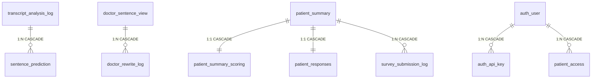

# Database Schema Guide — Prostate Cancer Consultation Dashboard

> Updated: 2026-04-02 (DB optimization: TEXT→JSONB, index tuning, Alembic, model_results deprecation)
> Database: PostgreSQL 13 (`prostatecancer_db`)
> ORM: SQLAlchemy (Backend: async/asyncpg, Pipeline: sync/psycopg2)
> Schema DDL: `Backend/database_schema.sql`
> ORM Models: `Backend/models.py`
> Migrations: Alembic (`Backend/migrations/`)

---

## Overview

This database serves two systems that share the same PostgreSQL instance:

1. **NLP Pipeline** (`AI_physician_patient_communication/`) — writes analysis results
2. **Dashboard Backend** (`Backend/`) — reads results for display, writes user interactions

There are **12 tables** organized into 5 functional groups:

| Group | Tables | Purpose |
|-------|--------|---------|
| Physician Interface | `doctor_sentence_view`, `doctor_rewrite_log` | NLP-scored sentences + rewrite practice history |
| Patient Interface | `patient_summary`, `patient_summary_scoring`, `patient_responses` | AI summaries + patient feedback |
| Survey System | `survey_submission_log` | SDM, DCS, Risk Perception, Satisfaction surveys |
| ML Pipeline Results | `transcript_analysis_log`, `sentence_prediction` | Raw NLP pipeline output storage |
| Infrastructure | `user_interaction_log`, `auth_user`, `auth_api_key`, `patient_access` | Behavior tracking + access control |

---

## App Screen → DB Table Guide

> Which tables provide data for each screen the user sees.

### 🩺 Doctor Dashboard (`?doctorid=auto`)

| Screen Element | Data Source | Description |
|---------------|-----------|-------------|
| Patient list (left panel) | `doctor_sentence_view` | File list = patient list |
| Domain sentence cards | `doctor_sentence_view` | Each sentence's text, NLP score (0-5), domain |
| Domain average scores | `doctor_sentence_view` | Calculated from score column |
| Score trend graph | `doctor_sentence_view` | Score changes over time per patient |
| Sentence rewrite tool | `doctor_rewrite_log` | Doctor rewrites a sentence → stored here. Original score unchanged |
| Rewrite history | `doctor_rewrite_log` | Previous rewrite attempts for same sentence |

### 👤 Patient First Visit (`?visit=first`)

| Screen Element | Data Source | Description |
|---------------|-----------|-------------|
| 5 AI summary cards | `patient_summary` | Per-domain AI-generated summary text |
| Evidence sentences below summary | `doctor_sentence_view` | Original sentences that the summary is based on |
| Summary usefulness rating | `patient_summary_scoring` | Patient rates 1-5: "Was this information helpful?" |
| Free-text feedback | `patient_responses` | Open-ended text response per domain |

### 📋 Patient Follow-up Visit (`?visit=followup`)

| Screen Element | Data Source | Description |
|---------------|-----------|-------------|
| Shared Decision Making survey (SDM) | `survey_submission_log` | "Did the doctor explain treatment options?" etc. |
| Decisional Conflict Scale (DCS) | `survey_submission_log` | "Are you confident about your treatment decision?" etc. |
| Risk Perception survey | `survey_submission_log` | Per-domain risk understanding assessment |
| Patient Satisfaction survey | `survey_submission_log` | Overall consultation satisfaction |

### 📊 Admin Tracking Dashboard (`/admin/tracking`)

| Screen Element | Data Source | Description |
|---------------|-----------|-------------|
| Timeline chart | `user_interaction_log` | Event count by time period |
| Per-patient activity | `user_interaction_log` | Who viewed which patient data, how much |
| Device distribution | `user_interaction_log` | desktop/tablet/mobile ratio |
| Hourly heatmap | `user_interaction_log` | Peak usage hours |

### ⚙️ Background (not visible to users)

| Role | Table | Description |
|------|-------|-------------|
| NLP pipeline run records | `transcript_analysis_log` | Parameters, timestamp, xlsx backup per analysis run |
| NLP detailed predictions | `sentence_prediction` | Per-sentence per-domain probability (0.0-1.0). Source data for doctor_sentence_view |
| User authentication | `auth_user`, `auth_api_key` | API key-based auth (currently simple mode) |
| Patient access control | `patient_access` | Which user can access which patient data (not yet active) |

---

## Table Relationship Diagram



---

## 1. `doctor_sentence_view` — Physician Dashboard Sentence Data

### Why this table exists

This is the **primary data source for the physician dashboard**. When a physician opens the dashboard, every sentence they see — along with its NLP score and domain classification — comes from this table. Without it, the physician dashboard has nothing to display.

### How data gets in

- **Pipeline path**: NLP pipeline Step 10 → `persistence.save_doctor_sentences()` → INSERT
- **CSV seed path**: `convert_output_to_csv.py` → `docter_interface_render_processed.csv` → `init_db.py` → INSERT
- Both paths produce identical data; the CSV path is used for initial seeding when the pipeline hasn't been run against the Docker DB yet.

### Who reads it

- **Physician Dashboard**: `GET /api/doctor/sentences/{file}/{speaker}` — fetches sentences grouped by domain
- **Physician Dashboard**: `GET /api/doctor/scores/summary/{file}/{speaker}` — computes average score per domain
- **Physician Dashboard**: `GET /api/doctor/scores/trajectory?speaker=...` — builds score trend across patients
- **Patient First Visit**: `GET /api/patient/sentences/{file}/{speaker}` — shows evidence sentences under AI summary cards

### Column details

| Column | Type | PK | Description |
|--------|------|:--:|-------------|
| `file` | VARCHAR(255) | PK1 | Transcript filename. Acts as the patient identifier across the dashboard. Example: `Input_Keystrokes REC001 (SID 14).xlsx` |
| `i` | INT | PK2 | Utterance index (1-based). Corresponds to the row number in the original transcript before sentence segmentation. |
| `i2` | INT | PK3 | Sentence index within the utterance (1-based). If utterance 5 was split into 3 sentences, `i2` = 1, 2, 3. |
| `speaker` | VARCHAR(100) | | Speaker label from the transcript. Always the doctor's label (e.g., `Interviewer:`). Includes trailing colon — the frontend queries with this exact string. |
| `sentence` | TEXT | | The actual sentence text (lowercased by the pipeline's segmentation step). This is what the physician reads on the dashboard. |
| `score` | FLOAT | | Consultation quality score (0–5). Assigned by the NLP pipeline's scoring step. Higher = better communication quality for the classified domain. |
| `class` | VARCHAR(100) | | Domain full name: `cancer_prognosis`, `life_expectancy`, `erectile_dysfunction_potency`, `continence`, or `irritative_urinary_symptoms`. The frontend groups sentences by this column. |
| `time` | TIMESTAMP WITH TIME ZONE | | Timestamp of when this record was created. Used for ordering in trajectory views. |

### Primary Key logic

The composite PK `(file, i, i2)` uniquely identifies one sentence from one patient's transcript. A single sentence can appear in multiple domains in `sentence_prediction`, but in `doctor_sentence_view` each `(file, i, i2)` appears once — the `convert_output_to_csv.py` deduplication keeps only the highest-scoring domain for each sentence.

### Indexes

| Index | Columns | Purpose |
|-------|---------|---------|
| PK (implicit) | `(file, i, i2)` | Unique sentence lookup + covers `file`-only queries |
| `idx_dsv_file_speaker_class_i` | `(file, speaker, class, i DESC, i2 DESC) WHERE class != '-1' AND score IS NOT NULL` | Partial + composite index for scores/average 3-stage subquery — the physician dashboard's heaviest query |

> Note: `idx_doctor_render_file (file)` was removed — redundant with PK first column.

---

## 2. `doctor_rewrite_log` — Physician Rewrite Practice History

### Why this table exists

Physicians can practice improving low-scoring sentences by rewriting them and getting a new score. This table records every rewrite attempt. It serves two purposes:
1. **Learning persistence**: When a physician refreshes the page, their latest rewrite is restored from this table.
2. **Research data**: Researchers can analyze how physicians improve their communication over time.

**Important**: Rewrites are a learning tool only. They do NOT change the original score in `doctor_sentence_view`. This was explicitly decided on 2026-03-13 (Ivan) to prevent score gaming.

### How data gets in

- **Physician Dashboard**: `PUT /api/doctor/rewrites` — saves original sentence, revised sentence, both scores, and timestamp.
- Each rewrite creates a new row (not an update), building a revision history.

### Who reads it

- **Physician Dashboard**: `GET /api/doctor/rewrites?file=...&speaker=...` — loads rewrites for a patient
- **Physician Dashboard**: `GET /api/doctor/rewrites/{file}/{i}/{i2}/history` — full revision history for one sentence
- **Physician Dashboard**: On page load, the most recent rewrite for the current sentence is loaded into the textarea.

### Column details

| Column | Type | PK | Description |
|--------|------|:--:|-------------|
| `file` | VARCHAR(255) | PK1 | FK → `doctor_sentence_view.file`. Links to the patient transcript. |
| `i` | INT | PK2 | FK → `doctor_sentence_view.i`. Utterance index of the original sentence. |
| `i2` | INT | PK3 | FK → `doctor_sentence_view.i2`. Sentence-within-utterance index. |
| `time` | TIMESTAMP WITH TIME ZONE | PK4 | Timestamp of this rewrite attempt. Part of PK to allow multiple rewrites of the same sentence. |
| `speaker` | VARCHAR(100) | | Doctor speaker label (same as in `doctor_sentence_view`). |
| `original_sentence` | TEXT | | The original sentence text that was rewritten. Stored redundantly for self-contained history. |
| `revised_sentence` | TEXT | | The physician's rewritten version of the sentence. |
| `score` | FLOAT | | The NLP score of the rewritten sentence. **Currently hardcoded to 5** (temporary — will be replaced with actual NLP re-scoring). |
| `class` | VARCHAR(100) | | Domain name (e.g., `cancer_prognosis`). Stored for filtering rewrites by domain. |

### Foreign Key

```
(file, i, i2) → doctor_sentence_view(file, i, i2) ON DELETE CASCADE
```

If a sentence is removed from `doctor_sentence_view`, all its rewrites are automatically deleted.

---

## 3. `patient_summary` — Patient AI Summary Cards

### Why this table exists

When a patient opens their report page, they see **5 AI-generated summary cards** — one per clinical domain. The text for these cards comes from this table. It's the primary content that patients read.

### How data gets in

- **Current (temporary)**: `convert_output_to_csv.py` concatenates the top-3 highest-scoring sentences per domain and stores them as the "summary". This is a placeholder.
- **Future (Step 9)**: Guillermo's AI Reformat sub-pipeline will generate patient-friendly summaries in plain language and save them via `persistence.save_patient_summary()`.

### Who reads it

- **Patient First Visit**: `GET /api/patient/summaries/{file}/{speaker}` — displays 5 summary cards
- **Patient Follow-Up**: Same endpoint — shows summaries alongside survey questions (especially Risk Perception survey)

### Column details

| Column | Type | PK | Description |
|--------|------|:--:|-------------|
| `file` | VARCHAR(255) | PK1 | Transcript filename (same as `doctor_sentence_view.file`). |
| `speaker` | VARCHAR(100) | PK2 | Patient identifier label. Format: `Patient_{filename}`. |
| `entire_summary` | TEXT | | Combined summary across all 5 domains. Currently NULL — reserved for future use. |
| `class_1` | VARCHAR(100) | | Domain name for slot 1 (e.g., `cancer_prognosis`). |
| `summary_class_1` | TEXT | | AI summary text for domain 1. **Currently temporary**: top-3 NLP sentences concatenated. |
| `class_2` | VARCHAR(100) | | Domain name for slot 2 (e.g., `continence`). |
| `summary_class_2` | TEXT | | AI summary text for domain 2. |
| `class_3` | VARCHAR(100) | | Domain name for slot 3 (e.g., `erectile_dysfunction_potency`). |
| `summary_class_3` | TEXT | | AI summary text for domain 3. |
| `class_4` | VARCHAR(100) | | Domain name for slot 4 (e.g., `irritative_urinary_symptoms`). |
| `summary_class_4` | TEXT | | AI summary text for domain 4. |
| `class_5` | VARCHAR(100) | | Domain name for slot 5 (e.g., `life_expectancy`). |
| `summary_class_5` | TEXT | | AI summary text for domain 5. |

### Design note

The `class_N` / `summary_class_N` pattern stores domain name and summary as paired columns. This is a denormalized design chosen for simplicity — the frontend reads all 5 summaries in a single row rather than joining 5 rows. The domain-to-slot mapping is fixed:

| Slot | Domain | Pipeline abbreviation |
|------|--------|-----------------------|
| 1 | cancer_prognosis | cp |
| 2 | continence | inc |
| 3 | erectile_dysfunction_potency | ed |
| 4 | irritative_urinary_symptoms | ius |
| 5 | life_expectancy | le |

---

## 4. `patient_summary_scoring` — Patient Helpfulness Ratings

### Why this table exists

After reading each AI summary card, patients rate how helpful the information was using a NIH PROMIS unipolar scale (1–5: "Not at all helpful" to "Extremely helpful"). These ratings are research data — they measure whether the AI-generated summaries are actually useful to patients.

### How data gets in

- **Patient First Visit**: `PUT /api/patient/scoring` — saves individual domain ratings as the patient clicks star ratings.
- Initial row created by `init_db.py` with all scores NULL, then updated as the patient interacts.

### Who reads it

- **Patient First Visit**: `GET /api/patient/scoring` — restores previously saved ratings on page reload.
- **Research Analysis**: Exported for measuring patient engagement and summary quality.

### Column details

| Column | Type | PK | Description |
|--------|------|:--:|-------------|
| `file` | VARCHAR(255) | PK1 | FK → `patient_summary.file`. |
| `speaker` | VARCHAR(100) | PK2 | FK → `patient_summary.speaker`. |
| `class_1_patient_scoring` | INT | | Rating for domain 1 (cancer prognosis). CHECK: 0–10. Frontend uses 1–5 scale. |
| `class_2_patient_scoring` | INT | | Rating for domain 2 (continence). |
| `class_3_patient_scoring` | INT | | Rating for domain 3 (erectile dysfunction). |
| `class_4_patient_scoring` | INT | | Rating for domain 4 (irritative urinary). |
| `class_5_patient_scoring` | INT | | Rating for domain 5 (life expectancy). |

### Foreign Key

```
(file, speaker) → patient_summary(file, speaker) ON DELETE CASCADE
```

---

## 5. `patient_responses` — Patient Free-Text Answers

### Why this table exists

On the Patient First Visit page, patients can optionally provide free-text answers to open-ended questions about each domain. This captures qualitative feedback that star ratings alone cannot convey.

### Column details

| Column | Type | PK | Description |
|--------|------|:--:|-------------|
| `file` | VARCHAR(255) | PK1 | FK → `patient_summary.file`. |
| `speaker` | VARCHAR(100) | PK2 | FK → `patient_summary.speaker`. |
| `answer_1` ~ `answer_5` | TEXT | | Free-text response per domain. Same slot mapping as `patient_summary`. |

---

## 6. `survey_submission_log` — Survey Responses (SDM, DCS, Risk Perception, Satisfaction)

### Why this table exists

The Patient Follow-Up page presents 4 validated survey instruments. Each submission is stored as a separate row with the full answers in JSON format. This design supports:
- Multiple submissions (e.g., partial saves on Next click, final save on Submit)
- Different survey types with different question structures in a single table
- REDCap synchronization for clinical research data management

### How data gets in

- **Patient Follow-Up**: `POST /api/surveys/submit` — called on Submit and on auto-save (Next click with `partial: true` in metadata).
- Each submission creates a new INSERT (not an update), so the full history of partial + final saves is preserved.

### Who reads it

- **Patient Follow-Up**: `GET /api/surveys/by-speaker/{speaker}` — restores previous answers on page reload.
- **REDCap Sync**: Backend can export survey data to REDCap via API integration.

### Column details

| Column | Type | PK | Description |
|--------|------|:--:|-------------|
| `id` | SERIAL | PK | Auto-increment primary key. |
| `file` | VARCHAR(255) | | FK → `patient_summary.file`. Indexed for fast lookup. |
| `speaker` | VARCHAR(100) | | FK → `patient_summary.speaker`. Indexed. |
| `survey_type` | VARCHAR(50) | | One of: `sdm`, `dcs`, `risk_perception`, `satisfaction`, `baseline`, `questions`. Indexed. |
| `answers` | JSONB | | JSON object containing all question-answer pairs. Structure varies by survey type. Example for SDM: `{"q1": "yes", "q2": 4, "q3": "no", ...}`. JSONB provides automatic validation and field-level queries. |
| `extra_data` | JSONB | | JSON object for metadata. Contains `{ "partial": true }` for auto-saves, or additional context. |
| `submitted_at` | TIMESTAMP | | When this submission was recorded. |
| `redcap_synced` | BOOLEAN | | Whether this submission has been exported to REDCap. Default `FALSE`. |
| `redcap_record_id` | VARCHAR(255) | | REDCap record ID after successful sync. NULL until synced. |
| `redcap_error` | TEXT | | Error message if REDCap sync failed. NULL on success. |

### Survey types

| Type | Survey Instrument | Question Count | Scale |
|------|-------------------|----------------|-------|
| `sdm` | Shared Decision Making | ~10 | Yes/No + Likert |
| `dcs` | Decisional Conflict Scale | ~16 | 5-point Likert |
| `risk_perception` | Risk Perception | 5 (one per domain) | 6-point scale |
| `satisfaction` | Patient Satisfaction | ~5 | Likert |

---

## 7. `transcript_analysis_log` — Pipeline Analysis Run Records

### Why this table exists

Every time the NLP pipeline processes a transcript file, it creates one row in this table. This provides:
- **Audit trail**: When was each file analyzed, with what parameters?
- **Reproducibility**: The `top_n` and `context_window` settings used for each run are recorded.
- **Download fallback**: The `xlsx_data` column stores the binary xlsx output, so results can be downloaded even if the file is deleted from disk.

### How data gets in

- **Pipeline Step 10**: `persistence.save_analysis_run()` — creates one row per pipeline execution.
- **CSV seed**: `transcript_analysis_log.csv` → `init_db.py` for initial seeding.

### Who reads it

- **Backend API**: `GET /api/transcript/history/{patient_id}` — lists all analysis runs for a patient.
- **Backend API**: `GET /api/transcript/download/{patient_id}` — falls back to `xlsx_data` if the file isn't on disk.

### Column details

| Column | Type | PK | Description |
|--------|------|:--:|-------------|
| `id` | SERIAL | PK | Auto-increment. Used as FK target by `sentence_prediction`. |
| `patient_id` | VARCHAR(255) | | Patient identifier extracted from filename (e.g., `SID_14`). Indexed. |
| `total_sentences` | INT | | Total number of sentences after Step 2 segmentation. Useful for understanding transcript size. |
| `top_n` | INT | | The `top_k` parameter used for this run (default: 10). Records how many sentences were selected per domain. |
| `context_window` | INT | | The `context_window` parameter used (default: 3). Records how many surrounding sentences were included. |
| `model_results` | JSONB | | **Deprecated** — set to NULL for new analysis runs. Per-model result data is now stored exclusively in the `sentence_prediction` table. Kept for backward compatibility with legacy rows that predate the `sentence_prediction` feature; `_backfill_predictions()` reads this column to reconstruct old data. |
| `xlsx_data` | BYTEA | | Binary xlsx file for DB-backed download. Allows result retrieval even after disk cleanup. Can be large (~50-200KB per file). |
| `source_filename` | VARCHAR(500) | | Original input filename (e.g., `Input_Keystrokes REC001 (SID 14).xlsx`). |
| `analyzed_at` | TIMESTAMP | | When this analysis was run. Indexed for chronological queries. |

### Indexes

| Index | Columns | Purpose |
|-------|---------|---------|
| `idx_transcript_log_analyzed_at` | `analyzed_at` | Chronological queries |
| `idx_transcript_log_patient_analyzed` | `(patient_id, analyzed_at DESC)` | Composite — covers both patient lookup and "latest run" queries. Replaces former single-column `idx_transcript_log_patient_id`. |
| `idx_transcript_log_patient_xlsx` | `(patient_id, analyzed_at DESC) WHERE xlsx_data IS NOT NULL` | Partial — download endpoint skips NULL xlsx rows |
| `idx_transcript_log_history` | `(patient_id, analyzed_at DESC) INCLUDE (id, total_sentences, top_n, context_window, source_filename)` | Covering — history endpoint can answer from index alone (index-only scan) |

### Relationship

```
transcript_analysis_log.id ←── sentence_prediction.analysis_id (1:N, CASCADE)
```

Deleting an analysis run cascades to delete all associated sentence predictions.

---

## 8. `sentence_prediction` — Per-Sentence NLP Scores

### Why this table exists

This is the **most granular NLP output** — one row per sentence per domain. While `doctor_sentence_view` stores only the highest-scoring domain for each sentence (for dashboard display), `sentence_prediction` stores **all 5 domain scores** for each of the top-K sentences. This enables:
- Querying "show me all sentences scored > 0.8 for cancer prognosis"
- Comparing how the same sentence scores across different domains
- Full context preservation (the `context` column with ±3 surrounding sentences)

### How data gets in

- **Pipeline Step 10**: `persistence.save_sentence_predictions()` — bulk inserts all top-K sentences for all 5 domains.
- **CSV seed**: `sentence_prediction.csv` → `init_db.py`.

### Who reads it

- **Backend API**: `GET /api/transcript/predictions/{patient_id}` — returns predictions with optional filters (`?model=cp&top_n=5&min_score=0.7`).

### Column details

| Column | Type | PK | Description |
|--------|------|:--:|-------------|
| `id` | SERIAL | PK | Auto-increment. |
| `analysis_id` | INT | FK | → `transcript_analysis_log.id`. Links this prediction to a specific pipeline run. CASCADE on delete. Indexed. |
| `patient_id` | VARCHAR(255) | | Patient identifier. Redundant with the analysis log but indexed for direct lookups without joining. |
| `model` | VARCHAR(10) | | NLP domain abbreviation: `cp`, `le`, `ed`, `inc`, or `ius`. Combined with `patient_id` for indexed queries. |
| `sentence_index` | INT | | Global sentence number (1-based) across the entire segmented transcript. Maps to `index` column in pipeline DataFrames. |
| `utterance_index` | INT | | Original utterance row number from the transcript. Maps to `i` column. |
| `sentence_in_utterance` | INT | | Position within the utterance (1-based). Maps to `i2` column. |
| `speaker` | VARCHAR(100) | | Speaker label (always the doctor for current implementation). |
| `sentence_text` | TEXT | | The sentence text (lowercased). |
| `pred_score` | FLOAT | | NLP prediction probability (0.0–1.0). Maps to `.pred_1` from the NLP Docker response. Indexed DESC for "top scoring" queries. |
| `context` | TEXT | | Surrounding sentences with `<main>target sentence</main>` tags. Window size determined by `context_window` in the analysis run. |

### Indexes

| Index | Columns | Purpose |
|-------|---------|---------|
| `idx_sp_analysis_model` | `(analysis_id, model)` | Composite — covers both join-to-run and filter-by-model. Replaces former `idx_sp_analysis_id` (redundant: first column covers single-column queries). |
| `idx_sp_patient_model` | `(patient_id, model)` | Filter by patient + domain |
| `idx_sp_pred_score` | `pred_score DESC` | "Top scoring sentences" queries |

### Difference from `doctor_sentence_view`

| Aspect | `sentence_prediction` | `doctor_sentence_view` |
|--------|-----------------------|------------------------|
| **Granularity** | One row per sentence **per domain** | One row per sentence (highest domain only) |
| **Rows for 1 patient** | ~50 (10 sentences × 5 domains) | ~45-50 (deduplicated) |
| **Has context** | Yes (`context` column) | No |
| **Has analysis_id** | Yes (links to pipeline run) | No |
| **Used by** | API predictions endpoint | Physician + Patient dashboards |

---

## 9. `user_interaction_log` — Behavior Tracking

### Why this table exists

Every click, page view, scroll, and interaction in the dashboard is tracked for **research purposes**. This data measures:
- How much time patients spend reading each summary
- Whether physicians actually use the rewrite tool
- Which domains get the most attention
- Device types and session patterns

The frontend batches events and sends them via `POST /api/tracking/events`.

### Column details

| Column | Type | PK | Description |
|--------|------|:--:|-------------|
| `id` | SERIAL | PK | Auto-increment. |
| `session_id` | VARCHAR(100) | | UUID generated per browser session. Indexed. Groups events from the same visit. |
| `role` | VARCHAR(20) | | `patient` or `doctor`. Indexed. Determines which UI the user was on. |
| `file` | VARCHAR(255) | | Which patient's data the user was viewing. Indexed. |
| `speaker` | VARCHAR(100) | | Speaker identifier. Indexed. |
| `event_type` | VARCHAR(50) | | Event category. Indexed. Examples: `page_view`, `click`, `summary_expand`, `rating_submit`, `survey_next`, `rewrite_save`. |
| `element_id` | VARCHAR(255) | | DOM element identifier (e.g., `summary-card-cp`, `rewrite-button`). |
| `event_data` | JSONB | | JSON object with event-specific data. Examples: `{"domain": "cp", "score": 4}`, `{"scroll_percent": 75}`. JSONB provides automatic validation. |
| `device_type` | VARCHAR(20) | | `desktop`, `tablet`, or `mobile`. |
| `client_timestamp` | TIMESTAMP | | When the event occurred on the user's device (may differ from server time). |
| `created_at` | TIMESTAMP | | When the event was recorded on the server. |

---

## 10. Authentication Tables

### `auth_user` — User Accounts

| Column | Type | Description |
|--------|------|-------------|
| `id` | SERIAL PK | |
| `username` | VARCHAR(150) | Display name. Indexed for login/lookup queries. |
| `email` | VARCHAR(255) UNIQUE | Login email. |
| `password_hash` | VARCHAR(255) | Bcrypt hash. NULL for API-key-only users. |
| `role` | VARCHAR(20) | `admin`, `user`, or `readonly`. CHECK constraint. |
| `is_superuser` | BOOLEAN | Full system access. |
| `is_active` | BOOLEAN | Can login. Set FALSE to disable without deleting. |
| `auth_provider` | VARCHAR(50) | `local` (default), could be `oauth` etc. |

### `auth_api_key` — API Keys

| Column | Type | Description |
|--------|------|-------------|
| `id` | SERIAL PK | |
| `user_id` | INT FK | → `auth_user.id`. CASCADE on delete. |
| `key_hash` | VARCHAR(255) | SHA-256 hash of the API key. The plain key is never stored. Indexed. |
| `label` | VARCHAR(100) | Human-readable label (e.g., "Jun's dev key"). |
| `is_active` | BOOLEAN | Revoke without deleting. |
| `expires_at` | TIMESTAMP | Optional expiration. NULL = never expires. |
| `last_used_at` | TIMESTAMP | Updated on each authenticated request. |

### `patient_access` — Patient-Level Access Control

| Column | Type | Description |
|--------|------|-------------|
| `id` | SERIAL PK | |
| `user_id` | INT FK | → `auth_user.id`. |
| `patient_id` | VARCHAR(255) | Which patient this user can access. |
| `access_type` | VARCHAR(20) | `read`, `write`, or `admin`. CHECK constraint. |
| `granted_at` | TIMESTAMP | When access was granted. |
| `granted_by` | INT FK | → `auth_user.id`. Who granted access. |
| UNIQUE | `(user_id, patient_id)` | One access record per user-patient pair. |

**Note**: These auth tables are defined in the schema but the current system uses a simple `X-API-Key` header for authentication (`AUTH_MODE=api_key` in `.env`). The full user/role system is available for future use when the system moves to production.

---

## Data Flow Summary

```
Pipeline output
    │
    ├──→ transcript_analysis_log    (1 row per pipeline run)
    ├──→ sentence_prediction        (N rows per run: 5 domains × top-K)
    ├──→ doctor_sentence_view       (deduplicated for dashboard display)
    └──→ patient_summary            (temporary summaries; future: AI-generated)
              │
              ├──→ patient_summary_scoring   (patient rates each summary)
              ├──→ patient_responses          (patient free-text answers)
              └──→ survey_submission_log      (SDM, DCS, Risk, Satisfaction)

User interactions
    └──→ user_interaction_log       (clicks, views, time tracking)

Physician rewrites
    └──→ doctor_rewrite_log         (practice history, does NOT change scores)
```

---

## Current Data Volume (6 test patients)

| Table | Row Count | Notes |
|-------|-----------|-------|
| `doctor_sentence_view` | 266 | ~44 sentences per patient |
| `sentence_prediction` | 300 | 50 per patient (10 per domain × 5) |
| `transcript_analysis_log` | 18 | Multiple runs during testing |
| `patient_summary` | 6 | 1 per patient |
| `patient_summary_scoring` | 6 | 1 per patient (initially NULL) |
| `patient_responses` | 6 | 1 per patient (initially NULL) |
| `survey_submission_log` | 0 | Populated when patients complete surveys |
| `doctor_rewrite_log` | 0 | Populated when physicians practice rewrites |
| `user_interaction_log` | ~20 | From development/testing |
| `auth_user` | 0 | Not yet configured |
| `auth_api_key` | 0 | Using env-based API key |
| `patient_access` | 0 | Not yet configured |

---

## Schema Migration (Alembic)

Schema changes are managed by Alembic. The initial schema is created by `database_schema.sql` (Docker entrypoint), and subsequent changes are applied via Alembic migrations.

**Files:**
- `Backend/alembic.ini` — config (DB URL from `DATABASE_URL` env var)
- `Backend/migrations/env.py` — runner (asyncpg→psycopg2 swap, models.Base metadata)
- `Backend/migrations/versions/001_baseline.py` — baseline (marks existing schema as starting point)

**Docker startup flow:**
```
PostgreSQL → database_schema.sql (create tables)
Backend → wait_for_db → init_db (CSV seed) → alembic stamp head → alembic upgrade head
```

**Adding a new column:**
```bash
# 1. Edit models.py
# 2. Generate migration
docker exec prostatecancer-backend alembic revision --autogenerate -m "add column X"
# 3. Apply
docker exec prostatecancer-backend alembic upgrade head
```

---

## Additional Indexes (user_interaction_log)

| Index | Columns | Purpose |
|-------|---------|---------|
| `idx_uil_session` | `session_id` | Session lookup |
| `idx_uil_role` | `role` | Filter by patient/doctor |
| `idx_uil_file` | `file` | Filter by patient file |
| `idx_uil_speaker` | `speaker` | Filter by speaker |
| `idx_uil_event_type` | `event_type` | Filter by event type |
| `idx_uil_client_timestamp` | `client_timestamp` | Time-based queries |
| `idx_uil_file_event_type` | `(file, event_type)` | Composite — by_patient analytics GROUP BY |
| `idx_uil_client_ts_hour` | `date_trunc('hour', client_timestamp) WHERE client_timestamp IS NOT NULL` | Expression — analytics timeline GROUP BY |
| `idx_uil_client_ts_hour_of_day` | `extract(hour FROM client_timestamp) WHERE client_timestamp IS NOT NULL` | Expression — hourly heatmap GROUP BY |

## Additional Indexes (survey_submission_log)

| Index | Columns | Purpose |
|-------|---------|---------|
| `idx_survey_submission_file` | `file` | Filter by patient |
| `idx_survey_submission_speaker` | `speaker` | Filter by speaker |
| `idx_survey_submission_type` | `survey_type` | Filter by survey type |
| `idx_survey_speaker_submitted` | `(speaker, submitted_at DESC)` | by-speaker endpoint — WHERE + ORDER BY |
| `idx_survey_file_submitted` | `(file, submitted_at DESC)` | by-file endpoint — WHERE + ORDER BY |
| `idx_survey_redcap_pending` | `id WHERE redcap_synced = FALSE` | Partial — REDCap sync pending items only |

---
