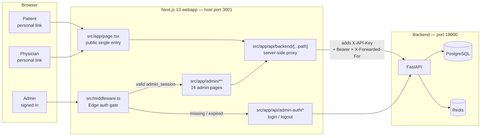
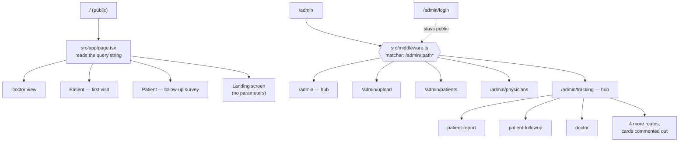
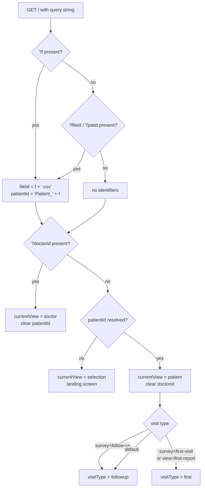
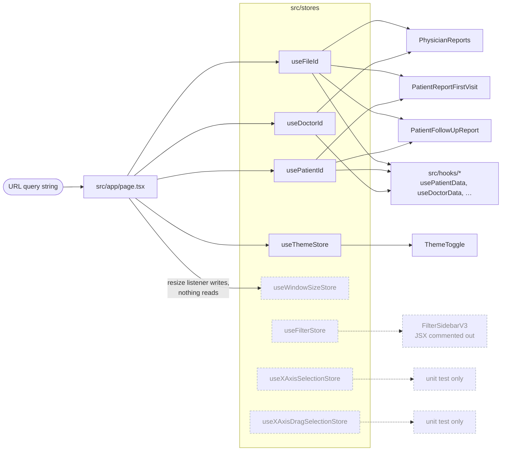
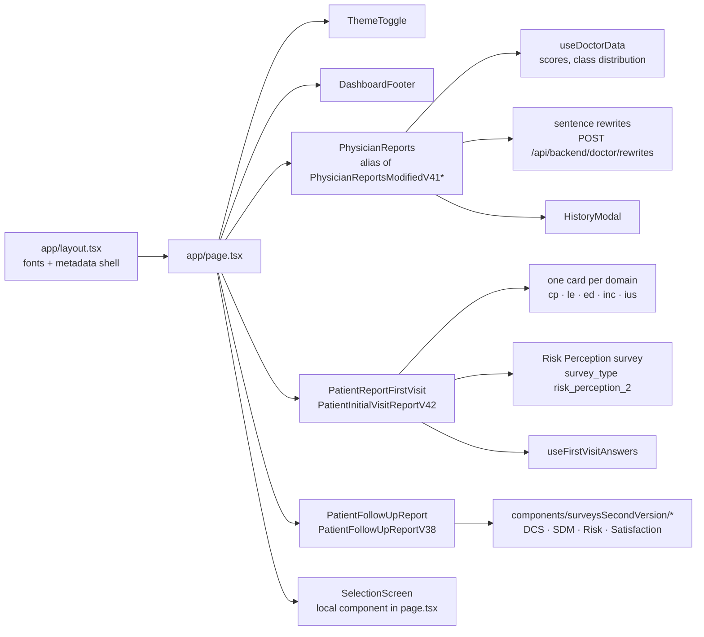
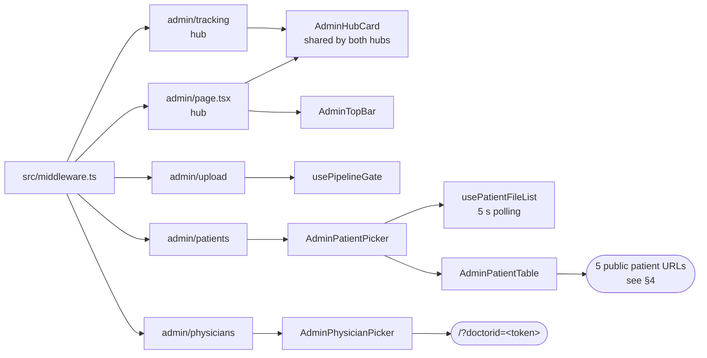
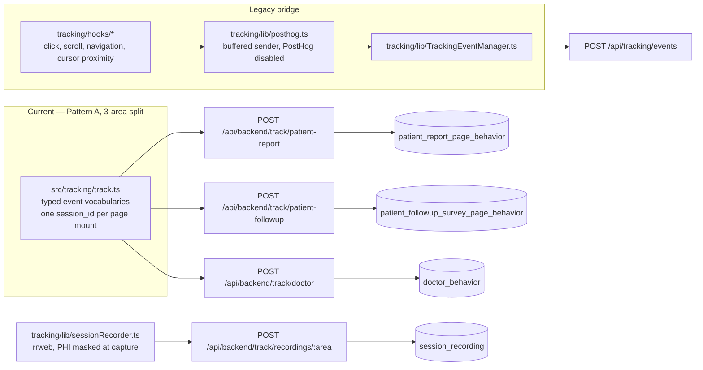

# COMPASS Webapp Architecture — Routing, Zustand State, and Component Relationships

> Scope: `app/Webapp/` only (Next.js 13 App Router). Backend, database and AI
> pipeline are covered by the sibling docs listed in `INDEX.md`.
> Korean mirror: `WEBAPP_ARCHITECTURE_KR.md`.
> Facts in this document were read off the source tree; line references point at
> `app/Webapp/src/`.

---

## 1. Why this document exists

Three things about this webapp are invisible from the file tree, and all three
have cost time before:

1. **Route files are not screens.** One file, `src/app/page.tsx`, reads the query
   string and decides which of three patient/doctor experiences to mount.
   Component composition *is* the routing.
2. **Most components are not mounted.** `src/components/` holds 105 top-level
   `.tsx` files plus 30 in subfolders. Many are versioned drafts (`V2` … `V42`)
   of the same screen. Only one version of each is actually imported.
3. **Not every store or hook is live.** Of 8 Zustand stores, 2 are imported only
   by their own unit tests, 1 is written but never read, and 1 more is reachable
   only through a component whose JSX is commented out. Of 12 hooks, 6 have no
   production importer.

This document answers: *what runs, what holds state, and what talks to what.*

Read order: §2 gives the outside view, §3–§5 the routing and the auth gate,
§6 the Zustand model (the state-management section), §7 the component graph,
§8 behaviour tracking, §9 the dead-code inventory.

---

## 2. System context

The webapp holds **no database credentials**. Every read and write goes through
a server-side proxy route that injects the API key, so the browser never sees
it.



**Proxy contract** — `src/app/api/backend/[...path]/route.ts`:

| Behaviour | Detail |
|---|---|
| Path rewrite | auto-prepends `/api/`, so `/api/backend/patient/files` → `${BACKEND_URL}/api/patient/files`. Callers must **not** include a leading `api/`, or the URL becomes `/api/api/...` (404) |
| API key | `X-API-Key` injected server-side from `process.env.API_KEY` |
| Admin identity | the httpOnly `admin_session` cookie is copied into `Authorization: Bearer …` so backend `require_admin_user` endpoints authenticate |
| Caller identity | `X-Forwarded-For` is appended to, not replaced — otherwise every audit row records the container's address |

The other four route handlers are `admin-auth/login`, `admin-auth/logout`,
`admin/upload-transcript` and `admin/upload-log`.

---

## 3. Routing model



`/admin/tracking` currently shows three cards. Four further routes exist and
work — `patient-survey`, `patient-surveys-combined`, `redcap-sync`,
`data-integrity`, plus `recordings` — but their cards are commented out in
`src/app/admin/tracking/page.tsx`.

---

## 4. URL → view resolution

All patient and physician entry points are query strings on `/`. This is a hard
constraint, not a style choice: the de-identifier hands out `/?f=…` and
`/?doctorid=…` links, and those recipients have no admin account. Gating `/`
would break every distributed link.



Legacy parameters still resolve: `?visit=followup` joins the first branch, and
`?visit=first` / `?visit=combined` join the second. The new self-descriptive
`?survey=` / `?view=` parameters take priority when both are present.

The reconstruction step matters: the short link carries one stem
`?f=<hashedPatient>_<hashedDoctor>_<date>`, and `page.tsx` rebuilds the
`<stem>.csv` filename and the `Patient_<stem>` speaker that the stores and APIs
expect. Legacy `?fileid=&patid=` links still resolve through the second branch.

**The five links the admin patient list produces** — `patientUrl()` in
`src/components/AdminPatientPicker.tsx`:

| Entry point | URL | What renders |
|---|---|---|
| Report | `/?f=<stem>&view=first-report` | read-only AI summary, no survey |
| 1st survey | `/?f=<stem>&survey=first-visit` | first-visit Risk Perception survey |
| Follow-up | `/?f=<stem>&survey=follow-up` | DCS / SDM / Risk / Satisfaction |
| Total Survey | `/?f=<stem>&survey=follow-up&combined=1` | one unified follow-up flow; the follow-up re-enables its Risk step and renders the 1st survey there |
| Combined (2-step) | `/?f=<stem>&survey=first-visit&seq=1` | 1st survey as its own screen, then chains to a follow-up whose Risk step is *not* embedded |

The chaining is a real navigation, not internal state: on completion the
first-visit component sets `window.location.href` to
`/?f=<stem>&survey=follow-up&seq=1` (or `&combined=1`), so the flow marker
survives the hop.

---

## 5. The admin auth gate

`src/middleware.ts` runs on the Edge runtime and guards `/admin/:path*`
(which includes `/admin` itself). It:

1. lets `/admin/login` through unconditionally — otherwise there is no way in;
2. reads the httpOnly `admin_session` cookie, which client JS cannot touch;
3. verifies the HS256 signature with the Web Crypto API (`crypto.subtle`), so
   no JWT dependency is needed in the Edge bundle;
4. rejects an expired `exp`, and requires `role === "admin"` or
   `is_superuser === true`;
5. on failure redirects to `/admin/login?next=<original path>`.

This middleware is the **UX gate**. The backend independently re-verifies the
token and the admin role on every admin API call, and is the hard gate. The
secret comes from `JWT_SECRET`; in the Docker deployment it reaches the
container through `env_file: app/Webapp/.env`.

---

## 6. State management with Zustand

### 6.1 The stores

Eight stores in `src/stores/`, 341 lines total. "Consumers" counts files that
import the store, excluding the store's own file.

| Store | Lines | Consumers | Shape | Status |
|---|---|---|---|---|
| `useFileId` | 33 | 46 | `fileId`, `setFileId`, `clearFileId`, `initFromStorage` | core |
| `usePatientId` | 33 | 27 | `patientId`, `setPatientId`, `clearPatientId`, `initFromStorage` | core |
| `useDoctorId` | 31 | 27 | `doctorId`, `setDoctorId`, `clearDoctorId`, `initFromStorage` | core |
| `useThemeStore` | 11 | 4 | `isDarkMode`, `toggleTheme` | live — but 2 of the 4 importers are the disabled download components |
| `useWindowSizeStore` | 17 | 1 | `width`, `height`, `setWindowSize` | write-only — see §6.2 |
| `useFilterStore` | 139 | 2 | US states / age brackets / gender / `displayBy` | effectively dead — see §9 |
| `useXAxisSelectionStore` | 15 | 1 | x-axis selection | dead — test only |
| `useXAxisDragSelectionStore` | 62 | 1 | x-axis drag range | dead — test only |

Seven stores use a named export; `useFilterStore` alone uses a default export.

### 6.2 Store → consumer graph

Dashed nodes have no production consumer. `useWindowSizeStore` is a special
case: `page.tsx` writes to it from a `resize` listener, but no other production
file reads `width` / `height` — the only other importer is its unit test.



### 6.3 The identifier pattern, and why it looks like this

`useFileId`, `usePatientId` and `useDoctorId` are the same store three times:
a plain `create<T>()` with `{ value, setX, clearX, initFromStorage }` and no
middleware — **no `persist`, no `devtools`, no `immer`**.

Two rules force that shape:

- **No PHI in localStorage / sessionStorage / cookies** (`app/Webapp/CLAUDE.md`
  rule 2). File, patient and doctor identifiers are session-scoped and derived
  from the URL on every mount.
- **A stale identifier must not survive into a new session.** If a previous
  patient's id were restored from storage, survey submits would POST against a
  patient that is not in this URL's context — the backend 404s and the user sees
  "Failed to submit".

`initFromStorage` is therefore a deliberate **no-op**, kept only because
`page.tsx` still calls it in the URL-parsing effect (the `else` branch when no
file id is in the URL). It is not vestigial by accident; each store documents
the reason in its header comment.

The consequence for the whole app: **the URL is the source of truth, and the
stores are a per-mount cache of what the URL said.** Deep-linking works, a
refresh is safe, and there is nothing to clear on sign-out.

### 6.4 Reading stores: `useShallow`

`page.tsx` pulls several fields from one store at a time and wraps every
selector in `useShallow` from `zustand/react/shallow`:

```ts
const { patientId, setPatientId, clearPatientId, initFromStorage } =
  usePatientId(
    useShallow((state) => ({
      patientId: state.patientId,
      setPatientId: state.setPatientId,
      clearPatientId: state.clearPatientId,
      initFromStorage: state.initFromStorage,
    }))
  );
```

Without `useShallow` the object literal is a new reference on every store
update, and the top-level page re-renders on any change to any field.

### 6.5 The boundary: stores hold identity, hooks hold server data

Server data never goes in a store. It is fetched through the proxy inside a
hook, keyed by the identifier the store holds. `src/hooks/` has 12 hooks, but
only 6 have a production importer:

| Hook | Imported by | Live |
|---|---|---|
| `usePatientData` | every patient report version, incl. the mounted V42 / V38 | yes |
| `useDoctorData` | every physician report version, incl. the mounted one; also `HistoryModal` | yes |
| `useFirstVisitAnswers` | `PatientInitialVisitReportV40/V41/V42` | yes |
| `useDebounce` | `PatientInitialVisitReportV41/V42`, `PatientFollowUpReportV31Re/V38` | yes |
| `usePatientFileList` | `AdminPatientPicker` | yes |
| `usePipelineGate` | `app/admin/upload/page.tsx` | yes |
| `useProstateCancelData` | only superseded physician versions (`V3`, `V5`, `PhysicianReports`, `PhysicianReportsModified`) | no |
| `useDemographicData` | only `utils/chartRenderer.tsx`, which nothing imports | no |
| `useChartSelection`, `useSectionSelection`, `useInstituteSelection`, `useNUSPARDemographicData` | no importer anywhere | no |

Alongside them, `src/api/` holds four thin API clients: `demographicData.tsx`,
`firstVisitAnswersApi.ts`, `surveyApi.tsx`, `trackingApi.ts`.

`usePatientFileList` is the clearest example of the pattern: it owns the
`/api/backend/patient/files` + `/api/backend/patient/processing-count` polling
loop (5 s interval, list reloaded when the processing count drops or the list is
still empty) and returns `{ patientList, loading, processingCount }`. It was
extracted from `AdminPatientPicker` so that component stays under the 150-line
limit.

---

## 7. Component relationships

### 7.1 What is actually mounted

`page.tsx` renders exactly six components. Everything else on screen is nested
inside one of them.

| Rendered at | Component | Condition |
|---|---|---|
| `page.tsx:489` | `ThemeToggle` | always |
| `page.tsx:504` | `PhysicianReports` | `currentView === "doctor"` |
| `page.tsx:512` | `PatientReportFirstVisit` | patient + `visitType === "first"` |
| `page.tsx:537` | `PatientFollowUpReport` | patient + `visitType === "followup"` |
| `page.tsx:579` | `APITestDashboard` | dev mode only (localStorage flag) |
| `page.tsx:585` | `DashboardFooter` | always |

`PhysicianReports` is the local import alias for the currently mounted
physician screen, `components/PhysicianReportsModifiedV41*`;
`PatientReportFirstVisit` aliases `PatientInitialVisitReportV42`, and
`PatientFollowUpReport` aliases `PatientFollowUpReportV38` (forward-only
navigation, chosen for elderly participants). Earlier versions of all three sit
next to them as commented-out imports — swapping one line rolls the screen back.

Dev mode is toggled with `localStorage.setItem("prostatecancerapp_dev_mode", "true")`.

### 7.2 The public tree — three personas plus the landing screen



### 7.3 The admin tree

The admin section is light-mode only — `useThemeStore` is not wired into it.



`AdminHubCard` is shared by the two hub pages. Both rendered the same markup
separately until 2026-08-27, which is how the Upload Transcript card ended up
duplicated on `/admin` and `/admin/tracking`; uploading is a pipeline action, so
it now appears on `/admin` only.

The landing screen (`SelectionScreen`) is a local component inside `page.tsx`.
It deliberately lists nothing — the browsable patient and physician indexes
moved behind the admin login on 2026-08-27 — and offers only a "Staff sign-in"
link to `/admin/login`.

### 7.4 Conventions the component tree follows

- Functional components with hooks; default export at the bottom; props typed by
  an inline `Props` interface.
- **Under ~150 lines.** A screen that outgrows the limit gets a new version
  (`V41` → `V42`) or has logic extracted into `src/hooks/`, rather than growing.
- Client components never call the backend directly — always the relative
  `/api/backend/...` proxy.
- shadcn/ui primitives in `components/ui/` (11 files) are preferred over new
  ones; variants live in the consuming component's own file.

---

## 8. Behaviour tracking

Two generations of tracking coexist.



Notes that matter when reading tracking data:

- `page.tsx` calls `useTracking({ role, file, speaker, visitType })` once and
  starts an rrweb capture whenever the view or file changes, tagged with one of
  `patient_first_report`, `patient_first_survey`, `patient_followup`,
  `physician`.
- `setReportTrackingTarget("followup-risk")` redirects first-visit report events
  into the follow-up table as `survey_type='risk_perception'`, so the combined
  Total Survey shows up uniformly in the admin follow-up dashboard.
- The tracking session id is intentionally **not** persisted: refreshing the same
  URL starts a new session.
- PostHog itself is disabled. `posthog.ts` keeps the old function signatures
  (`initializePostHog`, `captureEvent`) but sends to the backend instead, and
  `PostHogProvider` is commented out in `app/layout.tsx`.

---

## 9. Dead and disabled inventory

Recorded so the next reader does not have to re-derive it. Nothing here is
proposed for deletion in this document — removal needs its own change.

| Item | Evidence |
|---|---|
| `useXAxisSelectionStore` | only importer is its own unit test |
| `useXAxisDragSelectionStore` | only importer is its own unit test |
| `useWindowSizeStore` | written by `page.tsx`, read by nothing |
| `useChartSelection`, `useSectionSelection`, `useInstituteSelection`, `useNUSPARDemographicData` | no importer anywhere in `src/` |
| `utils/chartRenderer.tsx` → `components/charts/*` (7 files) → `useDemographicData` | `chartRenderer` has no importer, so the whole subtree is unreachable |
| `components/surveys/` (6 files, v1) | imported only by superseded report versions and by `surveysSecondVersion/index.tsx`; the mounted follow-up uses `surveysSecondVersion` |
| `useProstateCancelData` | imported only by superseded physician versions |
| `useFilterStore` (139 lines) | only `FilterSidebarV3` and its test import it; `<FilterSidebar>` is commented out at `page.tsx:426`. Its state — US states, age brackets, gender — does not match this study |
| `ReportDownload` | imported at `page.tsx:58`, JSX commented out at `page.tsx:581` |
| `PatientConsultationReports`, `Dashboard` | imported at `page.tsx:25` and `:55`, never rendered |
| `PostHogProvider` | import and usage both commented out in `app/layout.tsx` |
| Versioned drafts | `PatientReportModifiedV2…V31`, `PatientInitialVisitReportV29…V41`, `PatientFollowUpReportV31…V37`, `PhysicianReportsModifiedV33…V39` — superseded by the aliases in §7.1 |
| Hidden admin cards | `patient-survey`, `patient-surveys-combined`, `redcap-sync`, `data-integrity`, `recordings` — routes live, cards commented out |

---

## 10. Known issues / follow-ups

Status as of the `chore/webapp-safety-nets` change.

### Still open

1. **Component filenames carry a person's first name.** The mounted physician
   screen and one earlier draft are named `PhysicianReportsModifiedV41*` and
   `…V37*` with a personal-name suffix, which the repo naming rule disallows.
   This document refers to the screen by its import alias `PhysicianReports`.
   Renaming touches the import in `page.tsx` plus tests, so it belongs in its
   own change.
2. **The type checker is still off at build time.** `next.config.js` keeps
   `typescript.ignoreBuildErrors: true`, and `npx tsc --noEmit` reports **609**
   errors. They are not spread through the app — every one sits in code that
   never renders:

   | Where | Errors |
   |---|---|
   | 136 orphan components (§9) | 487 |
   | `ReportDownloadNonAIAPI` — imported at `page.tsx:58`, JSX commented at `:581` | 93 |
   | `charts/d3js/PieChartV3` — reached only through the never-rendered `Dashboard` | 17 |
   | `FilterSidebarV3` — imported at `page.tsx:54`, JSX commented at `:426` | 11 |
   | `PatientConsultationReports` — imported, never rendered | 1 |
   | **Rendered code, `src/__tests__/`, `e2e/`** | **0** |

   Flipping the flag to `false` belongs in the same change that deletes the
   orphan files — that removes 487 of the 609 by itself. Until then
   `npm run typecheck` runs the checker on demand, and the reason is written
   into `next.config.js` so the flag is not silently on.
3. **117 `react-hooks/exhaustive-deps` warnings.** Left as warnings on purpose:
   adding the missing dependencies changes re-render timing, so it is a
   behavioural change that needs its own review, not a bulk edit.
4. **Jest needs `--runInBand`** on the deployment host; the default worker pool
   crashes with child-process exceptions.
5. **`ApiTestDashboard` targets endpoints that no longer exist.** Its PUT
   buttons — and the `updateScoring` / `updateResponses` /
   `updateSingleClassScore` / `updateAllClassScores` / `updateSingleAnswer`
   helpers in `usePatientData` — call `PUT /api/patient/scoring` and
   `PUT /api/patient/responses`, both removed by migration 020. The request
   shapes were corrected to the current domain-keyed schema so the file type
   checks, but the calls still 404. Removing the surface touches ~15 dead
   components, so it is queued with the dead-code deletion.
6. **605 Korean comment lines remain in 39 orphan components** (§9), plus two
   deliberate non-ASCII round-trip fixtures in
   `src/__tests__/utils/cryptoUtils.test.ts`. The orphans are queued for
   deletion, so translating them would be wasted work.

### Resolved

- **ESLint now runs and gates the build.** `app/Webapp/.eslintrc.json` was
  added (`next/core-web-vitals`, with `react/no-unescaped-entities` lowered to
  `warn` — 206 of its hits are apostrophes in JSX text and none affect
  behaviour). `npx next lint` reports **0 errors / 329 warnings**, so
  `eslint.ignoreDuringBuilds` was **removed** from `next.config.js`: a new lint
  *error* now fails `npm run build`.
- **Six real `react-hooks/rules-of-hooks` bugs fixed.** `HistoryModal.tsx` and
  `PhysicianReportsModifiedV{9,11,13,15}` each had `if (…) return null;` above a
  `useMemo`, making the hook conditional. `HistoryModal` was latent only because
  its JSX is commented out; un-commenting it would have thrown "Rendered more
  hooks than during the previous render". The early returns now sit below the
  hooks.
- **Source is Korean-free wherever it runs.** Every import-reachable file — all
  92 of them, including the whole of `src/tracking/` — now has English comments,
  as do the four `playground/Redcap_api_playground/*.py` scripts.
- **Collaborator real names removed.** 26 occurrences across 11 files
  (`routes_doctor.py`, `models.py`, `database_schema.sql`, `page.tsx`,
  `PhysicianReportsModifiedV41*`, the setup scripts, and others) were replaced
  with role names. A repo-wide grep now returns 0.
- **Type declarations realigned with the backend.** The doctor hooks declared
  response shapes that `routes_doctor.py` does not return; the types were fixed
  to match the routes, which also removed three `(data as any)` casts. One real
  bug surfaced and was fixed: `ConsultationScoringV7Timothy7` defaulted
  `highlightPosition` to `null` but guarded with `!== undefined`, so a null
  score marked the "0" tick as current.

---

## 11. Quick reference

| Question | Answer |
|---|---|
| Where does routing happen? | `src/app/page.tsx` (public), `src/app/admin/**` (admin) |
| What guards admin? | `src/middleware.ts`, matcher `/admin/:path*`, HS256 `admin_session` cookie |
| Why is `/` not guarded? | patient and physician deep links live under `/` and their recipients have no account |
| Where is state? | 8 Zustand stores in `src/stores/`; 4 live, 4 dead or write-only |
| Is state persisted? | No. Identifiers are URL-derived and session-scoped by rule |
| Where is server data fetched? | 12 hooks in `src/hooks/` (6 live) + 4 clients in `src/api/`, always via `/api/backend/...` |
| How many components? | 105 top-level + `charts` 7 · `surveys` 6 · `surveysSecondVersion` 6 · `ui` 11 |
| How is this PDF built? | `node scripts/render-doc-pdf.mjs` from `app/Webapp/` — Playwright Chromium renders the Mermaid diagrams |
